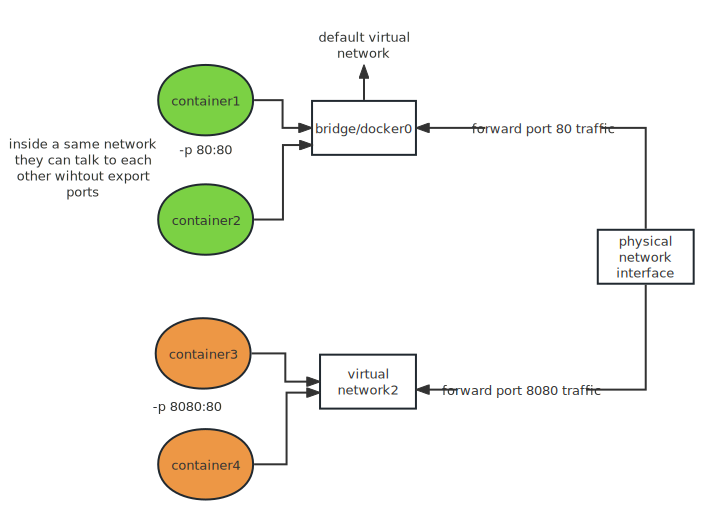

# docker mastery

## 镜像加速

* [阿里云加速器(点击管理控制台 -> 登录账号(淘宝账号) -> 右侧镜像工具 -> 镜像加速器 -> 复制加速器地址)](https://www.aliyun.com/product/acr?source=5176.11533457&userCode=8lx5zmtu)
* [网易云加速器](https://www.163yun.com/help/documents/56918246390157312) https://hub-mirror.c.163.com
* [百度云加速器](https://cloud.baidu.com/doc/CCE/s/Yjxppt74z#%E4%BD%BF%E7%94%A8dockerhub%E5%8A%A0%E9%80%9F%E5%99%A8) https://mirror.baidubce.com

腾讯加速 https://mirror.ccs.tencentyun.com


替换 debian 镜像

```bash
RUN echo "deb http://mirrors.tuna.tsinghua.edu.cn/debian/ bullseye main contrib non-free" > /etc/apt/sources.list \
    && echo "# deb-src http://mirrors.tuna.tsinghua.edu.cn/debian/ bullseye main contrib non-free" >> /etc/apt/sources.list \
    && echo "deb http://mirrors.tuna.tsinghua.edu.cn/debian/ bullseye-updates main contrib non-free" >> /etc/apt/sources.list \
    && echo "# deb-src http://mirrors.tuna.tsinghua.edu.cn/debian/ bullseye-updates main contrib non-free" >> /etc/apt/sources.list \
    && echo "deb http://mirrors.tuna.tsinghua.edu.cn/debian/ bullseye-backports main contrib non-free" >> /etc/apt/sources.list \
    && echo "# deb-src http://mirrors.tuna.tsinghua.edu.cn/debian/ bullseye-backports main contrib non-free" >> /etc/apt/sources.list \
    && echo "deb http://mirrors.tuna.tsinghua.edu.cn/debian-security bullseye-security main contrib non-free" >> /etc/apt/sources.list \
    && echo "# deb-src http://mirrors.tuna.tsinghua.edu.cn/debian-security bullseye-security main contrib non-free" >> /etc/apt/sources.list
```


## check docker

1. `docker version`  verified cli can talk to engine
2. `docker info` most config values of engine

3. command line structure
   1. old (still works): `docker <command>` (options)
   2. new: docker `<command> <sub-command>` (options)


## run containers

```bash
docker container run --publish 80:80 nginx
```

1. Downloaded image 'nginx' from Docker Hub

2. Started a new container from that image

3. Opened port 80 on the host IP

4. Routes that traffic to the container IP, port 80

### What happens in 'docker container run'

1. Looks for that image locally in image cache, doesn't find anything

2. Then looks in remote image repository (defaults to Docker Hub)

3. Downloads the latest version (nginx:latest by default)

4. Creates new container based on that image and prepares to start

5. Gives it a virtual IP on a private network inside docker engine

6. Opens up port 80 on host and forwards to port 80 in container

7. Starts container by using the CMD in the image Dockerfile


### change the default command

```bash
docker container run --publish 8080:80 --name webhost -d nginx:1.11 nginx -T
```

-d stands for detach, which means run in the background.

if you run the container in the background, you won't see the logs. you can use the `docker logs webhost` to check it out.

you may inspect what processes are running in that container, 

use `docker container logs webhost`


1. run three containers and remove them

```bash
# nginx 
docker container run --publish 80:80 --detach --name nginx nginx

# mysql pass the env
docker container run --publish 3306:3306 --detach --name mysql -e MYSQL_RANDOM_ROOT_PASSWORD=yes mysql

# httpd
docker container run --publish 8080:80 --detach --name httpd httpd

# stop them 
docker container stop nginx mysql httpd
# remove them
docker container rm nginx mysql httpd

# force remove running containers
docker container rm -f nginx mysql httpd
```

### what's going on inside containers

```bash
# process list in one container
docker container top
# details of one container config
docker container inspect
# performance stats for all containers
docker container stats
```


## get a shell inside containers

```bash
# start new container interactively and remove them later automatically
docker container run -it -rm
# run additional command in existing container
docker container exec -it
```

examples:

```bash
docker container run -it --name ubuntu ubuntu
docker container run -it alpine sh
docker container exec -it mysql bash
```


### network concepts



when we create a container, it normally lies in the default network, inside that network, containers can talk to one another freely without the need to publish a port.

you can create another network for another group of containers to seperate them. Among different containers, they are isolate.


check ip address of a container(namely nginx)

```bash
docker container inspect --format '{{ .NetworkSettings.IPAddress }}' nginx
```


### network management

```bash
# Show networks, have three network by default
docker network ls
# Inspect a network 
docker network inspect
# Create a network
docker network create --driver
# Attach a network to container
docker network connect 
# Detach a network from container
docker network disconnect
```

example:

```bash
docker network inspect bridge
docker network create my_app_net
docker container run -d --name new_nginx --network my_app_net nginx:alpine
docker network connect my_app_net nginx # connect exisiting container to a new network
docker network disconnect my_app_net nginx
```

the default network doesn't assign dns name to each container, but your newly created network will assign your container name as the dns name. It is always good to create a container inside a custom network.


#### DNS Round Robin Test

we can use assign multiple containers which lie in the same network a same alias, they can respond that dns name randomly.

```bash
# create two containrs within the same network, both share the same dns name
docker container run -d --net dude --net-alias search bretfisher/httpenv
docker container run -d --net dude --net-alias search bretfisher/httpenv
```


## Image

what's an image?

An image just like a template for a container. It contains the needed binaries to run. It can be huge, namely ubuntu, or just a go binary.


remove the dangling images

```bash
docker image prune
```

peek into images

```bash
# see the layers of an image
docker image history 
# see the metadata of an image
docker image inspect 
```


#### Tag And Push

If you don't specify a container's tag, it defaults to "latest".

you wanna add a tag to a existing image

```bash
docker image tag surwall/nginx surwall/nginx:testing
```


Besides official images, other images are prefixed with your account name. Before you upload your images, you are required to login first.

```bash
docker login
```

After you done with that, you can logout `docker logout`


#### Build Images

you need to wriet a Dockerfile first and then build it. By default, it will find a file named Dockerfile.

```bash
docker image build -t customnginx:latest .
```


### DockerFile format

1. 

2. WORKDIR 

change the working directory, if it doesn't exist, it will create it automatically

```dockerfile
# basic system
FROM node:6-alpine
# port
EXPOSE 3000
RUN apk add --no-cache tini 
# the working directory, if it doesn't it, it will create it automatically
WORKDIR /usr/src/app
# copy from host machine directory to container workdir
COPY ./package.json .
RUN npm install && npm cache clean --force
COPY . .
# run the final command, arguments are seperated
CMD [ "/sbin/tini", "--", "node", "./bin/www" ]
```


## Volume

what is Volume?

Containers are considered to contain only executables. You data should outlive that container even when that container is destroyed. You achieve that using "Volume". By default, docker engine will randomly generate a volume id at its base. But it isn't helpful. 

We can specify a name for a volume.

### Named Volume

```bash
docker container run -d --name mysql -e MYSQL_ALLOW_EMPTY_PASSWORD=True -v mysql-db:/var/lib/mysql mysql
```

check volume and inspect it

```bash
docker volume ls
docker volume inspect mysql-db
# remove any unused volume
docker volume prune
```

### Bind Mount

you can specify a host path to become your volume which connects your local directory to a container directory. 

```bash
docker container run -d --name nginx -p 80:80 -v $(pwd):/usr/share/nginx/html nginx
```


upgrade a container

```bash
# create volume first
docker volume create psql
docker run -d --name psql1 -e POSTGRES_PASSWORD=mypassword -v psql:/var/lib/postgresql/data postgres:15.1
docker logs psql1
docker stop psql1
docker run -d --name psql2 -e POSTGRES_PASSWORD=mypassword -v psql:/var/lib/postgresql/data postgres:15.2
docker logs psql2
docker stop psql2
```


## Clean up

```bash
#  to clean up just "dangling" images
docker image prune
# clean up everything you're not currently using
docker system prune

# will remove all images you're not using, including not used images
docker system prune -a 
# see space usage
docker system df
```


## docker compose

TODO