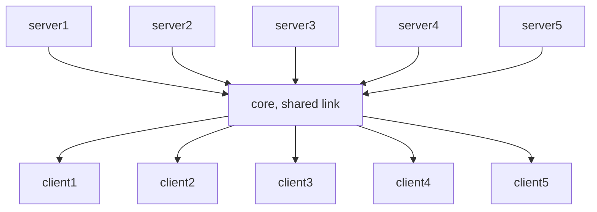

# Packet Switch Network

In packet-switched networks, there's a lofty goal, to reduce the required delay. The delay primarily formed by nodal processing delay, queuing delay, transmission delay, and propagation delay. Together, these delays accumulate to give a total nodal delay. 

## Delay

### Nodal Delay

$$
d_{nodal} = d_{proc} + d_{queue} + d_{trans} + d_{prop}
$$

### Queuing Delay and Packet Loss

The queuing delay can vary from packet to packet. For example, if 10 packets arrive at an empty queue, the first packet transmitted will suffer no queuing delay, while the last packet transmitted will suffer a relatively large queuing delay. We let $a$ denote the average rate at which packets arrive at the queue (a is in units of packets/sec) and all packets consist of $L$ bits. The average rate at which bits arrive at the queue is $La$ bits/sec. The ratio $La/R$, called the traffic intensity. If $La/R > 1$, **then the average rate at which bits arrive at the queue exceeds the rate at which the bits can be transmitted from the queue**, the queue will tend to increase without bound and the queuing delay will approach infinity! In that case, each router has a finite capacity storing the packets. A packet can arrive to find a full queue, with no place to store such a packet, a router will **drop** that packet; that is, the packet will be lost.

### End-to-end Delay

Suppose that there are `N-1` routers between the source host and the destination host. There are `N` nodal delays including the source host. Because the packet is first processed by the source host($d_{proc}$) and transmitted by it($d_{trans}$). It propagates from the host to the first node($d_{prop}$). Anyway, the total delay from source to destination is calculated by
$$
d_{end-end} = N * (d_{proc} + d_{queue} + d_{trans} + d_{prop})
$$
where, once again, $d_{trans} = L/R$, where L is the packet size(L bits/packet), R is the transmission rate(R bits/sec). 

***

## Throughput in Computer Networks

Consider transferring a large file from Host A to Host B across a computer network.  The instantaneous throughput at any instant of time is the rate (in bits/sec) at which Host B is receiving the file.  If the file consists of F bits and the transfer takes *T* seconds for Host B to receive all *F* bits, then the average throughput of the file transfer is *F/T bits/sec*. Imagine a situation like the graph below:  

The throughput for this simple two-link network is $min\{R_{c}, R_{s}\}$, that is, it is the transmission rate of the **bottleneck** link.  Now the approximate time to transfer a large file of F bits is $F/min\{R_{s}, R_{c}\}$. Provided that we have a network of N links with the transmission rates being $R_{1} , R_{2}, ..., R_{N}$, respectively, the throughput will be $min\{R_{1} , R_{2}, ..., R_{N}\}$.  

Now, consider a more typical example,   

Let's suppose that all servers access links have the same rate $R_{s}$, all client access links have the same rate $R_{c}$. The common link in the core network has the rate $R$. Because this link is shared by all the end hosts, the actual rate in this case is $R/5$, then the throughput would be $min\{R_{s}, R_{c}, R/5 \}$. 

