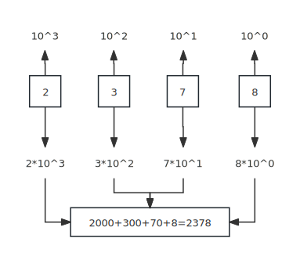

## counting

### Decimal counting
Let's view a example of decimal. Each bit represents an increasing power of 10.

In this case, each digit represent an increasing power of 10, let's count from right. The rightmost digit, or first digit, represents 1, second digit represents 10, third digit represents 100, and so on.
The final result is adding all the value each digit represent, in this case, it's 2000+300+70+8 = 2378.

### Binary counting

Binary means that there are only two possible values for each digit, 0 and 1.

If we have a binary `1010`. Each digit represent an increasing power of 2. The rightmost digit represent 1, the second digit always represent `2^1`.

### general counting

We see a pattern from binary and decimal counting, each digit represent an increasing power of its base. 

Let's count from from right to left. 

First digit is always 1, and second digit is `base^1`, and third digit is `base^2`. The n digit is `base^n-1`.
And the final result is the sum of value each digit represents.

| base | first digit value(count from right) | second digit value | nth digit value |
| ---- | ----------------------------------- | ------------------ | --------------- |
| 2    | 1                                   | 2                  | $2^{n-1}$       |
| 8    | 1                                   | 8                  | $8^{n-1}$       |
| 100  | 1                                   | 10                 | $10^{n-1}$      |
| 16   | 1                                   | 16                 | $16^{n-1}$      |
| x    | 1                                   | x                  | $x^{n-1}$       |

## binary to decimal

For example, `1111 1111` binary number is the sum of value each digit represents.

Here's a trick, the digit value goes from 1, 2, 4,8,16,32. If we have 4 binary digits, each of value they represent is `8 4 2 1`. We can then add them up.

In this case, the value of each digit are  `128 64 32 16    8 4 2 1`. 

Here's another trick, if all digits are 1, we know that the sum of it add 1, becomes `1 0000 0000`, we first count that digit value, it's the 9th digit, the value is `$2^{9-1}=256`, and minus 1, the sum is 255.

## Common powers of 2
| power | value                      |
| ----- | -------------------------- |
| 2^4   | **16**                     |
| 2^5   | **32**                     |
| 2^6   | **64**                     |
| 2^7   | **128**                    |
| 2^8   | **256**                    |
| 2^10  | **1024**                   |
| 2^16  | 65536                      |
| 2^31  | 2147483648=2 billion =21亿 |

## decimal to binary

## Operations

## Relation with Octal and Hexdecimal

## Bitmask
