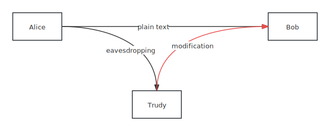
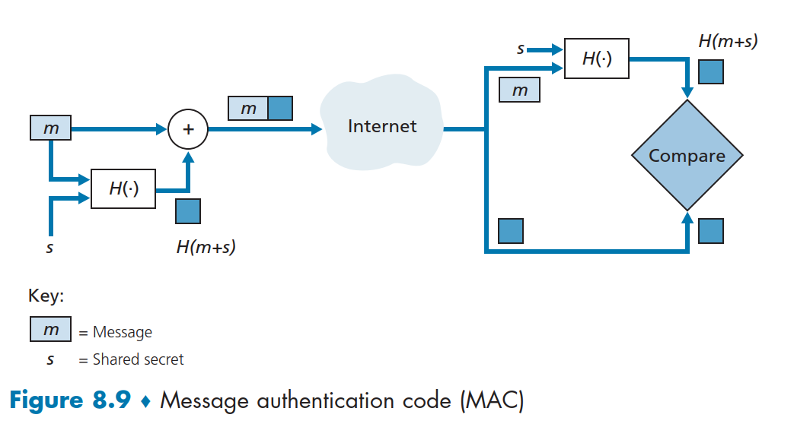
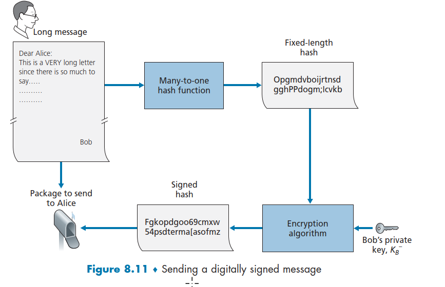
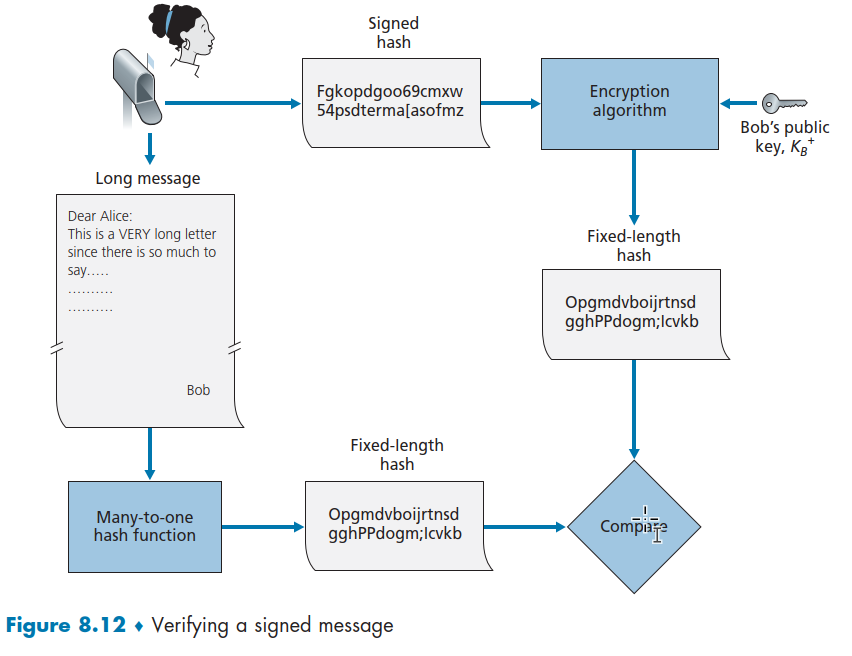

We wanna ensure secure communication, we need to have four invariable properties.
* Confidentiality 
  The message transferred should be encrypted and only be decrypted by the sender and the receiver.
* Message integrity. 
  We need a way to ensure the integrity of the message
* End-point authentication
  Both the sender and receiver should be able to confirm the identify of the other.
* Operation security. 
  Ensure the network for communication is operational, in that sense, it can prevent any dos attacks.

## Security Problems

Trudy not only can get the messages but also modify the message.
The first attempt to do is use a encrypt key key to encrypt the message. However, Trudy still can modify the messages, so the received message is tampered.

## Encryption
### Symmetric Encryption
If we have a message called m, we use the same key to encrypt and decrypt. However, two parities must agree on the shared key, and do so requires secure communication. Well, two parties can meet and agree on the key, however, in a networked world, two parties may never meet. That's where public key encryption comes into play.

### Public Key Encryption
Imagine that Alice wanna send messages to Bob. This encryption involves two keys, the public key (known to Alice, Bob and the whole world) and the private key (known only to Bob. 
Alice first retrieve the public key from Bob (Bob owns a public-private key pair) and use the public key with a known **encryption algorithm** to encrypt the message, and Bob use the private key with with the respected **decryption algorithm** to decrypt the message.
Let's use $K^-_B$  and $K^+_B$ to refer to Bob's private key and public key, and the message is $m$​.
$$
\begin{aligned}
\text{cipher text} &= K^+_B(m) \\
\text{deciphered text} &= K^-_B(K^+_B(m)) = m
\end{aligned}
$$
Note that we can interchange the public key and private key encryption and get the same result.
$$
\begin{aligned}
\text{cipher text} &= K^-_B(m) \\
\text{deciphered text} &= K^+_B(K^-_B(m)) = m
\end{aligned}
$$

## Message Integrity and Digital Signatures
When Bob receive the message, he need to ensure two things:
1. The message indeed originated from Alice
2. The message was not tampered
The second thing can be solved very easily by sending along with the hash. What is a hash? A hash is a fixed-size digital fingerprint of data. This hash value is a unique representation of the original data.
### Hash
We normally use a hashing function like `md5` that takes an input (data of arbitrary size) and produces a fixed-size output known as a **hash value** or **digest**.
So if our message is tampered, the hash value is different.

There are cases that two completely different data product the same hash, but the case is very rare. If that is a problem, we can choose more advanced hash functions that produce long hashes.
SHA-256 produces a 256-bit hash, and SHA-512 produces a 512-bit hash. These long hash values make it extremely difficult to find two different inputs that produce the same output. However, those advanced hashing functions are more computationally expensive than MD5.

| algorithmn | hash length    | hex length |
| ---------- | -------------- | ---------- |
| md5        | 128bits/16byte | 32         |
| sha-1      | 160bit         |            |
| sha-256    | 256bits/32byte | 64         |
| sha-512    | 512bits/64byte | 128        |

However, use hash along with the message is not enough. Since Trudy can forge his message and generate appropriate hash. To solve this problem, we need a secret key, or authenticate key.

Let's define the hash function as $h$, a secrete key as `s`, the final hash is called MAC(Message Authentication Code).
$$
\begin{aligned}
\text{mac} = h(m+s)
\end{aligned}
$$


Note that two parties hold the secrete key, so they can generate MAC on their own and compare with the received MAC.

MAC ensure the integrity and authenticity of the message, but cannot identify the sender. You have to introduce other mechanisms to do that job.

Let's talk about the application of hash functions.

1. Password Storage
   Instead of storing plain-text passwords, their hashes are stored. If a database is compromised, attackers cannot easily access the original passwords. Salt can be added to the password before hashing to make it even more secure.
2. Data Integrity
   Hashing is used to verify the integrity of data. If the hash of a file changes, it indicates that the file has been modified.
3. Digital Signatures
   Hashing is a crucial component of digital signatures.

### Signature

Since only the holder knows the private key, so if the message is encrypted by the private key, and it can be decrypted by the public key. The result is the signature. So if the receiver get the message and the signature. It can generate message from signature using the public key. And compare the message with the received message. 

However, since messages could very long, the resulting signature is also long. That's not efficient. Instead, we first grab the hash of the message, and sign the hash.




$$
\begin{aligned}
\text{signature} &= K^-_B(h(m)) \\
\text{message to send} &= m + \text{signature} \\
\\
\text{computed hash} &= h(m_{received}) \\
\text{received hash} &= K^+_B(\text{signature}) \\
\text{compare(computed hash} &\text{, received hash)}
\end{aligned}
$$

## Public Key Certificate

There's one caveat of using signature. If Trudy(the malicious hacker) replace Bob's public key, and Alice thinks that she receives Bob's public key, but in reality, it's Trudy's. In that case, all the above verification for signature is successful. How to prevent this?

The purpose of a public key certificate is to prove the validity of a public key.

A Certification Authority(CA)'s job is to bind a public key to a particular entity, and issue certificates.

A CA must verifies that the entity is who it says it is. Once the CA verifies the identify of the entity, the CA creates a certificate that contains the entity's public key along with his identify information and a signature created by the CA.

```bash
info = entity_public_key + entity_identify_info
signature = sign(hash ( info ) )
certificate = info + signature
```

The receiver must have the public key of the CA to do the check. The process of the check is listed below:

```python
info + signature = split(received_certificate)
generated_hash = hash(info)
# use CA's public key to decrypt the signature
received_hash = decrypt(signature, CA_pub_key)
compare(generated_hash, received_hash)
```

### Certificate Overview

If one party wanna prove its identify, it must give his public key to the other party to do the following check.

However, to prove his public key is correct, he need to provide a certificate.

### Common Certificate Extensions

| ext                       | descrption                                                   |
| ------------------------- | ------------------------------------------------------------ |
| `.pem`                    | [Base64](https://en.wikipedia.org/wiki/Base64) encoded [DER](https://en.wikipedia.org/wiki/Distinguished_Encoding_Rules) certificate |
| `.cert`, `.crt` or `.der` | usually in binary [DER](https://en.wikipedia.org/wiki/Distinguished_Encoding_Rules) form, but Base64-encoded certificates are common too |
| `.p12`                    | contain certificate and private key (password protected) in a single file |
| `.csr`                    | Certificate Signing Certificate, a unsigned certificate sent to CA |

Generally, when you distribute an app, whether it's a Windows app, an ios app, or an android app. You need to sign the app and append the associated certificate (contains public key).

Fingerprint is a unique representation of a file, a message or anything. In the context of SSH, fingerprint refers to the hash of a public key.

## See Also

[Certificate Specification X.509](https://en.wikipedia.org/wiki/X.509)

[Code Signing written by Microsoft](https://learn.microsoft.com/en-us/previous-versions/windows/internet-explorer/ie-developer/platform-apis/ms537361(v=vs.85)#digital-certificates)
[SSH](../linux-admin/networking/ssh.md)
[self-signed-certificate](self-signed-certificate.md)