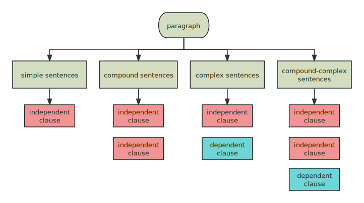
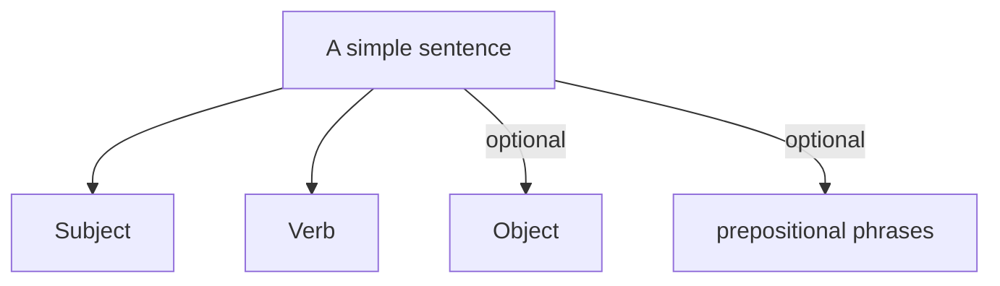
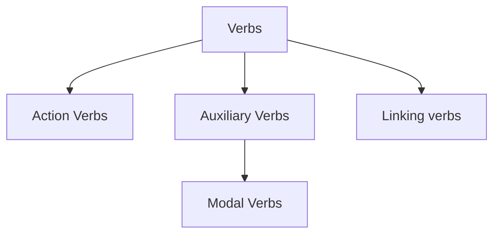
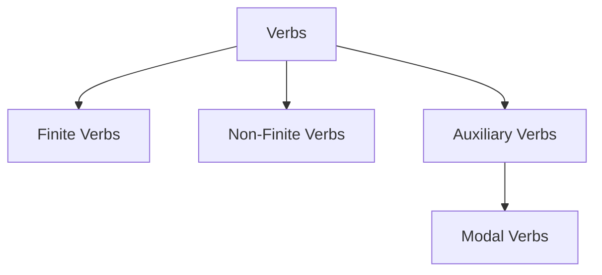
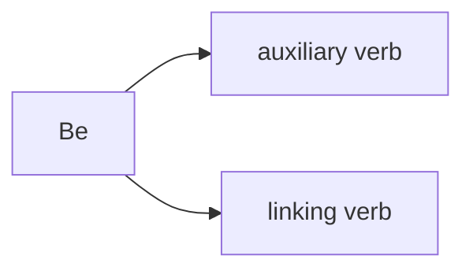
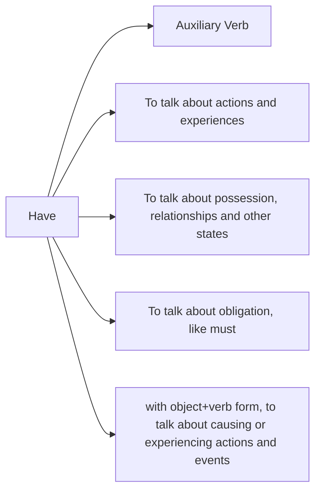
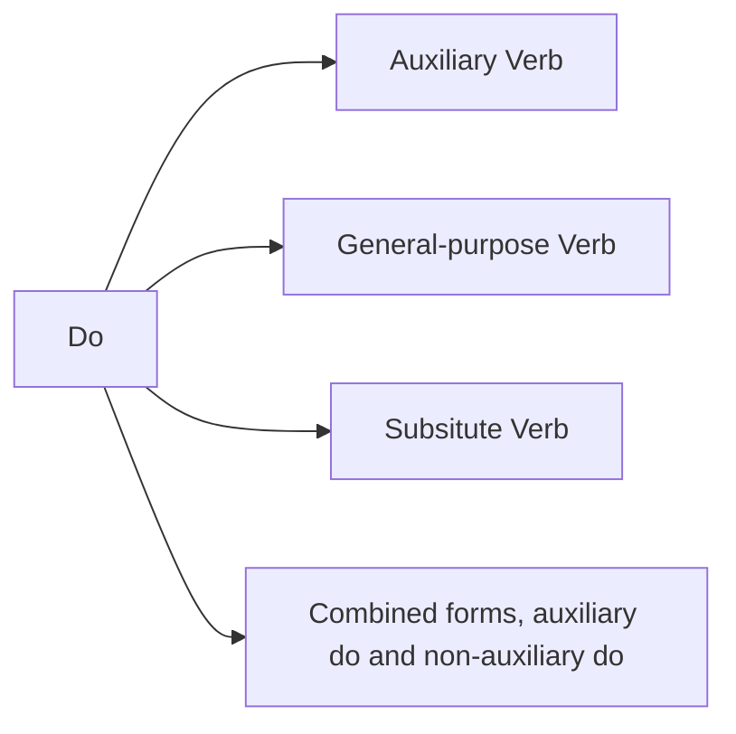
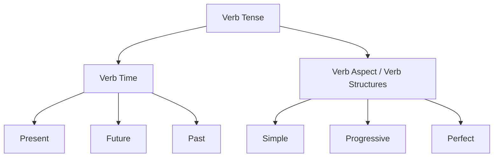
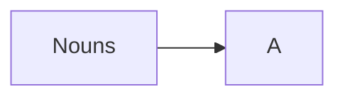

## The building blocks: clauses

Clauses are the building blocks of English sentences. A clause is a group of words containing a subject and of a verb.  Of the four sentence structures that clauses can be combined to make, the simple sentence is the most basic. Simple sentences have just a single independent clause, with no subordinate clauses. Let's dissect a paragraph, see how it is composed of:

### Independent Clause

An independent clause can stand alone as a sentence. It contains a subject and a verb and is a complete idea.

* **I** like *spaghetti*.
* **He** reads *many books*.

### Dependent clause

A dependent clause is not a complete sentence. It must be attached to an independent clause to become complete. This is also known as a subordinate clause.

* Although I like spaghetti,…
* Because he reads many books,…

---

The simple sentence is the most basic building block of the paragraphs. Let's see the general structure of it.

## General Structure of a simple sentence

### Subject, Object

A subject is a person, animal, place, thing, or concept that **does** an action. An object is a person, animal, place, thing, or concept that **receives** the action. The object is manipulated by that subject using that action. Sometimes the role of the subject and the object can be swapped. This is called Passive.

Subjects and Objects should be nouns. A noun is a word that names something, such as a person, place, thing, or idea.

The core is the subject and the verb, everything else is considered to be adding more information about the action or the subject. For a concrete example, look this sentence, "I **left** the house *before noon*". In this case, "before noon" is a prepositional phrases that describe the time of the action. The Object can also be viewed as extra information about the action.

### Verb

Verbs are the central element in sentences. Most of the things we say are built around them. Because Verbs are so important that they have different forms which can indicate various aspects of the action, including timing, duration, and completion.

## More on Verbs

### The Main Category of Verbs

1. Actions Verbs are those verbs actually express actions.
2. Auxiliary Verbs are verbs used to form the tenses, moods, or voices of other verbs. Modal Verbs are a subclass of it that express possibility, permission, obligation.
3. A linking verb connects the subject of your sentence to a noun or adjective that describes your subject. The noun or adjective is called the “subject complement.” A linking verb isn't an action.

### Verb Type

Most verbs describe a physical action or activity, something external that can be seen or heard. These verbs are formally known as dynamic verbs, but can also be called *action* or *event* verbs.

*Examples: walk, laugh, swim, play, eat, drink, sing, dance, talk, say*

There are a lot of actions that take place in our minds and feelings, which are *not* external. Verbs that describe mental or internal actions are still dynamic verbs, but they’re not always so obvious. These include “process verbs,” which describe actions of transition.

*Examples: consider, guess, change, grow, live, endure, succeed, fail*

Verb forms which show time (e.g. goes, went) are often called **finite**, other forms (e.g. written, playing) are **non-finite**.

> [Finite verbs](https://byjus.com/english/finite-verbs/) are those [verbs](https://byjus.com/english/verbs/) that agree with the [subject](https://byjus.com/english/subject/) and express the mood, tense, number and person. On the other hand, [non-finite verbs](https://byjus.com/english/non-finite-verbs/) do not agree with the subject and can be used in the present [participle](https://byjus.com/english/participles-in-english/), past participle or infinitive forms to perform different functions in a sentence.

In that sense, we can divide the verbs into three groups:

## Be, Have and do

These three verbs live a double life. They can be **auxiliary verbs** used to form questions, negatives, emphatic forms, perfect and progressive tenses, and passives. Be can also be a linking verb, and have and do can be ordinary full verbs. For this reason, each of them can appear twice in a single phrase.

* I am being served
* Have you had an invitation?
* What do you do?

### Be

Be can be auxiliary verb, used to form progressive and passive structures:

1. What are you doing?
2. We weren't told about the meaning.

Be can appear twice if it is used in both progressive forms and passive forms.

1. The hospital is being rebuilt.
2. I knew we were being watched.

Be can be a linking verb, used to join a subject to a complement

1. This is difficult.
2. Andy was very tired.

There is a special case that be can be used in progressive forms of the linking verb.

* You're being stupid. (= You're doing stupid things).

We use this structure to talk about temporary situations to do with actions and behavior, but not usually to talk about feelings.

* I was being very careful. (= I was doing something carefully.)
* I was depressed when you phoned. (NOT ~~I was being depressed~~.)

#### "there is" structure

In this structure, "be" acts more like a linking verb, although "auxiliary verb" is also involved. Let's see some examples:

* There's a hole in my sleeve.
* There is a lot of noise in the street.
* There are some people outside.
* There was dancing in the streets.

Normally, its main role is connect the subject (there) to the subject complement, indicating the existence or presence of an object, person, or situation. Nonetheless, there can also be used in structures where **be** is a progressive or passive auxiliary.

* There was a girl swimming in the lake. (= A girl was swimming ...)
* There have been more Americans killed in road accidents than in all the wars since 1900. (= More Americans have been killed ...)

**There** can be used with modal verb + be, and with some other verbs.

* There might be drinks if you wait for a bit.
* There seem to be some problems.
* There remains nothing more to be done.

As you might notice, any examples appeared before are describing a situation where the subject is indefinite or unknown. If you have a definite article, or a proper name, it is not normally used.

* The door was open. (NOT ~~There was the door open.~~)
* James was at the party. (NOT ~~There was James at the party.~~)

### Have

#### As a auxiliary Verb

We use **have** as an auxiliary verb with past participles, to make **perfect** verb forms.

* You've heard about Daniel and Corinne? (present perfect)
* We'll have been living here for two years next Sunday. (future progressive)
* I'd like to have lived in the eighteenth century.  (perfect infinitive)
* Having been there before, he knew what to expect. (perfect participle)

Like all auxiliary verbs, **have** make questions and negative without do.

* Have you heard the news? (NOT ~~Do you have heard ...~~)
* I haven't seen them. (NOT ~~I don't have seen them~~)

There are no progressive forms of the auxiliary verb **have**.

* I haven't seen her anywhere. (NOT ~~I'm not having seen her anywhere~~)

#### Have: Actions

We often use `have + object` to talk about actions and experiences.

* Let's have a drink.
* Have a good time.
* have a rest

In expressions like these, have can be the equivalent of 'eat', 'drink', 'enjoy' or many other things - the exact meaning depends on the following noun.  Regarding to the questions and negatives, it is used with **do**.

* Did you **have** a good time? (NOT ~~Had you a good time?~~)
* I'm **having** a bad day.

#### Have (got) : possession, relationships and other states

We often use **have** to talk about states: possessions, illnesses, the characteristics of people and things, and similar ideas.

* Her father **has** an office in Westminster.
* Do you **have** any brothers or sisters?
* I think we **have** mice. (simply express the fact of being in a particular situation)

Regarding to questions and negatives, we use **do**. And progressive forms of **have** are not used.

* Does the house **have** a garden?
* Her parents did not **have** very much money.
* She **has** three brothers. (NOT ~~She is having three brothers.~~)

In conversation and informal writing, we often use the double form **have got**

* **I've got** a new boyfriend. (More natural in speech than I have a new boyfriend.)
* **Has** your sister got a car?
* I haven't got your keys.
* Have you got a headache?
* Have you got a light? No, I haven't
* I've got a new apartment? You do?

When we are talking about repeated or habitual states, got-forms of have are less often used.

* I have / I've got a headache.
  * I often have headaches.
* Do you have / Have you got time to go to London this weekend?
  * Do you ever have time to go to London?

### Be and Have

**Be** is used to talk about hunger, thirst, heat and other physical conditions, and also used to talk about age, length, weight, size, shape, but it is not usually used in measuring expressions.

* **be** hungry
* She **is** nearly my age.
* **I'm** nearly thirty.
* What size **are** your shoes?
* It **weighs** 37 kilos.

### Do

#### Do: Auxiliary Verb

1. questions

We use **do** to make questions with ordinary verbs, but not with other auxiliary verbs. Compare:

* **Do** you like football?
* **Can** you play football?
* What **do** you do in the evenings? (make questions with the ordinary verb do)

2. negatives

We use **do** to make negative clauses with ordinary verbs, but not with other auxiliary verbs.

* I **don't** do much in the evenings.
* I **can't** play football.

3. emphasis

We can use **do** in an affirmative clause for emphasis.

* Do sit down.
* You do look nice today!
* She thinks I don't love her, but I **do** love her.
* I don't do much sport now, but I **did** play football when I was younger.

4. inversion

Do is used in some structures with inversion

* At no time did he lose his self-control.

5. ellipsis

In cases where an auxiliary verb is used instead of a whole verb phrase.

* She doesn't like dancing, but I **do**. (= ... but I like dancing)
* That meat smells funny. Yes, it **does**, **doesn't** it?
* Anna thinks there's something wrong with James, and so **do** I.

#### do: substitute verb.

Do used in this way only exist in British English. *do* can be used alone as a substitute verb after an auxiliary verb.

1. Come and stay with us. I may (do), if I have the time. (AmE I may, If ...)
2. He's supposed to have locked the safe. He has (done). (AmE He has. or He has locked it.)

## Tense

A tense is **a form of the verb that allows you to express time**. In that sense, verb is the key to indicate time. We can express things in the present, future or past. The tense can be divided into three categories.

For each kind of time, there are three possibilities with most verbs: simple; progressive or continuous; and perfect.

* simple present: I start
* present progressive: I am starting
* present perfect: I have started

There is not a direct relationship between verb forms and time. For example, past verb like *went* is not only used to talk about past events, but also about unreal or uncertain present or future events (e.g. It would be better if we went home now.).

## Passives

We have two ways to describe one thing. One is the active form, the other is the passive form. When A does something to B, in active form, A is the subject, B is the object. If you want to transform it to the passive form. The object becomes the subject, and we use a passive verb. Note that when we use passive form, we don't need the original subject, if it does, it is called the agent in an expression with by.

### agent

We usually use *by* to introduce the agent, the person that does the action, or that causes what happens. Some past participles can be more like adjectives than verbs, for example, shocked, worried, frightened. we often use other prepositions instead of by. (Such structures are not really passives, but examples of **be + adjective**).

1. I was **shocked at/by** your attitude.
2. We were **worried about/by** her silence.
3. Are you **frightened of** spiders.

When we talk about an instrument which is used by an agent to do an action, **with** is used:

1. He was shot (by the policeman) with a rifle.

## Common sentences

### as if...

## Nouns

Recall that nouns can play the role of **subject**, [**direct object**](https://www.grammarly.com/blog/direct-object/), [**indirect object**](https://www.grammarly.com/blog/indirect-object/), **subject complement**, **object complement**, [**appositive**](https://www.grammarly.com/blog/appositive/), or [**modifier**](https://www.grammarly.com/blog/modifiers/).

We can divide nouns into several categories:

