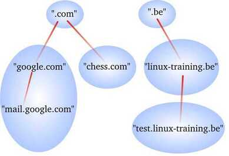
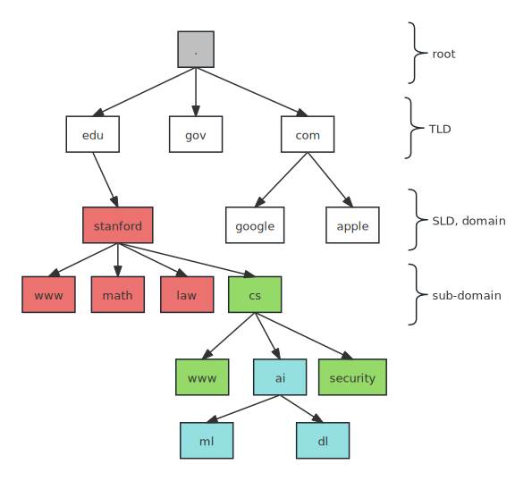
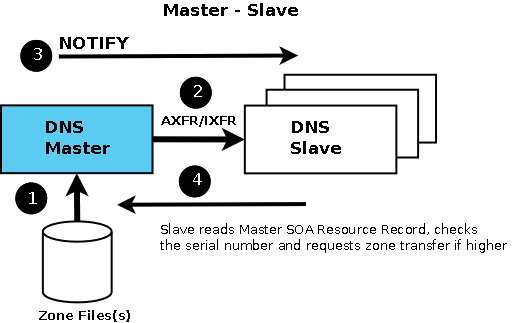
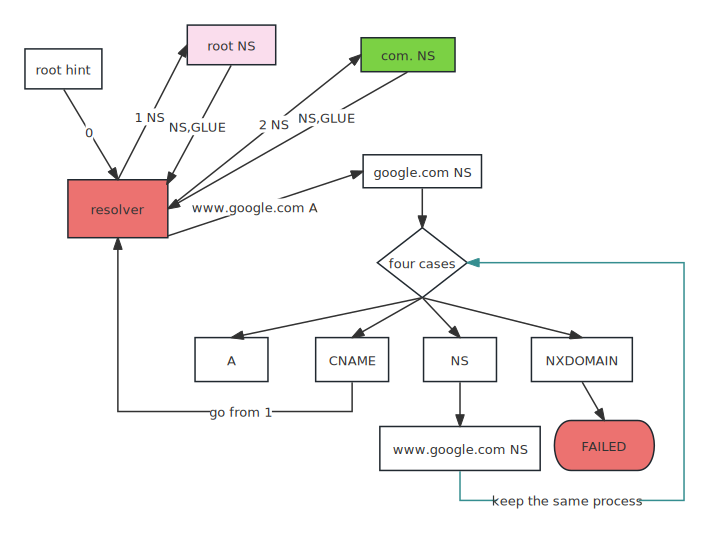

## Intro

At the early stage, there's only one central server that host a file called `HOSTS.txt`, which is a list of domain name and ip paires. As Internet grows, one central server can't respond so many requests. So we design a distributed system that each host host only a partial database.

DNS, the domain name system, is a client/server mechanism. DNS system is a tree of nodes. 

Normally, each node has a correspond name server that store information about child domain and its own domain. 

## Domain name Definition

The domain name is the sequence of labels from the root node to its own node. In the above graph, we have a node called `google`, its corresponding domain is `google.com.`, a node called `math`, the domain name is `math.stanford.edu.`. Most of time, we can ignore the `.` in the URL, but it do exist.

## Zone Definition

A zone is a namespace that is managed by an organization or administrator, in other words, a zone is just a node tree. Each zone has its own DNS records (A, CNAME, MX, etc.) to map domain names to IP addresses and other information. 

**However, you can delegate a portion of a zone to another name server. In that case, that portion of a zone becomes a new zone. And this zone also can delegate a portion of the zone to another name server, that create another zone.**

In the above case, `.com` organization should control over `google.com`, `chess.com`, however, it delegates those sub domains to other organizations. `.com` organization control other sub domains except these two. These two has its own zones.

## A University Example

 

If `.edu` organization delegate `stanford.edu` to Stanford university. In the university, we have many departments, the cs department may have their own ideas, so the unvierstiy delegate the subdomain `cs.stanford.edu` to the cs department. Now, the university has the zone that manages `stanford.edu`, `www.stanford.edu`, `math.stanford.edu`, and `law.stanford.edu`. 

The cs department may have an AI division that has its own zone at `ai.cs.stanford.edu`.

## Common terms

A top-level domain is called TLD, is a child of the root node, for instance, `.com`, `.edu`

A second-level domain is called SLD, is often referred as domain name, for instance, `.google.com`.

A third-level domain, is often referred as sub domain, for instance, `docs.google.com`.

## Type of Nameservers

While you can have multiple name servers for a domain, the typical setup involves a **master** server and one or more **slave** servers.

**Master Server:** This server maintains the authoritative zone files for the domain. It's responsible for creating and updating these files.

**Slave Servers:** These servers are configured to perform zone transfers from the master server. They periodically copy the zone files from the master through the process of zone transfer

## Zone Datafiles

The primary master name servers store information in so called zone data files. These files contain resource records that describe the zone. The resource records (RR) describe all the hosts in the zone and mark any delegation of sub domains.

## Resource Record Type

| Type  | Meaning                                                      |
| ----- | ------------------------------------------------------------ |
| SOA   | store email address of the administrator, serial number for zone transfer |
| NS    | it defines a name server that is authoritative for the domain, it shouldn't be ip |
| MX    | the mail server                                              |
| A     | ip address of a particular host                              |
| CNAME | defines an alias for an existing host, another domain name   |

## Resolver for www.google.com

1. The resolver must update [root hints](https://www.internic.net/domain/named.root) regularly, which contains 13 ip of root name servers.
2. it send NS query of `com.` to one root IP
3. root IP returns NS records and glue records, which just A records indicating ip of name servers
4. the resolver sends NS query of `google.com` to ip of `com.` name server
5. `com.` name server returns NS records and glue records of `ns1.google.com`
6. the resolver sends A query of `www.google.com` to ip of `ns1.google.com`
7. it has four case
   1. it returns A, that's the ip addresses, done
   2. it returns CNAME, it just another domain name, you have to go back to step 1 (ignore cache now)
   3. it returns NS, this indicate `www.google.com` is in another zone, we ask that nameserver the same question, go to step 7
   4. it returns NXDOMAIN, which stands for **a non-existent domain**, done

>[!tip]
>You can view all root servers at [here](https://root-servers.org/)
>
## See More

