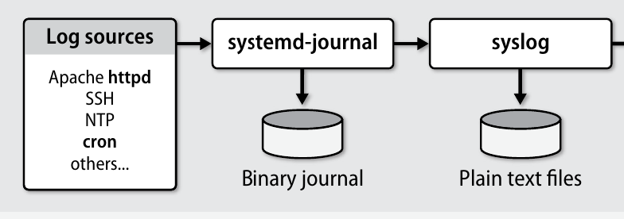
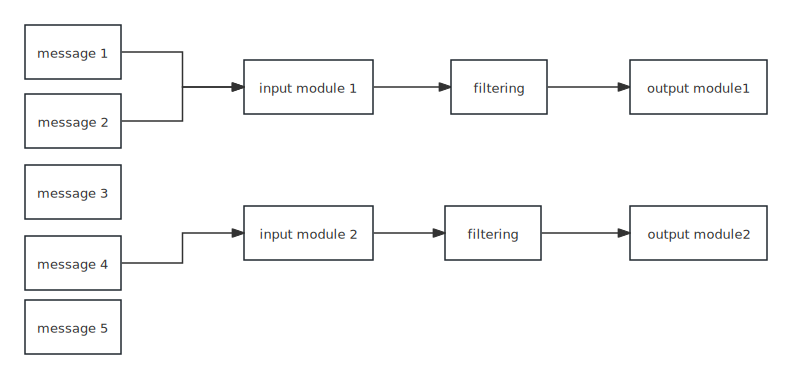
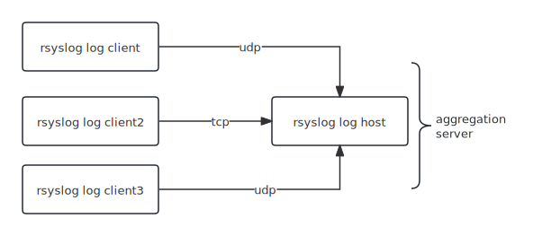

## Intro

System daemons, the kernel, and custom applications all emit operational data that is logged and eventually ends up on your finite-sized disks. 

### Log Message Format

A log message is usually a line of text with a few properties attached, including a time stamp, the type and severity of the event, and a process name and ID (PID).

### Log Management

Log management can be divided into three subtasks:

1. Collecting logs from a variety of sources
2. Providing a structured interface for querying, analyzing, filtering, and monitoring messages
3. Managing the retention and expiration of messages (rotatiton)

## Status Quo

For decades, Linux logging has been managed by the `syslogd` daemon. It would collect messages that sent to `/dev/log` pseudo device. Then it directs all the messages to appropriate plain text log files in `/var/log` directory. Since every message has a header including process name and pid(optional), `syslogd` would know where to send those messages.

However, since the advent of `systemd` universe, it also includes a `systemd-journald` logging service. So Linux logging is also handled by `journald`. Now the actual implementation of `syslogd` is called `rsyslog`, it will coexist with `journald` for a long time.



## Journald Logging

```bash
# show all logging
journalctl
journalctl -n 20 # show last 20 messages
journalctl -p emerg # show only emergency and above messages
journalctl -u nginx # show certain unit
journalctl -f # watch messages in real time, just like tail -f
```

## [rsyslog](https://www.rsyslog.com/doc/index.html) Messages

A list of log files maintained by `rsyslogd` can be found in the `/etc/rsyslog.conf` configuration file.

| Distro          | location            |
| --------------- | ------------------- |
| Red Hat, Centos | `/etc/log/messages` |
| Debian, Ubuntu  | `/etc/log/syslog`   |

Rsyslog messages are stored as plain text files. We can use `cat` or `tail` to show them:

```bash
cat /var/log/syslog
Sep 22 03:29:37 centos9 dhclient[125]: bound to 10.0.3.217 -- renewal in 1374 seconds.
Sep 22 03:29:37 centos9 systemd[1]: Starting Network Manager Script Dispatcher Service...
```

The format is `timestamp, hostname, processname[pid]: Message payload`

> [!note]
>
> Some daemons encode the payload to add metadata about the message. It may include timestamp in the message payload for its own convenience.

## Rsyslog Arch



Input module handles the message collecting (not all message are collected) , and we may filter out some collecting messages and then output them, well, you can transform those message a little bit.

## Rsyslog Configuration

The primary configuration file for rsyslog, located at /etc/rsyslog.conf, acts as the central point for establishing logging rules. Normally, we include `/etc/rsyslog.d/*`. Because order is important, distributions organize files by preceding file names with numbers.

* 21-cloudinit.conf
* 50-default.conf
* 55-remote.conf

> [!tip]
>
> If you modify /etc/rsyslog.conf or any of its included files, you must restart the rsyslogd daemon to make your changes take effect. A TERM signal makes the daemon exit. A HUP signal causes rsyslogd to close all open log files, which is useful for rotating (renaming and restarting) logs.

Filters, sometimes called “selectors,” constitute the bulk of an rsyslog configuration. They define how rsyslog sorts and processes messages. Filters are formed from expressions that select specific message criteria and actions that route selected messages to a desired destination.

Rsyslog understands three configuration syntaxes:

1. sysklogd format,Use it to construct simple filters. (compatible with syslogd)
2. Legacy rsyslog directives, always begin with a `$` sign. 
3. RainerScript, This is a scripting syntax that supports expressions and functions

### Sysklogd Syntax

The format is `selector	action`. Selectors are composed of `facility.severity`.

Facility names and severity levels must be chosen from a short list of defined values.

Facilities are defined for the kernel, for common groups of utilities, and for locally written programs. Everything else is classified under the generic facility “user.”

Just list a few commonly used facilities:

| Facility | Programs that use it                                 |
| -------- | ---------------------------------------------------- |
| *        | All facilities except “mark”                         |
| auth     | Security- and authorization-related commands         |
| authpriv | Sensitive/private authorization messages (like sudo) |
| daemon   | System daemons                                       |
| local0-7 | Eight flavors of local message                       |
| syslog   | syslogd internal messages                            |
| user     | User processes (the default if not specified)        |

Syslog severity levels (descending severity)

| Level   | Approximate meaning                          |
| ------- | -------------------------------------------- |
| emerg   | Panic situations; system is unusable         |
| alert   | Urgent situations; immediate action required |
| crit    | Critical conditions                          |
| err     | Other error conditions                       |
| warning | Warning messages                             |
| notice  | Things that might merit investigation        |
| info    | Informational messages                       |
| debug   | For debugging only                           |

There’s a clear difference between notice and warning and between warning and err. 

`auth.info` really means all info messages and above should be captured.

`auth.*` means all severity levels

`auth.=info` only messages at info priority because of `=`

`auth.info;auth.!err` info  and above but exclude err above

`auth.debug;auth.!=warning`  debug above and exclude only warning

`*.*; auth,authpriv.none` every facility but exclude auth and authpriv

***

As for action side, we can ouput to a file or forwards it to a host

| Action      | Meaning                                                |
| ----------- | ------------------------------------------------------ |
| filename    | Appends the message to a file on the local machine     |
| @hostname   | Forwards the message to the rsyslogd on hostname or ip |
| @ipaddress  | Forwards the message to ipaddress on UDP port 514      |
| @@ipaddress | Forwards the message to ipaddress on TCP port 514      |

You can view more syntax at [here](https://www.rsyslog.com/doc/configuration/sysklogd_format.html)

### Modules

We have input modules and output modules for inputing and outputting messages. 

We mainly focus on `imfile`, `imudp`, `imtcp`, `omfile`, `omfwd`.

Before using a module, you have to load it first, and then use it.

Let's see a concrete example of capturing nginx log and redirect into another place and send outside.

```bash
module(load="imfile" mode="inotify")

ruleset(name="nginx") {
    action(type="omfile" File="/var/log/messages")
    action(type="omfwd" Target="10.0.3.217" Protocol="udp")
}
input(type="imfile"
    Tag="nginx-access"
    File="/var/log/nginx/access.log"
    Severity="notice"
    ruleset="nginx"
)
```

In the first line, we load the module.

In the second statement, we create an explicit ruleset that do multiple actions.

In the third statement, we use `imfile` to input nginx access log and direct it not to global ruleset that will be accepted by all old sysklogd syntax, we don't wanna pollute our log files. So we explicit send it to a certain ruleset. Only this ruleset can accept those messages.

### Send to a Central Rsyslog Server



We already configure the client, it just need to use `omfwd`module and specify the addresses.

We need to configure the host or server to accept messages from udp.

```bash
module(load="imudp")

template(name="remote-log" type="string" string="/var/log/remote/%HOSTNAME%.log")

ruleset(name="remote") {
    action(type="omfile" dynaFile="remote-log")
}

input(type="imudp" Port="514"  ruleset="remote")
```

>[!note]
>Note that we declare a template that generate dynamic log path based on hostname.

## Rsyslog Logrotating

You may notice multiple files in the `/var/log/` directory with numbers after them (for example, `cron-20100906` or `cron-.log.1` or `cron.log.2.gz`.

In RHEL-based distros, it's `cron-20100906`, these numbers represent a time stamp that has been added to a rotated log file.

In Debian-based distros, it's `cron.log.1` or `cron.log.2`, old files have been renamed after rotating, so `cron.log.1` becomes `cron.log.2`, and `cron.log.2` becomes `cron.log.3`, there can only be limited files there, for example, if only three copies are allowed, `cron.log.3` will not become `cron.log.4`, it will be deleted.

The configuration file is located at `/etc/logrotate.conf` and `/etc/logrotate.d/*`.

Let's configure a rotating for NGINX.(It is installed automatically on Ubuntu)

```bash
/var/log/nginx/*.log {
        daily
        missingok
        rotate 14
        compress
        delaycompress
        notifempty
        create 0640 www-data adm
        sharedscripts
        prerotate
                if [ -d /etc/logrotate.d/httpd-prerotate ]; then \
                        run-parts /etc/logrotate.d/httpd-prerotate; \
                fi \
        endscript
        postrotate
                invoke-rc.d nginx rotate >/dev/null 2>&1
        endscript
}
```

The format is `/path/to/*.log {}` or you can specify multiple logs with the same rule:

```bash
/path/to/log1
/path/to/log2 
/path/to/*.log {
 ...
}
```

## Logging at Scale
“ELK” stack consisting of Elasticsearch, Logstash, and Kibana. This combination of tools helps you sort, search, analyze, and visualize large volumes of log data generated by a global network of logging clients.