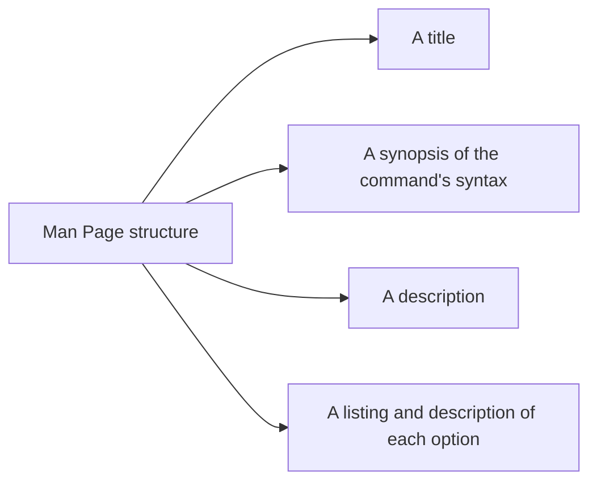

```mermaid
flowchart LR
A[Man Page structure] --> B[A title]
A --> C[A synopsis of the command's syntax]
A --> D[A description]
A --> E[A listing and description of each option]
```

## Quick Search a Option
To search a option like `-M`, use
```bash
^\s+-m
```

- [x] man options quick search ✅ 2024-11-02
https://askubuntu.com/questions/20752/how-can-i-search-within-a-manpage