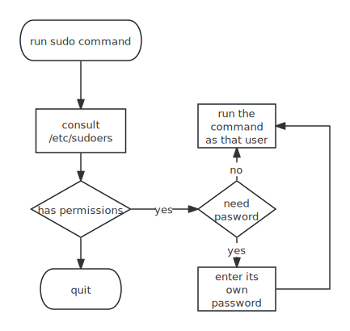

In linux, there are two kinds of user, one is normal user, another is super user.
Super user has unlimited power on the system. The default UID for super user is 0. Let's talk about what super user can do:  
• Creating device files   
• Setting the system clock  
• Raising resource usage limits and process priorities  
• Setting the system’s hostname  
• Configuring network interfaces  
• Opening privileged network ports (those numbered below 1,024)  
• Shutting down the system  
An example of superuser powers is the ability of a process owned by root to change its UID and GID. The login program and its GUI equivalents are a case in point; .  Once a root process has changed its ownerships to become a normal user process, it can’t recover its former privileged state.
## User Id and User Switching
when you temporarily switch to another user, all you're doing is changing your user ID. There are two ways to do this, one is to use `setuid` executable, another is to use `setuid` system calls.
A process running as root (user Id 0) can use `setuid()` to become any other user. A process not running as root has severe restrictions on how it may use `setuid()`; in most cases, it cannot.
The login program, the process that prompts you for your password when you log in to the system initially runs as root. If the password and username that you enter are legitimate, the login program changes its UID and GID to your UID and GID and starts up your shell or GUI environment.

## Effective UID, Real UID, and Saved UID
Every process has more than one user ID.
1. Effective UID, which defines the access rights for a process(most significantly, file permissions)
2. real UID, indicates who initiated a process
    Normally, they are identical, but when you run a setuid program, like passwd, Linux sets the Effective UID to the program's owner during execution, but it keeps your original Real UID.
    The Real UID defines the user that can interact with the running process, which user can kill and send signals to a process. For example, if a user A start a new process that runs as user B, user A still owns the process and can kill it.

> [!note]
>
> When you use `sudo command` to run a process as root, it like many other setuid programs that explicitly change the euid and ruid with `setuid()` system calls. So you can't kill them as a normal user.

### See in Real World
You can view both user IDSs on your system:
```bash
ps -eo pid,euser,ruser,comm
```
You can run `passwd` as a normal user in one shell, and use this command to filter out `passwd`, and kill this process.
```bash
passwd # first shell
ps -eo pid,euser,ruser,comm | grep passwd # second shell
kill -9 293382 # second shell
```

## Swithcing User

1. Switch to superuser (requires the root password) `su`

2. Switch to a given user (requires the user's password): `su username`

3. Switch to a given user and simulate a full login shell: `su - username`

4. Execute a command as another user: `su - username -c "command"`

5. switch to superuser 
   ```bash
   sudo -s
   ```

## Sudo

The `sudo` command is used to temporarily grant users elevated privileges to run commands. 

sudo takes as its argument a command line to be executed as root (or as another restricted user). 



You can configure the privileged users in your `/etc/sudoers`. You can use `visudo` to edit it. It can check syntax errors.

### Quick and Dirty way

The quick and simple way to provide authority is by adding an existing user to the sudo group (Ubuntu)
other linux distros have a **wheel** group that services a similar function.

```bash
usermod -aG sudo joe # for ubuntu
usermod -aG wheel joe  # for other distros
```

## Sudoers Syntax

```bash
User_List Host_List = [(Runas_List)] Cmnd_List
```

If you don't provide the runas_list, when you use `sudo` it will run as root, if you provide a user list, you can only run as one user of this list. For a concrete example, see:

```bash
herb CS = /usr/sbin/tcpdump : PHYSICS = (operator) DUMP
```

in this case, DUMP commands can only be executed as `operator`, not root. So in this case, `herb` can only use command like this:

```bash
sudo -u operator /usr/sbin/dump 0u /dev/sda1
```

Other segments are pretty straight forward, let's say a concrete example:
```bash
# Define aliases for machines in CS & Physics departments
Host_Alias CS = tigger, anchor, piper, moet, sigi
Host_Alias PHYSICS = eprince, pprince, icarus
# Define collections of commands
Cmnd_Alias DUMP = /sbin/dump, /sbin/restore
Cmnd_Alias WATCHDOG = /usr/local/bin/watchdog
Cmnd_Alias SHELLS = /bin/sh, /bin/dash, /bin/bash
# Permissions
mark, ed PHYSICS = ALL
herb CS = /usr/sbin/tcpdump : PHYSICS = (operator) DUMP
lyndd ALL = (ALL) ALL, !SHELLS
%wheel ALL, !PHYSICS = NOPASSWD: WATCHDOG
```

Generally speaking, we use commas to separate users, hosts, and commands. We can use `ALL` to refer to all users, hosts, and commands. Note that we use `%wheel` to refer to a group called wheel.

### Typical Setup

```bash
User_Alias ADMINS = alice, bob, charles
ADMINS ALL = (ALL) ALL
%admin ALL = (ALL) ALL
```

In this case, all members in admin group can run as anybody and execute any command.

> [!note]
>
> sudo permissions might be better expressed in terms of user accounts rather than UNIX groups. In case of using group, you don't know which user has the actual privilege in a group of hosts.

## Sudo Behavior
By default, sudo caches passwords for a default interval of 15 minutes. After that period, you have to enter the password again.
To change timeout in `/etc/sudoers`
1. `sudo visudo`
2. append a line: `Defaults timestamp_timeout=60`
This means 60 minutes, set it to 0, it will ask for password every time, set `-1` your password never expires.

## Create Individual Sudoers Configurations
You may set different sudo configurations for your users. For example, set a different password timeout for your students.
1. `sudo visudo -f /etc/sudoers.d/student`
2. Type `Defaults timestamp_timeout=30`

## See Also

* PAM
* Selinux
* AppArmor MAC based access control

