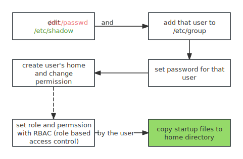

Linux is a multi-user system. Every user has a unique id, called UID. Every operation is around this UID. You can use `getpwuid()` system call to get username and home directory.

## /etc/passwd
`/etc/passwd` stores users information, the password is no longer actually stored in the passwd file, but rather in the shadow file called `/etc/shadow`. `/etc/passwd` has 7 fields for each user:
1. username
2. placeholder for password (just `x` or `*`)
3. UID (user ID)
4. GID (primary group ID)
5. optional info (full name, telephone)
6. home directory
7. login shell
```bash
# get username and login shell
awk -F: '{print $1,$7}' /etc/passwd
```


>[!note]
>An x in the second passwd file field indicates that the encrypted password is stored in the shadow file (which should be configured on your system). An asterisk (*) indicates that the user cannot log in.
>If this password field is blank (that is, you see two colons in a row, like ::), no password is required to log in.

username must be unique and is limited to 32 characters. It can never contain colons or newlines, because these characters are used  as field separators and entry separators in the passwd file, respectively. we recommend sticking with alphanumeric characters for logins, using lower case, and starting login names with a letter.

there are ways to add users on a system without explicitly including them in the passwd file; for example, adding users from a network server using something like NIS (Network Information Service) or LDAP (Lightweight Directory Access Protocol) was once common.

## Special Users
You’ll find a few special users in /etc/passwd. The superuser (root) always has UID 0 and GID 0, as in Listing 7-1. Some users, such as daemon, have no login privileges. The nobody user is an underprivileged user; some processes run as nobody because it cannot (normally) write to anything on the system. 
Users that cannot log in are called pseudo-users. Although they can’t log in, the system can start processes with their user IDs. Pseudo-users such as nobody are usually created for security reasons.
Again, these are all user-space conventions. These users have no special meaning to the kernel; the only user ID that means anything special to the kernel is the superuser’s, 0. It’s possible to give the nobody user access to everything on the system just as you would with any other user.

## /etc/shadow
The shadow password file (/etc/shadow) on a Linux system normally contains user authentication information, including the encrypted passwords and password expiration information that correspond to the users in /etc/passwd.

## /etc/group
Groups in Unix offer a way to share files among certain users. The idea is that you can set read or write permission bits for a particular group, excluding everyone else. The /etc/group file defines the group IDs.
```bash
root:*:0:juser
daemon:*:1:
bin:*:2:
sys:*:3:
adm:*:4:
disk:*:6:juser,beazley
nogroup:*:65534:
user:*:1000:
```
1. The group name
2. The group password  Unix group passwords are hardly ever used, nor should you use them (a good alternative in most cases is sudo). Use * or any other default value. An x here means that there’s a corresponding entry in /etc/gshadow, and this is also nearly always a disabled password, denoted with a * or !.
3. The group ID (a number)  The GID must be unique within the group file. This number goes into a user’s group field in that user’s /etc/passwd entry.
4. An optional list of users that belong to the group  In addition to the users listed here, users with the corresponding group ID in their passwd file entries also belong to the group.


## Create and Delete User (Hard Way, manual)



1. create a user called mike by `viwpw` command to append a line into the passwd file
   ```bash
   mike:*:1003:1003::0:0: Mike Jona, AMATH 3-27, X7919,:/home/staff/mike:/bin/bash
   ```

   In this case, we use `*` in the password field to lock the user account before setting a password

2. use `vigr` to edit `/etc/group`, insert a new line and append this user into any groups that contains him

   ```bash
   mike:x:1003:
   ```

3. set a password for the user with `password mike`

4. create the home directory and create `.bashrc` and `.profile`

5. change the permission of the home `chown -R mike:mike ~mike`

> [!note]
>
> Sample startup files are traditionally kept in `/etc/skel`. If you customize your sys-
> tems’ startup file examples, `/usr/local/etc/skel` is a reasonable place to put the
> modified copies.

## Create and Delete User (Easy Way, scripts)

| distro        | command                         | configuration files                      |
| ------------- | ------------------------------- | ---------------------------------------- |
| all distros   | `useradd`, `usermod`, `userdel` | `/etc/login.defs` `/etc/default/useradd` |
| Debian/Ubuntu | `adduser`, `deluser`            | `/etc/adduser.conf` `/etc/deluser/conf`  |

* `/etc/login.defs` addresses issues such as password aging, choice of encryption algorithms, location of mail spool files, and the preferred ranges of UIDs and GIDs. You maintain the login.defs file by hand. 
* `/etc/default/useradd` stores **the location of home directories** and **the default shell** for new users. 
  * You can directly modify this file to change the value
  * Or you can use `useradd -D -s /bin/bash` to change the default value, `useradd -D` will show all the default value

By default, `useradd` uses `SHA-512` algorithm, and copies all startup files in `/etc/skel` to that home folder.

1. create a user with home directory

   ```bash
   useradd -m mike
   passwd mike
   ```

2. create a user with additional group using `-G` and additional info using `-c`

   ```bash
   useradd -m -c "Mike John" -G staff -s /bin/zsh mike
   ```

3. delete a user along with the home directory and mail spool:

   ```bash
   userdel --remove mike
   ```


## Change User Password

1. change the current user's password interactively
   ```bash
   passwd
   ```

2. Change the password of a specific user:
   ```bash
   passwd username
   passwd -e john.doe # expire the password and force the user to change upon next login
   passwd -l john.doe # lock the user's account
   passwd -u john.doe # unlock the user's account
   ```

3. Get the current status of the user:
   ```bash
   passwd -S
   ```

4. directly change the password file and shadow file respectively

   ```bash
   vipw 
   vipw -s
   ```

> [!important]
>
> we can employ password restriction and new authentication algorithm using PAM, you can check more on - [ ] Authentication

## Change User Additional Information (GECOS)

1. Update a user's "Name" field in the output of `finger`:
   ```bash
   chfn -f new_display_name username
   ```

2. update a user's office and home phone number, respectively
   ```bash
   chfn -p new_office_telephone_number username
   chfn -h new_home_telephone_number username
   ```

> [!tip]
>
> information is stored in the `/etc/passwd` file, and is displayed by the finger program. `finger` will display: your real name, your work room and office phone, and your home phone.       

## Change User Login Shell
1. Set a specific login shell for the current user 
   ```bash
   chsh -s $(which zsh)			
   ```
2. Set a login shell for a specific user:
   ```bash
   chsh -s path/to/shell username
   ```

## Modify User

1. Change a username(login name):
   ```bash
   sudo usermod --login new_username username
   ```

2. Change a user home directory:
   ```bash
   usermod --move-home --home path/to/new_home username
   ```

3. Change a user ID:
   ```bash
   usermod --uid id username
   ```

## Manipulate Groups

1. create a new group

   ```bash
   groupadd group_name
   ```

2. add existing user to one or more groups (mind the lack of whitespace):

   ```bash
   usermod -aG group1,group2,... user
   ```

3. delete an existing group

   ```bash
   groupdel group_name
   ```
