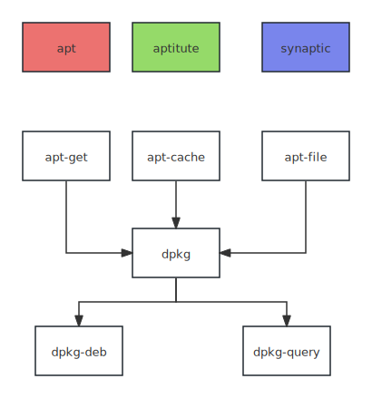

## overview
There are two kinds of tools to manage packages. One is an high-level package called `apt-*`, another is called `dpkg`.
The relations are like this:

`apt`, `aptitude` and `synaptic` is a command line, text-based interface, and graphical interface, respectively.

1. `apt-get` for downloading and removing packages
2. `apt-cache` for searching package and query package info
3. `apt-file` for searching files contained in which package
4. `dpkg-*` handle installed packages
5. `dpkg-deb` for building packages and installing local packages
6. `dpkg-query` for querying local packages files

## repository

There are two kinds of packages, one is source package, another is binary package. We mainly use the latter form. The file `/etc/apt/sources.list` will list the different repositories that publish Debian packages. APT will import the list of packages published by each of these sources. This operation involves several steps:

1. download `InRelease` or (`Release` and `Release.gpg`) that contains the hash of all package-list file and a signature with it. 
2. download `Packages.xz` or `Packages.gz` that contain a list of package location.
3. download `Sources.xz` in case of a repository or source of source packages
4. when you download a package, It checks if the required dependencies are already installed or need to be downloaded. Dependencies information can be found in `Packages.xz`.
5. after downloading, it verifies the integrity of the downloaded packages using cryptographic signatures.


## `sources.list` file structure

Each line in this file represents a repository and is made of at least three parts separated by spaces.

```bash
deb url distribution [component1] [component2] [...]
deb-src url distribution [component1] [component2] [...]
```

The URL can start with `file://`  or `http://` or `ftp://`. 

The distribution field is the code name.

The component filed is just a directory. It aims to categorize packages into different folders. So you can enable it or disable it by appending component names. Debian has three components: `main`, `contrib`, and `non-free`.

1. `main` folder contains open source packages
2. `non-free` contains proprietary packages
3. `contrib` contains open source packages rely on proprietary components

> [!note]
>
> In a simplest case that you don't have a directory under that URL, you can just like Typora, that use a single `./` to indicate the absence of a directory. 
>
> ```bash
> deb https://typora.io/linux ./
> ```

### bookworm stable example

```bash
deb https://mirrors.tuna.tsinghua.edu.cn/debian/ bookworm main contrib
deb-src https://mirrors.tuna.tsinghua.edu.cn/debian/ bookworm main contrib

deb https://mirrors.tuna.tsinghua.edu.cn/debian/ bookworm-updates main contrib
deb-src https://mirrors.tuna.tsinghua.edu.cn/debian/ bookworm-updates main contrib

deb https://mirrors.tuna.tsinghua.edu.cn/debian/ bookworm-backports main contrib
deb-src https://mirrors.tuna.tsinghua.edu.cn/debian/ bookworm-backports main contrib

deb https://security.debian.org/debian-security bookworm-security main contrib
deb-src https://security.debian.org/debian-security bookworm-security main contrib
```

### stable backports

When the distribution becomes a little dated, numerous projects released new versions that are not integrated into the current stable suite. Package maintainers sometimes voluntarily offer recompilations of recent applications for Stable. 

This repository is indicated by code-backports, like `bookworm-backports` above. You have to explicitly install backports applications:

```bash
sudo apt-get install package/bookworm-backports
sudo apt-get install -t bookworm-backports package
```

## Adding a third-party repository

APT needs a set of trusted GnuPg public keys to verify signatures in the `InRelease` or`Release.gpg`. It gets from `/etc/apt/trusted.gpg.d` and from `/etc/apt/trusted.gpg` keyring (managed by the `apt-key` command).

The official Debian keys are already provided. When a third-party repository is added to the sources. APT needs to be told to trust its public key. The general steps are:

1. add the public key which ends with `.asc` into the `/etc/apt/trusted.gpg/.d`

2. add the repository

   1. ```bash
      sudo add-apt-repository 'deb https://typora.io/linux ./'
      ```

   2. ```bash
      sudo curl -fsSL https://download.docker.com/linux/ubuntu/gpg -o /etc/apt/keyrings/docker.asc
      sudo chmod a+r /etc/apt/keyrings/docker.asc
      ```

3. update the index


## common operations using apt
1. search a package depending on a specific file like `bin/vim`
   ```bash
   sudo apt-file update # update the database
   sudo apt-file search bin/vim
   ```
2. sync the package list and upgrade all installed packages
   ```bash
   sudo apt-get update & apt-get upgrade
   ```
3. install one or more package, `vim`, `gcc`

   ```bash
   sudo apt-get install vim gcc
   sudo apt-get install --reinstall vim # repair corrupted package
   ```
4. remove a package without or with deleting configuration files 
   ```bash
   sudo apt-get remove vim
   sudo apt-get purge vim # delete conf files
   ```

5. search package names and description based on regex

   ```bash
   sudo apt-cache search regex
   sudo apt-cache search '^python3$'
   ```

6. display the package information (including dependencies) for each specified package
   ```bash
   sudo apt-cache show vim gcc
   ```

### dpkg operation on local installed packages

1. list all installed packages

   ```bash
   dpkg -l
   dpkg -l | grep -i http
   ```

2. list all files of an installed packages

   ```bash
   dpkg -L package-name
   ```

3. status and information about a package (installed) and its dependencies
   ```bash
   dpkg -s vim
   ```

4. search a existing file belongs to which package, for example, bin/vim
   ```bash
   dpkg -S bin/vim
   dpkg --search bin/vim
   ```

## System upgrade

For important upgrades, such as the change from one major Debian version to the next, you need to use 

```bash
sudo apt full-upgrade
# or
sudo apt-get dist-upgrade
```

This instruction will remove some obsolete packages.

## Files

`Contents-arch.xz` contain information about all the files shipped with each package

> [!tip]
>
> since `apt-file update` need to run as much as `apt-update`. It is recommend to do it on a weekly basis.
> ```bash
> @weekly root test -x /usr/bin/apt-file && /usr/bin/apt-file update >> /dev/null 2>&1
> ```

`/var/lib/apt/lists`: a copy of available packages used by `apt list`

`/var/cache/apt/archives/`: a cache of already downloaded packages


## Special Notes for Ubuntu

You can add a PPA to your ubuntu.

```bash
sudo apt-add-repository ppa:ansible/ansible
```

It just like adding a third-party repository, but this can be used only on Ubuntu-based system.
