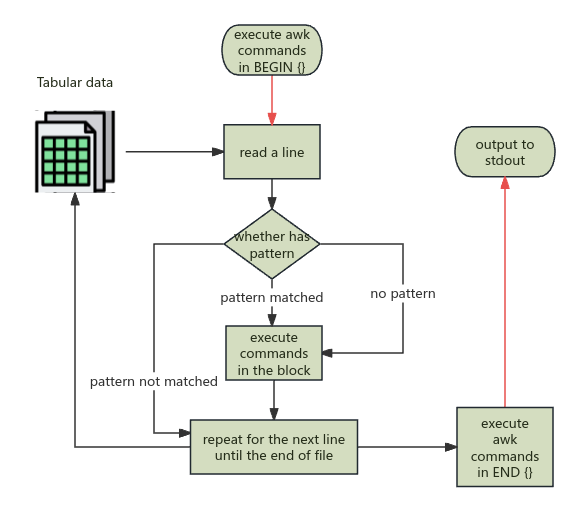

## Intro

Awk is good at processing record or tabular data, that is, when each line (record) contains multiple fields separated by a delimiter, like csv file.

## Syntax

```bash
awk -Fs '/pattern/ {action}' input-file
awk -Fs '{action}' intput-file
awk -f script input-file
```

* -F is the field separator. If you don't specify, it will use an
  empty space as field delimiter.
* The `/pattern/` and the `{action}` should be enclosed inside
  single quotes. pattern is optional, if not provided, it will process all the records (lines). If a pattern specified, only matched records will be process. Surely, awk process applies actions one at a time just like sed.

## Program Structure

Since Awk is really an advanced language, we normally write awk scripts.  An awk program consists of:

* an optional BEGIN segment for setting some variables or execute something prior to the input
* pattern - action pairs (one or more pairs)
* An optional END segment for processing after end of input data.

```awk
BEGIN {
	action
}

[pattern] {
	action
}

[pattern] {
	action
}

END {
	action
}
```

## A simple example

Let's imagine we have a file called `emp.data` that contains three fields: name, pay rate in dollars per hour, and number of hours worked.

```txt
Beth    21      0
Dan     19      0
Kathy   15.50   10
Mark    25      20
Mary    22.50   22
Susie   17      18
```

Now you want to print the name and pay (rate times hour) for everyone who worked more than zero hours. This can be easily done with awk:

```awk
awk '$3 >0 { print $1, $2 * $3}' emp.data
```

`$3 > 0` is the pattern, it tries match the lines that satisfy this condition, then execute the action in the curly braces. `$1, $2, $3` are variables represents the 1st, 2nd, 3rd field in current line respectively.

To print out those employees that work 0 hours, try this:

```awk
awk '$1 == 0 { print $1 }' emp.data
```

> [!important]
>
> If there is an action with no pattern, for example `{print $1}`, it will print the first field for every input line.

## Execution flow

Let's wrap up how awk works.



## Variables

$0 refers to the entire line. $1, $2, $3, ... refer to 1st, 2nd, 3rd field and so on.

There are other built-in variables:

| name | default value | usage |
| ---- | ------------- | ----- |
| FS   | space         |       |
|      |               |       |
|      |               |       |

You can also define you own variables. We can use variables to 

## Functions

As we alluded before, `print $1, $2` uses `print` function. Parameters separated by a semicolon `,`. We can also print out strings, `print "the first field is ", $1, "the second is ", $2`.

For a more advanced printing, use `printf(format, value1, value)`, the usage is almost identical to the c function `printf`. For example, `{ printf("total pay for %s is $%.2f\n", $1, $2 * $3) }` or `printf "1st field is %s\n", $1`.


## Script Examples
* if else
  ```awk
  {
      # all 2 years to the age
      age = $2
      age += 2
      if (age > 30) {
          print "great"
      } else {
          print $1,$2
      }
  }
  ```

* check current user's login shell

  ```bash
  grep $USER /etc/passwd | awk -F: '{print $NF}'
  ```


## Debugging

You can omit the input files from the command line and just type `awk {action}`, in this case awk will apply the program to the standard input. You can type one record to test out the results.

```bash
awk '$3 == 0 { print $1 }'
Beth 21 0
Beth
# ctrl + d to end the input
```


