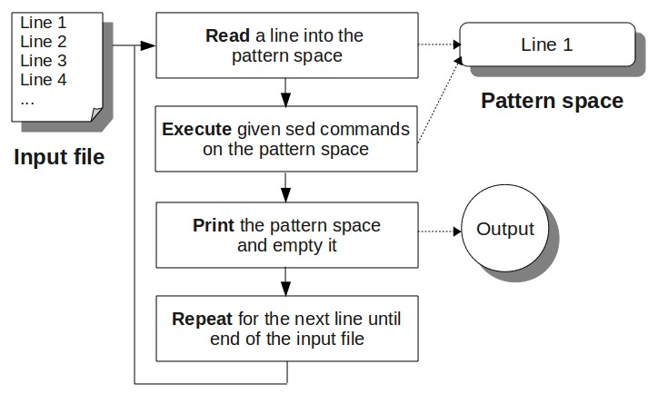

## Intro

Sed stands for Stream Editor, sed process one line at a line just like grep. It is a powerful tool to manipulate, filter, and transform a bunch of lines.

## Syntax

```bash
sed [options] {sed-commands} {input-file...} # simple use
sed -f scriptfile.sed inputfile1 inputfile2 # write sed scripts
sed [-e] 'instruction' file
sed -e 'instruction1' -e 'instruction2' file # multiple commands
```

Sed read one line at a time from the input file or standard input, and execute the commands on that particular line.  So it read the 1st line and execute the commands on 1st line, then read the 2nd line and execute the commands on 2nd line.

### A Simple Example

This simple sed example prints all the lines from the /etc/passwd file.

```bash
sed -n 'p' /etc/passwd
```

> [!NOte]
>
> Note that in this case, `{sed-commands}` is a single command, or it could be multiple commands.  
>
> You can also combine commands in a file and call the script use the `-f` option as shown above.

## Execution Flow

A single sed command can further be divided into `[address[, address]][!]command`.

Addresses are actually the pattern *sed* tries to match with the line. sed copies each input line into a pattern space: 

1. If no address is provided, *sed* execute the command on it as it enters *pattern space*
2. If the address of the command matches the line in the *pattern space*, the command is applied
3. If a command changes the line in *pattern space*, **subsequent** commands operate on the modified line
4. When all commands have been read, the line in **pattern space** is written to stdout and a new line is read into **pattern space**

Let's wrap up with a flowchart:



## Addressing

An address can be a line number or a Regex pattern, patterns should be enclosed in `/pattern/`. We can use `$` to refer the last line, because it's unpredictable.  

Most commands will accept two addresses:

1. If only one address is given, the command operates on that line or that matched line (using pattern)
2. If two comma separated addresses are given, the command operates on a range of matched lines, inclusively
3. The `!` operator can be used to negate an address, or a range.

### Addressing Examples

* `d` delete all line
* `6d` delete line 6
* `/^$/d` deletes all blank lines
* `/^[[:space:]]*$/d` delete all blank lines (include explicit blank space)
* `1,10d` delete lines 1 through 10
* `/^$/,$d` deletes from the first blank line through the last line of the file
* `/^ya*y/,/[0-9]$/d`  deletes from the first line that begins with yay, yaay, yaaay, etc. through the first line that ends with a digit

## Common Commands

* **s/pattern/replacement/[flags]:** Substitute `pattern` with `replacement` globally on each line.

  ```bash
  sed -i 's/main/second/g' a.txt# convert all main occurences
  sed -i 's/main/second/' b.txt # replace the first occurence
  
  ```

  > [!note]
  >
  > Note that when using substitute, we often have `-i` option to modify the file in place.

* **d:** Delete the line.

* **p:** Print the line.

  ```bash
  sed -n '1,5p' a.txt # print out only 1-5 line
  # print out the whole line except the 1st and 2nd line
  sed -n '3,$p' a.txt
  # Print the line matching "Jason" and 2 lines immediately after that
  sed -n '/Jason/,+2 p' employee.txt
  # filter lines with gtk and 1 line after it
  sudo apt search vim | sed -n '/gtk/,+1p'
  ```

  > [!note]
  >
  > Note that by default, `sed` will output the matched lines to the stdout, so use `-n` to suppress it.

  > [!warning]
  >
  >  Note in the last command, we use single quotes to prevent `$` be interpreted by bash.

* **a\text:** Append `text` after the current line.

  ```bash
  sed -i 'a\text with space' a.txt # append 'text with space' after each line
  ```

* **i\text:** Insert `text` before the current line.

  ```bash
  sed -i 'i\text with space' a.txt # insert before each line
  ```
  
  > [!tip]
  >
  > To insert multiple lines at once, for example, insert two lines at the beginning
  >
  > ```bash
  > sed -i 'i\
  > first line\
  > second line' a.txt
  > ```
* **c\text:** Change the current line to `text`.

  ```bash
  sed -i '1c\replacement' # change the first line
  ```

* **sed 'y/char_table/mapping_table/' **: translate old_table into new mapping table

  ```bash
  # lowercase all the characters
  sed 'y/ABCDEFGHIJKLMNOPQRSTUVWXYZabcdefghijklmnopqrstuvwxyz/abcdefghijklmnopqrstuvwxyzABCDEFGHIJKLMNOPQRSTUVWXYZ/' file.txt
  # tranlsate characters into symbols
  sed 'y/aeiou/12345/' file.txt
  ```

  > [!note]
  >
  > Note that this mode is like `tr` command, the replacing text must have the same length of the old one. That's why we call it a mapping table.

* **q** : quit the `sed`: this is usually when have multiple commands

## Scripts

A sed script typically consists of one or more sed commands, each on a separate line.  Comments can be added using the `#` character.

> [!important]
>
> If you wanna apply a bunch of commands on a range of lines, use the curly braces to wrap the commands
>
> ```bash
> 1,5{
>     s/old/new/g
>     s/bad/good/g
> }
> ```

### Example

1. replace multiple words

   ```bash
   # replace_words.sed  replace "old" with "new" and "bad" with "good"
   s/old/new/g
   s/bad/good/g
   ```

   To use it, run `sed -f replace_words.sed my_file.txt`

2. reduce multiple blank lines to one; version using d command

   ```bash
   /^$/{
   N
   /^\n$/d
   }
   ```

   > [!important]
   >
   > In this case, `N` will first append the newline `\n`, and read the next line into the pattern space. Now it's a multi-line space, inside this curly brace, `^` matches the first characters, `$` matches the last characters of the pattern space.
   >
   > Note that when `N` read the next line, next line doesn't go through the new cycle, because it's been processed in the current cycle. The second line below will be processed in a new cycle.

   