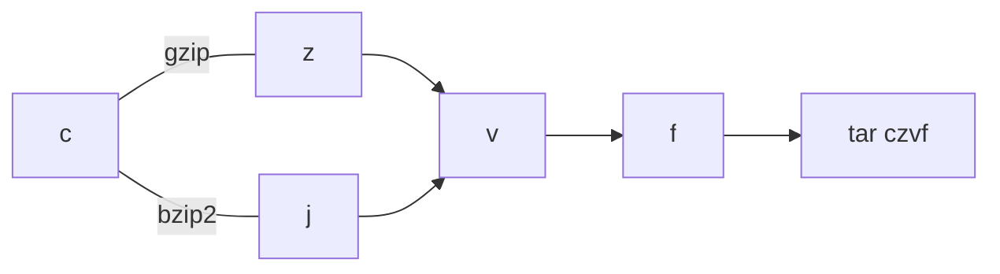

Tar is an archive utility. We often see names end with `.tar` or `.tgz`, which indicate a "plain" tar archive or a gzipped archive, respectively.

## Usage

The command syntax works like this:

```bash
tar mode[options] pathname
```
`tar` has both modes and modifiers. You can have one mode and multiple modifiers. Here are the common mode:
- **`c`:** Create a new archive
- **`x`:** Extract files from an archive
- **`t`:** List the contents of an archive without extracting
- **`u`:** Update an existing archive by adding or replacing files
**Modifiers** are used to modify the behavior of the `tar` command. Here are some common modifiers:
- **`v`:** Verbose output, showing progress and file names
- **`f`:** Specify the archive file name, if not, use the standard input
- **`z`:** Use gzip compression, `.tgz` extension
- **`j`:** Use bzip2 compression, `.bz` extension
- **`xz`:** Use xz compression

To remember this strangle style, first specify the mode and then whether use compression or not, then `f` option, and finally `v` option.




## archive some files

```bash
tar czvf test.tgz some-dir # relative path
tar czvf test.tgz -C some-dir sub-dir # remove unnecessary path
tar czvf test.tgz /tmp/some-dir # absolute path
```

> [!NOTE]
>
> Note that when you provide files, you can use relative path or absolute path, tar will store it as relative path or absolute path respectively. So if you are distributing softwares, use relative path. For archiving home directories or other directories, use absolute path.

> [!TIP]
>
> Note that we usually wrap our files in a directory, so at the time of extracting, it won't pollute our directories.  
>
> If you don't provide `-C` option, it will use current directory as the starting point of the relative path, so you might use `-C` to remove unnecessary path. For example, by using `-C dir1` to change path from `dir1/dir2/dir3` to `dir2/dir3`.


## extract an archive

```bash
tar xzvf test.tgz # extract to the current directory
tar xzvf test.tgz -C /opt # extract to the desired directory
```


## view the content of an archive

```bash
tar tf test.tgz # basic info like ls
tar tvf test.tgz # show permission and mod time like ls -l
```

​	

