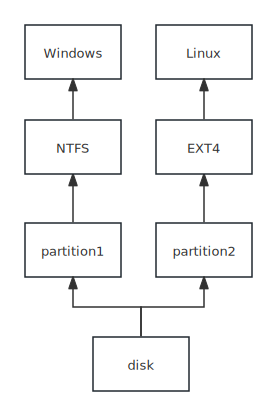
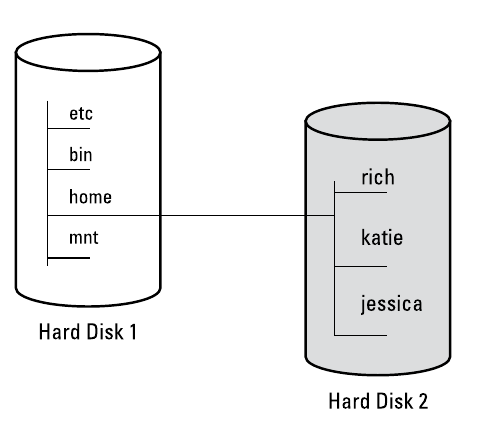
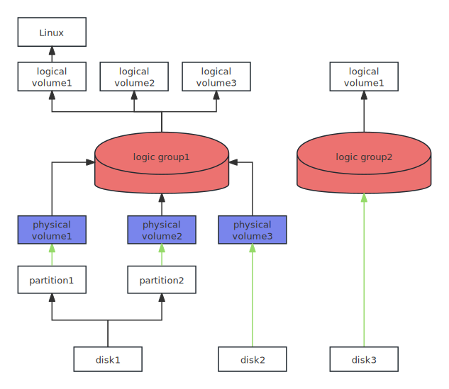
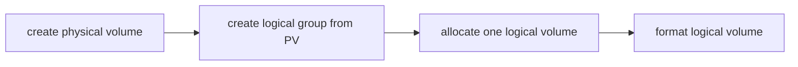

## Workflow


## Show Disks Information
```bash
lsblk -o +MODEL,UUID # show partition UUID
lsblk -o +MODEL,SERIAL # list all disks in addition to model,serial
lsblk /dev/sda -o +MODEL,UUID # show only one disk
lsblk -o MODEL,NAME,PHY-SEC,LOG-SEC # show sector size
sudo blkid -o list # show the uuid and the mount point of a partition 
lsblk -o +LABEL # show with labels, labels stored in gpt partition
```

## Partition Disk

1. cfdisk - TUI partition tool

2. fdisk - command line partition tool
   ```bash
   sudo fdisk /dev/sda
   
   :p # print partition layout
   :g # create a gpt table first
   :n # add a new partition
   Partition number (1-128,default 1): <Return>
   First sector: <Return>
   Last sector: 50G # or 500M, or by default use all the remaining size
   :w # write to disk
   ```

   > [!tip]
   >
   > All the previous operation are carried Until we enter `w`.

3. gparted - GUI tool

4. sfdisk - for scripts to create partitions
## Format

Build a filesystem of a specified type

```bash
mkfs -L system -t ext4 /dev/sda1
mkfs -t fat32 -n data /dev/sdb1 # create fat32 format and give a label "data"
# give label to ext4
mkfs.ext4 -L my-system /dev/sdb1
# format nt		fs
mkfs.ntfs -L "MyNTFSVolume" /dev/sdb1
```

> [!note]
>
> It turns out that `mkfs` is only a frontend for a series of commands, like `mkfs.ext4`, `mkfs.msdos`. show them all with `ls -l /sbin/mkfs.*`

## Mount


The mount point for a filesystem can be any directory, but the files and subdirectories beneath
it are not accessible while a filesystem is mounted there.

1. show all mounted partitions

   ```bash
   mount
   ```

2. Mount a device to a directory

   ```bash
   mount -t filesystem /dev/sda /mnt/drive
   mount -m path/to/device_file path/to/target_directory # directory not exist
   mount -t iso9660 -o ro /dev/cdrom /cdrom # mount a cd rom readonly
   ```

3. unmount or remount 

   ```bash
   umount /dev/sdc
   ```

4. mount a iso file

   ```bash
   sudo mount -m -o loop ./Edgeless_Beta_4.1.0.iso /mnt/iso
   ```

5. mount a img file

   `.img` is a generic extension for disc images that can contain various file systems, including ISO 9660, UDF, FAT, ext4 or others

   ```bash
   sudo mount -m -o loop ./xx.img /mnt/img
   ```

### Auto Mount

To mount filesystems at boot time, we can configure it in `/etc/fstab`.

The format is below:

```bash
device/UUID	mount-point	filesystem-type options backup-option integrity-test	
```

The backup-option field is no longer relevant, it should always set to 0.

The integrity test order is whether to run `fsck` check integrity 

1. set 1 for the root filesystem. 
2. set 2 for any other locally attached file system
3. set 0 to disable the bootup check for the file system, including read-only devices, and the `proc`

Options are long options, separated by commas:

1. defaults - for most filesystems
2. errors, this is `ext2/3/4` specific parameter, the default is `errors=continue`, to let kernel mount again in read only use `errors=remount-ro`. The `errors=panic` set the kernel to halt when there's a problem 
3. noauto, set this to prevent a boot-time mount of a removable media
4. user, allows regular users to mount a filesystem
5. **nofail:** If the USB drive is not found, the system will continue to boot without mounting it.
6. **auto:** Automatically mounts the filesystem when it is connected.

After you edit the `/etc/fstab`, you can use `mount -a` to mount all devices and `systemctl daemon-reload`.

### FStab for Usb Drive

```bash
/dev/sdb1 /mnt/usb ext4 defaults,user,nofail,auto 0 0
# since defaults includes auto option
/dev/sdb1 /mnt/usb ext4 defaults,user,nofail 0 0
```

### Fstab for Swap

```bash
/path/to/swapfile none swap sw 0 0
```

### Fstab for Ntfs Drive
```bash
# ntfs-3g
UUID=xxx /mount/path ntfs defaults,user,nofail,auto 0 0
# ntfs3 new driver
UUID=xxx /mnt/ ntfs3 defaults,user,nofail,auto,uid=1000,gid=1000 0 0
```
Check more [ntfs3 option](https://docs.kernel.org/filesystems/ntfs3.html)

You can specify a swap partition or use a swap file.

mkswap

swapon

- [x] swap file ✅ 2024-11-02

## Disk Usage

1. display the partition usage containing current file

   ```bash
   df -lh . # list only current partition
   df -lh # list all partitions usage
   ```

2. find big files, list the sizes of a directory

   ```bash
   du -hd 1 # list only to sub folders, human readable
   du -hd 1 ~ | sort -hr # list home directory and sort it, descending
   du -hd 2 # list sub folder and sub sub folder, 2 depth
   du -sh # show size of a single directory
   du -sh path/to/directory
   ```

3. ncdu - text graphical disk usage analyzer 

   ```bash
   ncdu # current
   ncdu ~ # home
   ncdu --color dark # enable color
   #exclude certain files, argument can be given multiple times to add more patterns
   ncdu --exclude '*.txt' 
   ```

## Disk Checking

1. hparm
2. fsck - check disk errors
3. 

## LVM Overview

LVM is called Logical volume management. It allows us to dynamic enlarge the filesystem without actually changing the underlying disks.You don't need to enlarge a partition. You just need to add an additional disk or partition. It's another layer on top of the partition. Let's call it logic partition or logic volume. Operating systems are built on it not on partitions.

Logical volumes are just like normal disk partitions that you can put filesystem on them



## LVM Workflow



Since we can create logical group from a raw disk(without partition table) or a partition. We can omit the creation  of PV(physical volume).

```bash
vgcreate vg1 /dev/vdb # create a vg from a disk or a partition
vgcreate vg1 /dev/vdb /dev/sdc1 # create from multiple disks or partitions

lvcreate -L 10G vg1 -n lv1 # create 10G logical volume named lv1
lvcreate -l 60%VG -n lv1 vg1  # use 60% space of volume group
lvcreate -l 100%FREE -n lv1 vg1 # use all remaining volume group
lvcreate --size 10g -n lv1 vg1 # use size not PEs

mkfs -L test -t ext4 /dev/mapper/vg1-lv1 # format it
mount -m /dev/mapper/vg1-lv /mnt/test # mount it
```

> [!tip]
>
> the device name of the newly created logical volume is at `/dev/[vg-name]/[lv-name]`, so in this case, vg-name is `vg1`, lv-name is `lv1`, so the location is `/dev/vg1/lv1`. It also has a shortcut called `/dev/mapper/[vg-name]-[lv-name]`, so the location is the concatenation of vg-name and lv-name, so in this case, it's `/dev/mapper/vg1-lv1`.
>
> You can also use `lvdisplay` to show the actual path of logical volumes.

## LVM Management

1. list all PV, VG, and LV

   ```bash
   pvs
   vgs
   lvs
   ```

2. show all details of PV, VG, and LV

   ```bash
   pvdisplay
   vgdisplay
   lvdisplay
   ```

### Remove a Logical Volume

To remove a logical volume, you have to umount the filesystem in it.

```bash
umount /dev/vg1-lv1 
lvremove volume_group/logical_volume # remove a logical volume

lvremove /dev/vg1 # Remove all logical volumes in a volume group:
```

### LVM Resizing Logical Volume and Filesystem

```bash
# (optional) add more physical volumes to a group
vgextend vg1 /dev/sdc1
```

To enlarge your filesystem, you have to enlarge the "partition" first, in this case, it's the logical volume. And then you resize the fileystem inside it.

```bash
# use all remaining PEs (basic blocks of a volume)
lvresize -l +2602 vg1/lv1 # specify the full name, group/volume
fsadm -v resize /dev/mapper/vg1-lv1 # resize filesystem
```

Since resize volume and filesystem is so common, we can do it with one step

```bash
lvresize -r -l +100%FREE vg1/lv1
```

> [!tip]
>
> To shrink the size of a file system. Use:
>
> ```bash
> lvresize --size -120G -r volume_group/logical_volume
> ```

### Remove and Rename a Volume Group

To remove a volume group, ensure all logical volumes have been umounted.

```bash
vgremove volume_group

# rename
vgrename VG VG_new
# confirm the result
vgs
```

## LVM Implementation

## Raid
create raid using `mdadm`
