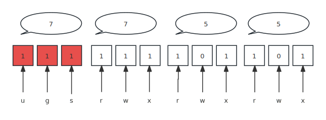

## File Type
In Linux, there are seven types of files.
• **-** - Regular files
• **d** - Directories
• **c** - Character device files
• **b**- Block device files
• **s** - Local domain sockets
• **p** - Named pipes (FIFOs)
• **l** - Symbolic links
1. You can determine the file type using `file /bin/sh`. It can also show you the format of the file like an executable or a text file
2. You can also use `ls -ld` to show the file type, note that only the first character in the first column that tells its type. The corresponding character is listed above in bold.

### Hard Link
A hard link is just a manually created entry in a directory to an inode that already exists. The `ln` command (without the -s option) allows you to create new hard links manually.
```bash
ln oldfile newfile
```
Hard link is a great way to create backup. Since old files has been deleted, the references to the actual inodes still exist. Sometimes we call removing a file **unlinking**. Because we only delete the directory entry and subtract a inode link count.

> [!note]
>
> Note that we normally create hard links to regular files not directories.

### Soft Link (Symbolic Link)
A symbolic link is a file that points to another file or a directory, effectively creating an alias (like a shortcut in Windows). For example, we may put the program in some directory like `/opt/some-program`, and then we create a symbolic link to that executable in `/opt/some-program`, this way we don't need to modifty the PATH variable.
An another use case is to use symbolic links to allow multiple versions coexist. For example, you might have `python-3.11`, we use `python` pointed to this file, when we install another version `python-3.12`, we can use `python` pointed to this version. 
```bash
ln -s target linkname
ln -sf /path/to/new_file path/to/symlink # overwrite exsiting symlink

# create a shortcut to a directory
ln -s target-dir shorcut-dir
unlink linkname # remove the link, rm is also ok
```
>[!note]
>The file permissions that ls shows for a symbolic link, `lrwxrwxrwx` , are dummy values. Permission to create, remove, or follow the link is controlled by the containing directory, whereas read, write, and execute permission on the link target are granted by the target’s own permissions. Therefore, symbolic links do not need (and do not have) any permission information of their own.

### Character device
**A character device** is a type of special file that represents a device that communicates with the operating system one character at a time. Common examples of character devices include:
- **Keyboard:** Each keystroke is a single character. `/dev/tty`
- **Serial port:** Data is transmitted one character at a time. `/dev/ttyS0`
- **Terminal:** Input and output are handled character by character. `/dev/tty`
- **Modem:** Data is received and transmitted in character-based protocols.
### Block device
**Block devices** are a type of special file that represents a storage device that transfers data in fixed-size blocks. It could be:
* hard disk `/dev/sda` `/dev/sdb`
* Solid-state drives (SSDs) `/dev/nvme0n1`


## File modes

Every file has a set of nine permission bits that control who can read, write, and execute the contents of the
file. With three extra bits to control additional behaviors. In total, we have 12 bits to control the file modes.

These 12 bits represent a bit mask, but we don't specify 12 bits to change modes, it's just like netmask, in that case, we use decimal. In this case, we use one octal number to represent 3 bits. So in total, we use 4 octal numbers to designate file modes.

| Bitmask (three bits) | octal value |
| -------------------- | ----------- |
| 000                  | 0           |
| 001                  | 1           |
| 010                  | 2           |
| 011                  | 3           |
| 100                  | 4           |
| 101                  | 5           |
| 110                  | 6           |
| 111                  | 7           |



In this graph, we know first octal assign the setuid, setgid, sticky bit.

* setuid**(u)**, when this bit is set, it changes the effective UID of the resulting process to the UID of the file containing the program image rather than the UID of the user that ran the command. For example, `/etc/passwd` can only be modified by root, but `passwd` program's uid is set, so when we as a normal user run it, we run it as if we're the root, in turn, we change the read-only file `/etc/passwd`.
* setgid**(g)**, when this bit set on a directory, every file created in this directory, its group belongs to the directory's group. Not user's primary group. In other words, its effective GID is the directory's GID.
* sticky bit**(s)**, when it is set on a directory, only the file's owner, the directory's owner, or [root user](https://en.wikipedia.org/wiki/Superuser) can rename or delete the file.. It is normally set on a public directory like `/share`


## Change file modes

As alluded before, we can use four or three octals to represent the file modes. The first octal means setuid, setgid, and sticky bit. The other octals represent owner, group and other respectively.

1. change the file mode to a directory (rwx, r-x, r-x) with sticky bit

   ```bash
   chmod 1755 dir
   ```

2. change the file mode to gives all permissions to the user (owner) and execute-only permission to everyone else (ignoring special bits)

   ```bash
   chmod 711 myprog
   ```

3. recursively update the file permission within a directory
   ```bash
   chmod -R 755 mydir
   ```

There's also a mnemonic syntax that you combine a set of targets (`u, g, or o` for user, group, other, or `a` for all three) with an operator (+, -, = to add, remove, or set) and a set of permissions. 

1. add write permission for the owner of the file

   ```bash
   chmod o+w file
   ```

2. Gives r/w permission to owner and group, and read permission to others
   ```bash
   chmod ug=rw,o=r file
   ```

3. add or remove executable permission to all 

   ```bash
   chmod a+x prog
   chmod a-x prog
   ```

4. Makes setuid/setgid and gives r/x permission to only owner and group, other no permission
   ```bash
   chmod ug=srx,o= prog
   ```

5. Makes the group permissions be the same as the owner permissions

   ```bash
   chmod g=u file
   ```

   


## change file owner or group

The `chown` command changes a file’s ownership, and the `chgrp` command changes
its group ownership. 

1. reset the owner and group of files restored from a backup file for matt
   ```bash
   sudo chown -R matt ~matt/restore
   ```

2. `chown` can change both the owner and group of a file at once

   ```bash
   sudo chown -R matt:staff ~matt/restore
   sudo chown -R :staff ~matt/restore # change only the group
   ```

3. change the group
   ```bash
   chgrp -R staff ~matt/restore
   ```

### Group manipulation

1. creating a new group admin
   ```bash
   groupadd admin
   ```

2. Add a user to the named group:
   ```bash
   sudo usermod -aG group1,group2 user1 user2 user3
   sudo gpasswd -a user1 group_name
   ```

3. set the member  of a group

   ```bash
   sudo gpasswd -M user1,user2 group
   ```

4. remove a user from a group

   ```bash
   gpasswd -d user group
   ```

5. check all members of a group

   ```bash
   groups [username]
   ```

## default file modes

`umask` is the reversed bitmask for file modes. So when a new file is created, the actual permission bits is getting from the default mode minus umask. 

1. 777 is the default mode for directories (777 is the octal number for granting all permissions for user, group, and other with directories)
2. 666 is the the default mode for files

By default, umask is `022`, so the actual mode is `755` for directories, and `644` for files

## ACL

ACL gives you finer control over files. See More.					


