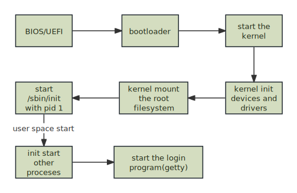

## Shell and Help
We mainly use command line to manage Linux. We first need to understand How Bash works. 
1. [Bash](Bash.md)
2. [Bash-Scripts](Bash-Scripts.md)
3. [Bash-configuration](Bash-configuration.md)
4. [Zsh](Zsh.md)

After familiarizing with Bash, and since there are numerous commands out there. In Linux, we have manuals to reference those commands. There are two types of manuals, one is called man, another is called info.
[Man Tutorial](Man%20Tutorial.md)

Each Linux vendors has their own documentation.
1. [The Debian Administrator's Handbook](https://debian-handbook.info/browse/stable/)
2. [Ubuntu Server documentation](https://ubuntu.com/server/docs)
3. [RHEL](https://docs.redhat.com/en/documentation/red_hat_enterprise_linux/)
4. [Arch Wiki](https://wiki.archlinux.org/title/Main_page)

You can also find out books related to Linux on [O'Reilly](https://www.amazon.com/stores/page/A2798F2E-D247-4F52-A80C-D695D9792A74?ingress=6&visitId=5ea8f5b4-4a7d-4296-9be2-f937a8285bf0&store_ref=storeRecs_dp_aplus), [No Starch Press](https://nostarch.com/catalog/linux-bsd-unix), [Manning](https://www.manning.com/catalog), [Wiley](https://www.wiley.com/en-sg/search?pq=linux) or [Apress](https://www.apress.com/gp/open-source) or  [Addison-Wesley](https://www.oreilly.com/publisher/addison-wesley-professional/?page=1&sort=publication_date)

## Bootstrapping
A simplified view of the boot process looks like this:

  
[BIOS and UEFI](BIOS%20and%20UEFI.md)

In Linux, we exclusively use `Grub2` as our bootloader. The bootloader normally can recognize some file system. As for Grub, it can recognize *ext4*, so we can put kernel images in `ext4` format file system.  
As for init process, systemd becomes the new init replant the old Sysinit. 
[Grub](Grub.md)
[init-system](init-system.md)
[Systemd](Systemd.md)

## Disk and FileSystem
[Disk-and-FileSystem](Disk-and-FileSystem.md)
- [x] network file system ✅ 2024-11-02
- [x] network storage, NFS, SMB ✅ 2024-11-02
[samba](samba.md) 
## Access Control
[super-user](super-user.md)
[user-management](user-management.md)  
[file-type-and-file-mode](file-type-and-file-mode.md)
## Process, Scheduling, and Monitoring
[process](process.md)
[scheduling](scheduling.md)
- [x] monitoring system ✅ 2024-11-02
[monitoring-sytem.md](monitoring-sytem.md.md) 
- [x] mange machine states ✅ 2024-11-02
## Logging
[Logging](Logging.md)

## Common Commands

| command                                                    | usage                         |
| ---------------------------------------------------------- | ----------------------------- |
| [grep](../commands/grep.md)                                | filter lines                  |
| [awk](../commands/awk.md)                                  | handle table data             |
| [sed](../commands/sed.md)                                  | handle lines,insert or delete |
| [tar](../commands/tar.md)                                  | archive, uncompress           |
| [strace](../commands/strace.md)                            | find sytem calls of a process |
| [curl](../commands/curl.md)                                | get http response             |
| [wget](../commands/wget.md), [aria2](../commands/aria2.md) | download utility              |
| [nmap](../commands/nmap.md)                                | scan ports                    |
|                                                            |                               |
|                                                            |                               |

## Software Installation
[software-installation](software-installation.md)  
[apt package system](apt%20package%20system.md)
- [x] rpm package system ✅ 2024-11-02
[arch package system](../../1a-linux-desktop/arch%20package%20system.md)
## Networking
[networking](networking.md)
[wifi-bluetooth](wifi-bluetooth.md)
[DNS in a nutshell](DNS%20in%20a%20nutshell.md)
[SSH](SSH.md)

## Virtualization
[kvm](kvm.md)
[docker in a nutshell](../virtualization/docker%20in%20a%20nutshell.md)
[docker](../virtualization/docker.md)
[docker-images](../virtualization/docker-images.md)
