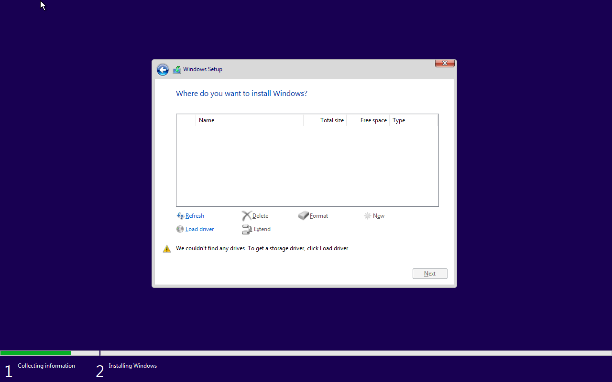

## Install KVM

## Create a Shared Folder
We can use cockpit to create a shared folder.
1. navigate to guest page and find "shared directories" section

2. click add shared folder (note that it can only be added when the guest is off)

we provide the source path and mount tag.
3. in the guest, we edit the `/etc/fstab`
```bash
share /mnt/share virtiofs defaults 0 0
```
4. create the mount point and mount it 
```bash
mkdir /mnt/share
mount -a
systemctl daemon-reload
```

## Cockpit Issues
### Session Timeouts
Cockpit will automatically log you out of your current session after 15 minutes of inactivity. You can configure the timeout, in **minutes**, in `/etc/cockpit/cockpit.conf` `/etc/cockpit/cockpit.conf` change:
```bash
[Session]
IdleTimeout=0
```
```bash
sudo systemctl restart cockpit
```

## Virt Manager Big Icons on KDE

The problem according to this [bug](https://bugzilla.redhat.com/show_bug.cgi?id=1208662), because that KDE Plasma themes provide 22x22 icons, but Gtk is looking for 24x24. When it can't find a 24x24 icon, it moves up to the next size that is available.
In this case, the big icon name is `/usr/share/icons/breeze/status/64/dialog-information.svg`.
The workaround is in `/usr/share/icons/breeze/index.theme` 
```bash
# change the following line
[status/64]
MinSize=23
```

## Share Clipboard
You should use spice as our display server, not vnc.
As for guest machines, you should install `spice-vdagent`
1. Linux Guest, install `spice-vdagent`
2. Windows Guest, install [here](https://www.spice-space.org/download/windows/spice-guest-tools/spice-guest-tools-latest.exe)
Normally, linux guest has this package installed by default during installation.

## Shared Folder
Add a filesystem hardware into the guest
For Linux, mount with `virtifs`

For Windows, download the driver for disk, [here](https://fedorapeople.org/groups/virt/virtio-win/direct-downloads/latest-virtio/virtio-win.iso)
More info can be found [here](https://forum.manjaro.org/t/how-to-setting-up-shared-folders-auto-resize-vm-and-clipboard-share-with-virt-manger/127490)

## KVM Windows Installation
You might wanna use virtio to improve performance of Windows Guest. However, windows doesn't support virtio natively like Linux. So additional drivers are required.
You can download the ISO [here](https://fedorapeople.org/groups/virt/virtio-win/direct-downloads/stable-virtio/virtio-win.iso), which includes a list of virtio drivers, like disk drivers, network drivers, spice agent tools.
During the setup,
1. change the disk type from sata to virtio
2. change NIC to virtio
3. load this particular ISO

During installation, you might find that there's no disk available like this:

So you need to load the disk driver called **viostor**, you might choose `w10` for Windows 10, or `2k16` for Windows Server 2016. After loading the driver, the disk show up.

After Installation, open the `virtio-win-gt-x64` exe, it will let you choose a list of drivers to install.
To enable clipboard share, you might wanna install `virtio-win-guest-tools` to install the [QEMU Guest Agent](https://pve.proxmox.com/wiki/Qemu-guest-agent "Qemu-guest-agent") and the [SPICE](https://pve.proxmox.com/wiki/SPICE "SPICE") agent.
Finally, reboot 
After boot into the system, in virt-manager "view" menu, check auto resize with window, so the guest can change resolution automatically.
