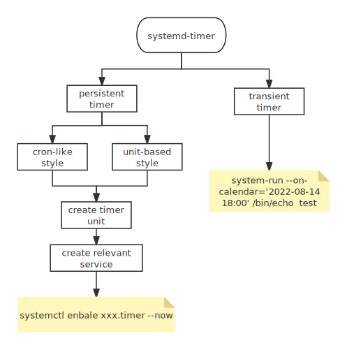

## One time Task

1. sleep

   ```bash
   sleep 5m # do nothing for 5mins
   sleep 3 && echo "three seconds passed" # sleep 3 seconds
   ```

2. Repeatedly run a command and show the result:

   ```bash
   watch command # every two seconds
   watch -n 60 command # every 60 seconds
   watch -d ls -l # monitor a directory content, show differences
   ```

3. at, run commands later

   ```bash
   at [options] time_specification
   at 22:30 30.09.15 # DD.MM.YY format
   at 7am next sunday
   at 22:30
   # end the input with ctrl+D
   atq # check scheduled jobs
   atrm # remove
   ```

## Crontab
The cron utility schedules commands to run a specific time. It helps to automate repetitive tasks.

Crontabs for individual users are stored under `/var/spool/cron/crontab`. There is at most one crontab file per user. The name of each user's crontab is just username, cron uses these filenames (and the file ownership) to figure out which UID to use when running the commands contained in each file. 

Cron log stored at `/var/log/cron`. But for systemd distros, you can view it by `journalctl -fu cron`

### Manage Crontab

1. `Edit the crontab file for the current user:

   ```bash
   crontab -e 
   sudo crontab -e -u user
   ```

2. View a list of existing cron jobs for current user:

   ```bash
   crontab -l
   ```

3. Remove all cron jobs for the current user:

   ```bash
   crontab -r
   ```

### Syntax
```bash
minute hour day(month) month day(week) command...
```
| segment    | value range             | desc                       |
| ---------- | ----------------------- | -------------------------- |
| minute     | 0-59                    | specific time not interval |
| hour       | 0-23                    | specific hour to run       |
| day(month) | 1-31                    | which day to run           |
| month      | 1-12                    | which month                |
| day(week)  | 0-6(Sunday to Saturday) | which day to run           |

There are five time segments, if you don't specify any explicit value, but use `*`, this indicates it will run every unit of that segment.
You can specify multiple value in a segment separated by `,` or specify a range using `-`.

1. To run every Monday, Wednesday, and Friday at 2:00pm

   ```bash
   0 2 * * 1,3,5 /path/to/script.sh
   
   ```
2. run at 6 a.m on the 15th of every month

   ```bash
   0 6 15 * * script.sh
   ```

3. run every 10 minutes every day

   ```bash
   0,10,20,30,40,50 * * * command
   ```

> [!warning]
>
>  If both weekday and day of month are specified, a day need satisfy only one of the two conditions to be selected.

### Cron Access Control

Two config files specify which users may submit crontab files. They are `/etc/cron.{allow,deny}`.

If the cron.allow file exists, then it contains a list of all users that may submit crontabs, one per line. 

If the cron.allow file doesn’t exist, then the cron.deny file is checked.

By default, most default configurations allow all users to access cron by default.	

## Systemd Timer



There are two kinds of timers: persistent timer and transient timer.

### Persistent timer

To create a periodic timer, you must create two units: a timer unit and a service unit. The timer unit is just an activation mechanism to run a service unit. This also make debug easier by debugging service files.

We should put timer units in `/etc/systemd/system`. Let's create a timer called `loggertest.timer`.

```ini
[Unit]
Description-Example timer unit

[Timer]
OnCalendar=*-*-* *:00,20,40
Unit=loggertest.service

[Install]
WantedBy=timers.target
```

In the timer section, with the `OnCalendar` resembling the cron syntax. The format is  

```bash
year-month-day hour:minute:second
```

The filed for seconds is optional. The periodic syntax `/` is also valid. So `*:00/20` is equivalent to the above `00,20,40` that will run every 20 minutes. 

**The associated service is specified by `Unit`. This isn't strictly necessary though because systemd looks for a service file with the same name as the timer unit.**

As for the service, we create something like:

```ini
[Unit]
Description=Example Test Service

[Service]
Type=oneshot
ExecStart=/usr/bin/logger -p local3.debug I\'m a logger
```

`ExecStart` is the actual command to run, the use of `Type=oneshot` means the service is expected to run and exit. You can specify multiple `ExecStart` commands for this kind of type. (Others may not possible).

***

We only talk about cron-like timers, there are unit-based timers.

| Type              | Time basis                                                  |
| ----------------- | ----------------------------------------------------------- |
| OnActiveSec       | Relative to the time at which the timer itself is activated |
| OnBootSec         | Relative to system boot time                                |
| OnStartupSec      | Relative to the time at which systemd was started           |
| OnUnitActiveSec   | Relative to the time the specified unit was last active     |
| OnUnitInactiveSec | Relative to the time the specified unit was last inactive   |

values for those timer options are given in seconds. We can combine some options to create interval-based timers. For example

```ini
OnBootSec=3min
OnUnitActiveSec=30min
```

The unit started 3 minutes after boot and then every 30 minutes after that first time.

> [!warning]
>
> You need to first activate units using the first three options, then use `OnUnitActiveSec` to achieves an `every X minutes` effect.

> [!tip]
>
> By default, `AccuracySec` option defaults to 60 seconds. This option delays its activation by a random amount of time within the specified time window.  To get best accuracy, set this option to `1us`.

### Transient Timer (One time task)

```bash
systemd-run --on-calendar='2022-08-14 18:00' /bin/echo test
```

`systemd-run` functions by creating timer and unit files for you in subdirectories of /run/systemd/system. However, transient timers do not persist after a reboot. To make them permanent, you can fish them out of `/run`, tweak them if necessary.

### Manage timers

1. list all timers

   ```bash
   systemctl list-timers
   ```

2. enable,disable, start and stop timer

   ```bash
   systemctl enable xxx.timer
   systemctl disable xxx.timer
   systemctl start xxx.timer
   systemctl stop xxx.timer
   ```

### Timer format

You can view more details in `man systemd.time`.

### running timers as a regular user

To create a timer unit as a regular user, add `--user` option. However, if you log out before the unit runs, the unit won't start, and if you log out before the unit completes, the unit terminates. This happens because systemd has a user manager associated with a logged-in user, and it is necessary to run timer units. You can tell systemd to keep the user manager around after you log out with this command:

```bash
loginctl enable-linger # run for current user
loginctl enable-linger user # as root, enable for another user
```

## Use cases

1.  Sending mail
2. Cleaning up a filesystem
3. Rotating a log file
4. Running batch jobs
5. Backing up and mirroring

## See Also

