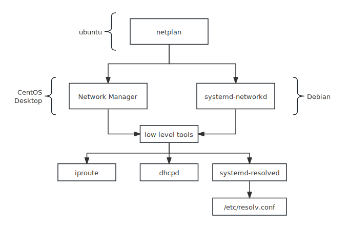

## Overview



Ubuntu tends to use netplan as a frontend to simplify the difference between NetworkManager and systemd-netword. On the other hand, CentOS and desktop distros use NetWorkManager, and Debian by default use systemd-networkd.

For server environments, the choice between networkd and NetworkManager depends on your specific requirements. If you prefer a simple, lightweight, and predictable network configuration, networkd is a good choice.

## Netplan

[Netplan](https://netplan.readthedocs.io/en/stable/structure-id/) integrates with both of the primary Linux network management daemons: NetworkManager and systemd-networkd. It can generate target configuration based on its own yaml configuration.

Configured devices get handled by systemd-networkd by default, unless explicitly marked as managed by a specific renderer (NetworkManager). 

### Configuration

All `/{lib,etc,run}/netplan/*.yaml` are considered. 

A file in `/run/netplan` completely shadows a file with same name in `/etc/netplan`, and a file in either of 

those directories shadows a file with the same name in `/lib/netplan`.


### Configure as DHCP

```yaml
network:
  version: 2
  renderer: networkd
  ethernets:
    enp3s0:
      dhcp4: true
```

You can add a logical name to the interfaces with `match` and `set-name`. Note that interface should have the same name as  set-name.

```bash
network:
  version: 2
  renderer: networkd
  ethernets:
    eth_lan0:
      dhcp4: true
      match:
        macaddress: 00:16:3e:c2:74:00
      set-name: eth_lan0
```

### Configure as Static Addresses

```yaml
network:
  version: 2
  renderer: networkd
  ethernets:
    eth0:
      addresses:
        - 10.10.10.2/24
      routes:
        - to: default
          via: 10.10.10.1
      nameservers:
          search: [mydomain.com, otherdomain]
          addresses: [10.10.10.1, 1.1.1.1]
```

Traditionally, the file `/etc/resolv.conf` was a static configuration file that rarely needed to be changed, or it automatically changed via DHCP client hooks. `systemd-resolved` handles nameserver configuration, and it should be interacted with through the `systemd-resolve` command. Netplan configures `systemd-resolved` to generate a list of nameservers and domains to put in `/etc/resolv.conf`, which is a symlink:

The *search* option means your current server may called `web1` and serves at `web1.mydomain.com` , it wanna send packets to `web2`, which serves at `web2.mydomain.com`. In that case, if we set search to `mydomain.com`, when we send to a url like `web2`, it will automatically append to `web2.mydomain.com`. 

### Apply the Configuration

```bash
sudo netplan apply
```

## Networkd (sytemd-networkd)

Under [systemd](https://en.wikipedia.org/wiki/Systemd), the network may be configured in `/etc/systemd/network/` instead

### Configure as DHCP

Create a file called "`/etc/systemd/network/dhcp.network`"

```ini
[Match]
Name=eth*

[Network]
DHCP=yes
```

### Configure as Static Addresses

```ini
[Match]
Name=eth*

[Network]
Address=192.168.0.15/24
Gateway=192.168.0.1
```

After changing configuration, restart `systemctl reload systemd-networkd`

### Change the Interface name

https://askubuntu.com/questions/1317036/how-to-rename-a-network-interface-in-20-04

## Network Manager

The configuration is at `/etc/NetworkManager/system-connections`. By default, NetworkManager will generate default configuration at `/run/NetworkManager/system-connections`. After you modify the connection, it will move to `/etc`. 
>[tip]
>You mainly use `nmcli` to configure it. As an alternative, you can use `nmtui`, a TUI tool.

### Remove a Connection

```bash
nmcli conn # show all connections
nmcli delete test # delete a connection named "test"
```

### Add a Connection

1. create a connection called `eth0` and configure it with dhcp(auto)
   ```bash
   nmcli conn add ifname eth0 type ethernet ipv4.method auto ipv6.method auto connection.id eth0
   ```

2. create a static connection called `eth0`

   ```bash
   nmcli con add ifname eth0 ipv4.addresses "10.0.3.3/24" ipv4.gateway "10.0.3.1" ipv4.dns "223.5.5.5,8.8.8.8" ipv4.dns-search "" ipv4.method "manual" connection.id eth0
   ```

### Modify a Connection from Dhcp to Static

```bash
nmcli con mod eth0 ipv4.addresses "10.0.3.3/24" ipv4.gateway "10.0.3.1" ipv4.dns "223.5.5.5,8.8.8.8" ipv4.method "manual"
```

### Activate or Deactivate a Connection

```bash
nmcli con up "Wired connection 1" # reload only one connection
nmcli reload # reload all connetions
nmcli con down "eth0" # close a connection
```

### Configuration

In reality, our nmcli command will generate or modify the configuration file:

```ini
[connection]
id=eth0
uuid=313d54b5-67e3-34e4-9e90-6d270a28103f
type=ethernet
autoconnect-priority=-999
interface-name=eth0
timestamp=1727104770

[ethernet]

[ipv4]
address1=10.0.3.3/24,10.0.3.1
dns=223.5.5.5;8.8.8.8;
method=manual

[ipv6]
addr-gen-mode=default
method=auto

[proxy]
```

We can modify this file directly or use `nmcli conn mod eth0 <setting>.<property> <value>`, note that setting is just the value in square bracket.  So we wanna modify the configuration from

```ini 
[ipv4]
method=manual
```

to:

```ini
[ipv4]
method=auto
```

we only need to use `nmcli conn mod eth0 ipv4.method auto`.