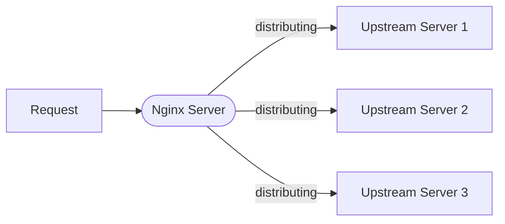
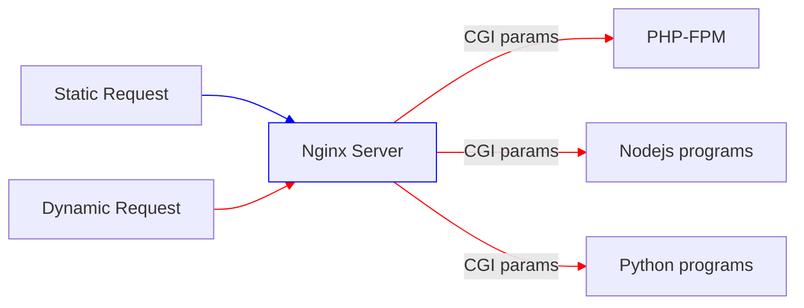

# Web Server (NGINX)

The web server is mainly used to respond static files, like html, css, images. There are two prevalent static softwares out there, [NGINX](https://nginx.org/en/) and [Apache web server](https://httpd.apache.org/).  

Traditionally a Web Server has a directory which is designated as a document collection. Nginx use the location defined in the configuration file.

## Install - LINUX

```bash
sudo apt install nginx -y # debian based
```

## Configuration Location

In Linux,  the **conf** directory is located at `/etc/nginx`. The majority of our work will be done in here.  

## Configuration Structure

In NIGNX, there are two terminologies, **directives** and **contexts**. Everything inside a NGINX configuration is a directive, they are of two types:

* Simple Directives
* Block Directives

Let's first check a simple configuration: 

```nginx
http {
    server {
        listen 80;
        server_name nginx-handbook.test;
        return 200 "hello from port 80!\n";
    }

    server {
        listen 8080;
        server_name nginx-handbook.test;
        return 200 "hello from port 8080!\n";
    }
}
```

We can see that `listen 80;` is a single directive that ends with a semicolon. `server {}` is a block directive capable of containing other directives inside is called a **context**, that is `events`, `http` and so on. You can treat contexts in NGINX like scopes in other programming languages. There's also a sense of inheritance among them. ou can find an [alphabetical index of directives](https://nginx.org/en/docs/dirindex.html) on the official NGINX docs.  


## Common Operations

```bash
nginx -t  # check the syntax
nginx -s reload # -s means to send signals, we are sending reload singal to reload conf
systemctl restart nginx # restart nginx service
```

## Virtual Host

There can be multiple `server` contexts within in a configuration. The `listen` directive is one of the ways to identify the correct `server` context. You can assign the same port but with different server names, that is the idea of virtual hosts. 

*Virtual hosting is a method fore hosting multiple domain names on a single server. One widely used application is shared web hosting. The price for shared web hosting is lower than for a dedicated web server because many customers can be hosted on a single server. It is also very common for a single entity to want to use multiple names on the same machine.*

```nginx
http {
    server {
        listen 80;
        server_name library.test;
        return 200 "your local library!\n";
    }
    
    server {
        listen 80;
        server_name librarian.library.test;
        return 200 "welcome dear librarian!\n";
    }
}
```

Note that if you keep using IP addresses to access this host, it will respond with the first server which often is not the site you expect. 

## Web Root and File Type

A static server needs a **web root** folder to serve static content.  You can define it using `root` directive. By default, NGINX treat all text files as `text/plain`, that means, like css, it will return `text/plain` not `text/css`. To solve this problem update your configuration once again:

```nginx
http {
    types {
        text/html html;
        text/css css;
    }

    server {
        listen 80;
        server_name nginx-handbook.test;
        root /srv/nginx-handbook-projects/static-demo;
    }
}
```

## Partial Config Files

That would be tedious to append all rules in the main configuration. We happen to know that there already many partial config files included in the NGINX `conf` folder. A file named `mime.types` which contains all the rules for handling different files. You can use this file by add a directive `include`. 

```nginx
http {
    include /etc/nginx/mime.types;
    
    server {
        listen 80;
        server_name nginx-handbook.test;
        root /srv/nginx-handbook-projects/static-demo;
    }
}
```

This `include` directive is similar to `#include` in c programming languages which paste the content of  all the included file into the current file.  A wildcard may appear in the path t match multiple files:

```nginx
include /etc/nginx/nginx.d/*.conf
```

A configuration file can be easily tested by calling NGINX as follows:

```bash
nginx -t -c <path-to-nginx.conf>
```


## Variables

Variables can be of three types:

* String
* Integer
* Boolean

The `set` directive can be used to declare new variables. Apart from newly declared variables, there are embedded variables coming with NGINX modules. An [alphabetical index of variables](https://nginx.org/en/docs/varindex.html) is available in the official documentation.

```nginx
server {
    listen 80;
    server_name nginx-handbook.test;
    return 200 "Host - $host\nURI - $uri\nArgs - $args\n";
}
```

## Dynamic Routing

The `location` directive is the key to Dynamic Routing. It allows you to configure how Nginx should process requests based on the request path.  

| Modifier | Handling                                                     |
| -------- | ------------------------------------------------------------ |
| =        | Use exact match and terminate search                         |
| ~        | Case-sensitive regular expression matching                   |
| ~*       | Case-insensitive regular expression matching                 |
| ^~       | Stops processing before regular expressions are checked for a match of this location's string, if it's the most specific match. |

### Single Page Application Deploy

When you deploy Single Page Application using your favorite frameworks like React or Vue. Of course, you are adopting the history mode. The default config doesn't really support this very well. If you have a page like `http://example.com` and then you click a link, it navigates to `http://example.com/user`. Indeed, that's fake. Because when you refresh the page, it typically give you a 404 error.  SPAs just change the URL in the client side, your browser aren't really request a new URL. So we need to configure the static server to respond the same page no matter what's path look like.   

```nginx
server {
    # listen on port 80
    listen 80;
    # save logs here
    access_log /var/log/nginx/access.log compression;

    gzip on;
    gzip_types text/html application/javascript application/json text/css;

    # where the root here
    root /usr/share/nginx/html;
    # what file to server as index
    index index.html;

    location / {
        # First attempt to serve request as file, then
        # as directory, then fall back to redirecting to index.html
        try_files $uri $uri/ $uri.html /index.html;
    }

    location ~* \.(?:css|js|jpg|svg)$ {
        expires 30d;
        add_header Cache-Control "public";
    }

    location ~* \.(?:json)$ {
        expires 1d;
        add_header Cache-Control "public";
    }
}
```

You might notice that this `try_files` directive. It basically says to attempt to serve it directly just as files, then fall back with a `/`， then try a `html` file with the same path name, finally just serve up the normal `index.html`.

### Regex Matching

```nginx
location ~ /agatha[0-9] {
	return 200 "Miss Marple.\nHercule Poirot.\n";
}
```

That directive will respond only if there's a number after the word "agatha". 

### Multiple "Location" Directive Order

A regex match has more priority than a prefix match. So in the following configuration:

```nginx
location /Agatha8 {
    return 200 "prefix matched.\n";
}
        
location ~* /agatha[0-9] {
    return 200 "regex matched.\n";
}
```

Even though prefix match is ahead of a regex match. The regex match still win. In some cases, you may wanna the prefix to have more priorities. To do that, you add `^~` to turn the prefix match into a **Preferential Prefix**. 

### Redirects and Rewrites

A redirect in NGINX is same as redirects in any other platform.  A `rewrite` directive, however, works a little differently. It changes the URI internally, without letting the user know.

```nginx
location = /index_page {
        return 307 /index.html;
}

location = /about_page {
        return 307 /about.html;
}

location /index_page /index.html
location /about_page /about.html
```


## Logging

 By default, NGINX's log files are located inside `/var/log/nginx`. You can delete log files and recreate them. However, you need to dispatch a `reopen` signal to NGINX, otherwise it'll keep writing logs to previously open streams and the new file will remain empty. 

Any request to the server will be logged to this file by default. But we can change this behavior using the `access_log` directive.

Note that `errror-log` directive must be set, otherwise no error will be logged.

```nginx
error_log /var/log/nginx/error.log;
location = /admin {
    access_log /var/logs/nginx/admin.log;
    return 200 "this will be logged in a separate file.\n";
}

location = /no_logging {
    access_log off;
    return 200 "this will not be logged.\n";
}
```

### Log Level

There are eight levels of error messages. By default, NGINX will record all level of messages. You can override this behavior using the `error_log` directive. If you want to set the minimum level of a message to be `warn` in a certain server.  

```nginx
error_log /var/log/nginx/error.log;

http {
    server {
        error_log /var/log/error.log warn;
    }
}
```

## Reverse Proxy

A reverse proxy is an application that sits in front of back-end applications and forwards client requests to those applications.  


Proxy is on behalf of clients conversely reverse proxy on behalf of servers. It has many uses:

1. Hide the existence of origin servers
2. Protect against common web-based attacks
3. Perform the TLS encryption and decryption instead of putting on the origin servers.
4. Loading balancing
5. Cache static content and dynamic content

We can configure NGINX this way:  

```nginx
events {

}
  
http {
    listen 80;
    server_name nginx-handbook.test

    location / {
        proxy_pass http://localhost:3000;
    }
}
```

## Load Balancer

As your users become more, the more pressure are on your servers. You might deploy multiple servers to process a set of tasks. That's where load balancing comes into play. Basically it's the process of distributing a set of tasks over a set of resources, in this case, your cluster. NGINX can do that using Round Robin way.  

```nginx
events {

}

http {

    upstream backend_servers {
        server localhost:3001;
        server localhost:3002;
        server localhost:3003;
    }

    server {

        listen 80;
        server_name nginx-handbook.test;

        location / {
            proxy_pass http://backend_servers;
        }
    }
}
```

Imagine that there are three Nodejs. apps running at port 3001, 3002, 3003, respectively. Nginx become the gateway to those servers that it can distribute request orderly. 




## Define custom CGI Params

Before defining custom cgi params, you first need to enable `ngx_http_fastcgi_module`which is enabled by default. We see in the **conf** folder we have a partial conf called `fastcgi_params`.  

```nginx
# fastcgi_params
fastcgi_param  QUERY_STRING       $query_string;
fastcgi_param  REQUEST_METHOD     $request_method;
fastcgi_param  CONTENT_TYPE       $content_type;
fastcgi_param  CONTENT_LENGTH     $content_length;

fastcgi_param  SCRIPT_NAME        $fastcgi_script_name;
fastcgi_param  REQUEST_URI        $request_uri;
fastcgi_param  DOCUMENT_URI       $document_uri;
fastcgi_param  DOCUMENT_ROOT      $document_root;
fastcgi_param  SERVER_PROTOCOL    $server_protocol;
fastcgi_param  REQUEST_SCHEME     $scheme;
fastcgi_param  HTTPS              $https if_not_empty;

fastcgi_param  GATEWAY_INTERFACE  CGI/1.1;
fastcgi_param  SERVER_SOFTWARE    nginx/$nginx_version;

fastcgi_param  REMOTE_ADDR        $remote_addr;
fastcgi_param  REMOTE_PORT        $remote_port;
fastcgi_param  SERVER_ADDR        $server_addr;
fastcgi_param  SERVER_PORT        $server_port;
fastcgi_param  SERVER_NAME        $server_name;

# PHP only, required if PHP was built with --enable-force-cgi-redirect
fastcgi_param  REDIRECT_STATUS    200;

```

## Dynamic Content And CGI

Static web server can't respond dynamic generated content, it can only be done by a program written by a programmer, it can java-based, python-based, or nodjes-based. We use nginx-like static servers to serve static requests and call those custom programs, which may query content from a database, to generate dynamic content and then respond to clients. There's a standard called **[Common Gateway Interface(CGI)](https://datatracker.ietf.org/doc/html/rfc3875.html)** . Every static server obey this standard in order to server dynamic content. 

Web page-generating programs invoked by server software that adheres to the CGI specification are known as CGI scripts, it must provide all the information required by HTTP for a response to the request.   



From the graph above, you can see that NGINX server delegates the tasks that require dynamic content to separate processes such as PHP-FPM, Nodejs or Python by CGI.  


### CGI Deployment

In terms of actual cgi deployment, the web server must have a way to distinguish the static request and the normal request. A common convention is to have a `cgi-bin/` directory at the base of the web root directory and treat all executables files within this directory as CGI scripts. Another popular convention is to use filename extensions, for instance, if CGI scripts are consistently given the extension `.php`, the Web server can be configured to interpret all such files as CGI scripts. 

### How CGI works

The CGI specification defines how additional information passed with the request like **cookie** or **form data** is passed to the script. Those information is passed in the way of environment variables. The details can be found at [RFC3875](https://datatracker.ietf.org/doc/html/rfc3875.html). 

| Environment Variable             | Meaning                                                      |
| -------------------------------- | ------------------------------------------------------------ |
| PATH_INFO                        | the actual URL                                               |
| QUERY_STRING                     | query string                                                 |
| AUTH_TYPE                        | it can be "Basic" or "Digest" or extension-auth              |
| REQUEST_METHOD                   | 'get' \| 'post'                                              |
| Protocol-Specific Meta-Variables | Servers can define their specific variables, for instance, if the protocol is http, it should define a variable that starts with `http_` |


### Alternatives

For each incoming HTTP requests, a Web server creates a new CGI programs for handling it and destroys the CGI process after the HTTP request has been handled. Creating and destroying a process can be expensive. We can use `FASTCGI` to reduce the overhead. FASTCGI  use persistent processes to handle a series of requests, like a process pool. **This FASTCGI is a separate service that occupies another port**.  Note that NINGX only have fastcig module, but you still need specific fastcgi implementation server like PHP-FPM. FASTCGI was initially developed for PHP and has been widely adopted by the PHP community. However, other programming languages and frameworks have developed their own solutions for handling dynamic content and concurrent requests. 


## Performance


## SSL


## See Also


