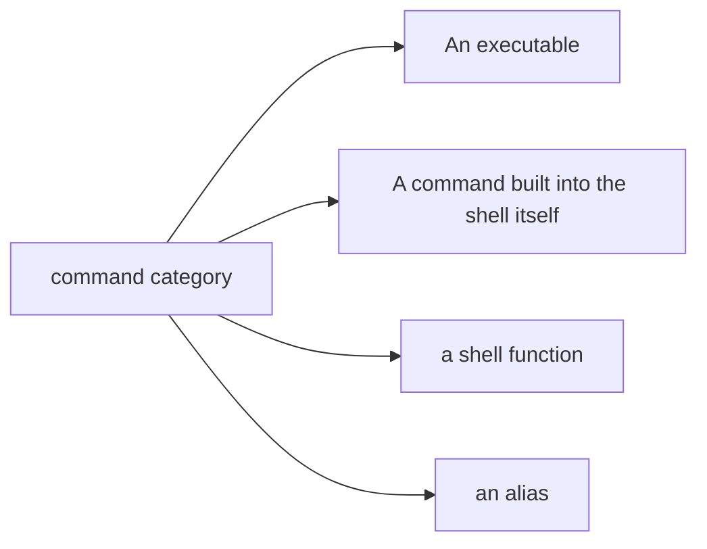
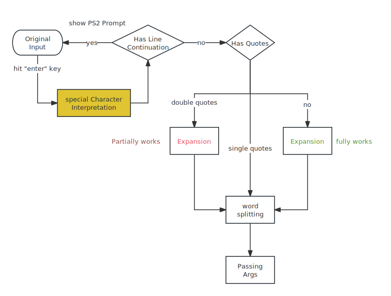
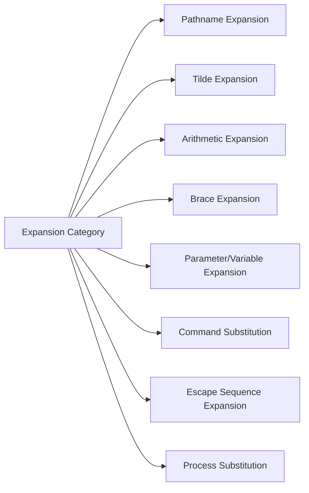
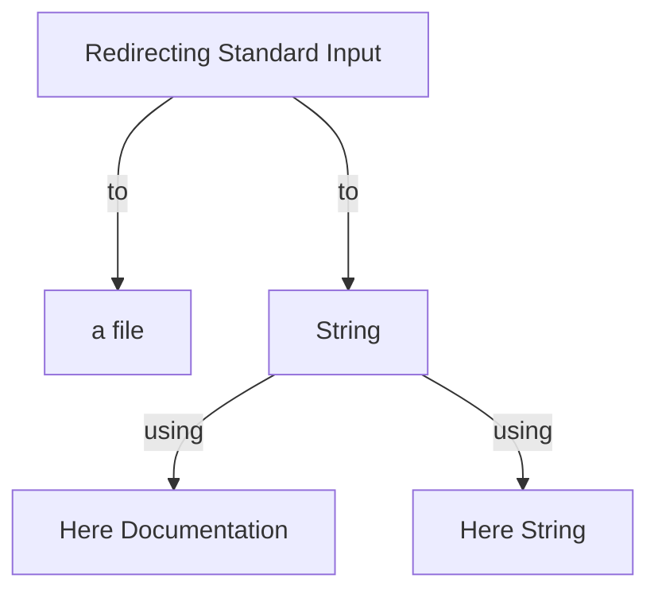

## Intro
Bash can be viewed as a command line interface called shell or as a script interpreter. We'll devote the command line usage at first, then focus on the script side. 

## Command Line Structure
```bash
[env foo=1 bar=2] command [options] arguments...
```
We can see from above that a typical command line consists of three parts. Firstly, a command can be one of four different things:  


1. **An executable program** like those files in `/usr/bin`. These programs can be compiled binaries such as programs written in C, or programs written in *script languages* such as the bash itself, Python, and so on. 
2. **A command built into the shell itself**. `bash` supports a number of commands internally called *shell builtins*. The `cd` command, is a shell builtin.
3. **A shell function**. Shell functions can be viewed as mini bash scripts.
4. **An Alias**. Alias are commands that we can define ourselves, built from other commands. You can define it by `alias newAlias='string'`. Note that there's no space around '=' sign. 

Regarding to identify those commands, we have a couple of ways to find out.
1. type - Display a Command's Type
   ```bash
   type command
   # examples
   type ls
   type /bin/cp
   ```

2. which - Display an Exectuable's Location

   1. Search the PATH environment variable and display the location of any matching executables:
      ```bash
      which executable
      ```

   2. If there are multiple executables which match, display all:
      ```bash
      which -a executable
      ```

## Find Documentation about a Command

Different types of command has different ways of finding help. Most of the time we use shell builtins or executables. As for shell builtins, type `help` followed by the name of the shell builtin. For example:

```bash
help cd
```

As for massive executables, we have a lot of ways to deal with it. 

1. Many executables support `--help` option that displays a short description of the command's syntax and option. For example:
   ```bash
   mkdir --help
   ```

2. Most executables are shipped with a piece of documentation called *man page*. A special program called `man` is used to view them. It is used like this:
   ```bash 
   man program
   ```

   `man` use `less` to display the manual page, mostly `less`, so all of the familiar `less` commands works.

   The man pages are broken into sections and covers not only those user commands but also programming interfaces, file format and more. The following table describes the layout of manual. 

   | Section | Contents                                       |
   | ------- | ---------------------------------------------- |
   | 1       | User command                                   |
   | 2       | Programming interfaces for kernel system calls |
   | 3       | Programming interfaces to the C library        |
   | 4       | Special files such as device nodes and drivers |
   | 5       | File format                                    |
   | 6       | Games and amusements such as screen savers     |
   | 7       | Miscellaneous                                  |
   | 8       | System administration commands                 |

   Sometimes we are looking for a file format that is also the name of a command. Without specifying a section number, `man` will always retrieve the first instance of a match. To specify a section, use this: 

   ```bash
   man section_number search_term
   # examples
   man 5 passwd
   ```

3. It is also possible to search the list of man pages for possible matches based on a **vague** search term. If we wanna find programs about partition, we can type like this:
   ```bash
   apropos partition
   man -k partition # same as above
   ```

4. The `whatis` program displays the name and a one-line description of a man page matching a specified keyword:
   ```bash
   whatis ls
   ```

5. The GNU Project provides an alternative to man pages for their programs, called "info." Info pages are hyperlinked much like web pages. The info operations is similar to Emacs, a powerful editor made also by this project. You can check more here.

## Options Style

When you display a command's syntax, you might be daunted by the complexness. For example:  

```bash
Usage: ls [OPTION]... [FILE]...
```

Brackets mean that that argument is optional, so in this case, you can use `ls` without any options or any files. The ellipsis means there could be more of that kind of words, so it is capable of accepting multiple options and arguments of "file" kind. 

Let's view a more complex one, an excerpt from `man tar`

```bash
SYNOPSIS
   Traditional usage
       tar {A|c|d|r|t|u|x}[GnSkUWOmpsMBiajJzZhPlRvwo] [ARG...]

   UNIX-style usage
       tar -A [OPTIONS] ARCHIVE ARCHIVE

       tar -c [-f ARCHIVE] [OPTIONS] [FILE...]

       tar -d [-f ARCHIVE] [OPTIONS] [FILE...]

       tar -t [-f ARCHIVE] [OPTIONS] [MEMBER...]

       tar -r [-f ARCHIVE] [OPTIONS] [FILE...]

       tar -u [-f ARCHIVE] [OPTIONS] [FILE...]

       tar -x [-f ARCHIVE] [OPTIONS] [MEMBER...]

   GNU-style usage
       tar {--catenate|--concatenate} [OPTIONS] ARCHIVE ARCHIVE

       tar --create [--file ARCHIVE] [OPTIONS] [FILE...]
```

From this excerpt, there are three flavors of specifying options. Note that both Unix-style and BSD(which is traditional usage) style can **string options together** (not GNU/long option), for example, when we wanna compress some files, we can use like this:

```bash
# BSD style
tar czvf some.tar.gz some-dir/
# Unix style
tar -cvzf some.tar.gz some-dir/
```

Note that `{A|c|d|r|t|u|x}` means choose one from those choices, it's not optional like brackets. Note that in Unix style that the optional argument supplied to -f option should immediately after it, BSD style doesn't require it, but we just keep this as a convention. **Also note that we generally put options before positional arguments (which is mandatory)**, because GNU and BSD style doesn't allow it.

## Bash Interpretation Process



### Expansion



Expansion is a rather important part in shell. 

#### Pathname Expansion

```bash
echo *
echo *s
```

The wildcards can be expanded into multiple arguments depending on the files in the current directory.

1. `echo *` - It will match all the non-hidden files (including directories, also a file in Linux).  

2. `echo *s` - This will match all the filenames end with "s".

3. `echo [[:upper:]]*` - This will match all the filenames start with a capital. 

   ```bash
   $ echo [[:upper:]]*
   PDF Photos
   ```

4. `echo /usr/*/share` - This will match all the directories that have this structure

   ```bash
   $ echo /usr/*/share
   /usr/marcus/share /usr/local/share
   ```

#### Tilde Expansion

The tilde character "~" has a special meaning. When used at the beginning of a word, it expands into the name of the home directory of the named user or, if no user is named, the home directory of the current user. 

```bash
echo ~ # enter the home of the current user
echo ~foo # enter the home of foo
```

#### Arithmetic Expansion

The shell allows arithmetic to be performed by the form: `$((expression))`

```bash
echo $(($((5**2)) *3))
```

Arithmetic expansion is covered in greater detail in

#### Brace Expansion

We can create multiple text strings from a pattern or template containing braces. Here's an example:

```bash
$ echo Front-{A,B,C}-Back # leading portion called a preamble and trailing portion called a postscript 
Front-A-Back Front-B-Back Front-C-Back

$ echo {Z..A} 
Z Y X W V U T S R Q P O N M L K J I H G F E D C B A

$ echo {01..15} # zero-padding by adding one or more zeros
01 02 03 04 05 06 07 08 09 10 11 12 13 14 15

$ echo {001..15}
001 002 003 004 005 006 007 008 009 010 011 012 013 014 015
```

The brace expression may contain either a comma-separated list of strings or a range of integers or single characters by inserting "..".  The most common application of this is to create multiple files or directories, for example:  

```bash
mkdir {2007..2009}-{01..12}
```

#### Parameter Expansion

We can show the value of variables or twisted variables. 

```bash
echo $USER
echo $HOME
printenv | less # see all available variables
echo $SUER # an empty string
```
#### Command Substitution
Command substitution allows us to use the output of a command as an expansion.

```bash
echo $(ls)
ls -l $(which cp)
file $(ls -d /usr/bin/* | grep zip)
```

Note that the inner command is executed in subshell, so if won't affect the outer shell by assigning variables. It is interesting to note that if the output of that command contains linefeed, it would be interpreted as multiple arguments just like space because of [Word Splitting](#word-splitting). 

#### Escape Sequence Expansion

When we trying to `echo` a string contains escape sequence, it will not be interpreted as you expect. One way is to add `-e` option, another way is to put that string inside `$''`.  

### Special Characters Interpretation

Certain special characters will affect the behavior of execution of shell. There's a list of them:

| Special Characters    | Meaning                                       |
| --------------------- | --------------------------------------------- |
| `{ ;}`                | group commands (execute in the current shell) |
| `( )`                 | group commands (execute in subshells)         |
| `command [args]... &` | execute the command in the background         |
|                       |                                               |

> [!IMPORTANT]
>
> This `{ ; }` group commands are really powerful. For example, if we wanna keep the head of the output after grep, we can use `ps -ef | { head 1; grep 'bash'; }`. In this case, both commands in this curly braces accept the same stdin. Note that it should have space around those commands, and every command should end with `;`.

#### Quoting

Quoting allows us to embed space in one argument otherwise it will be interpreted as two arguments. 

1. Double Quotes
   If we place text inside double quotes, all the special characters used by the shell lose their special meaning (including expansion characters). The exception are `$`, `\`, and ` (back-quote). This means only arithmetic expansion, parameter expansion, and command substitution are carried out. **Files with space** should be quoted to prevent word-spitting. 

   ```bash
   echo "$USER $((2+2)) $(cal)"
   ```

2. Single Quotes
   Single quotes suppress all expansions. In order to use single quote in those single quotes, use `\` to escape it. 

3. Escaping Characters
   In double quotes, we wanna suppress that parameter expansion. Often this is done by preceding a character with a backlash. 

   ```bash
   echo "The balance for user $USER is: \$5.00" # $5 is suppressed
   ```

   It is also common to use escaping to eliminate the special meaning of a character in a filename.
   ```bash
   mv bad\&filename another\ badname
   ```

### Word Splitting

By default, word-splitting looks for the presence of spaces, tabs, and **newlines**(line feed) and treats them as delimiters between words. This means those characters are considered as separators.  If you have two or more space between your arguments, there would be no difference. 

The fact that newlines are considered delimiters by this mechanism causes an interesting, albeit subtle, effect on  [Bash](#command-substitution). Consider the following:

```bash
$ echo $(cal)
April 2024 Su Mo Tu We Th Fr Sa 1 2 3 4 5 6 7 8 9 10 11 12 13 14 15 16 17 18 19 20 21 22 23 24 25 26 27 28 29 30

$ echo "$(cal)"
     April 2024
Su Mo Tu We Th Fr Sa
    1  2  3  4  5  6
 7  8  9 10 11 12 13
14 15 16 17 18 19 20
21 22 23 24 25 26 27
28 29 30
```

In the first instance, the unquoted command substitution resulted that line feeds are used as splitter, so there are 38 arguments being passed to `echo`. In the second, it resulted that all the line feeds are embed in those double quotes, in turn, only one argument passed to `echo`. 

### Line Continuation

Normally when you input one line of command and hit enter, the bash will execute that line. However, there are cases that you need split a long single line into multiple lines. You can use this line continuation feature. When bash detect the newline (by hitting enter) immediately after the backslash `\`, this combinatio is called **backslash-linefeed sequences** to spread a long command over several lines. For example, this technique is often used in Docker file to improve style.

```dockerfile
RUN set -x \
# create nginx user/group first, to be consistent throughout docker variants
    && groupadd --system --gid 101 nginx \
    && useradd --system --gid nginx --no-create-home --home /nonexistent --comment "nginx user" --shell /bin/false --uid 101 nginx \
    && apt-get update \
    && apt-get install --no-install-recommends --no-install-suggests -y gnupg1 ca-certificates
```

Note that it use `&&` logical operator, another if branch, to combine those commands together. Note that it also use *indentation* to make this complex command more clear. 

If we input backslash-linefeed sequences, bash will not execute the current command, but shows a leading ">" character, which is the shell prompt contained in the PS2 shell variable. It appears whenever we type a multiline statement into the shell. 

Besides this *backslash-linefeed sequences*, there are several cases also cause line continuation. Such as:

```bash
$ echo 'hell
> o world'
hel
o world
```

Note that the linefeed character is included in because of the single quotes. This also applies to `&&` or `||`.

## Redirection and Pipeline

The output of many programs consists of two type:

* The program's results, that is, the data the program is designed to produce
* Status and error messages 

Programs such as `ls` send their results to a special file called standard output (often expressed as *stdout*) and their error messages to another file called standard error (stderr). By default, both files are linked to the screen and not saved into a disk file. You can view them by this command: `ls -l /dev/std*`. 

```bash
root@ubuntu-1:/root# ls -l /dev/std*               
lrwxrwxrwx 1 root root 15 Apr 24 11:56 /dev/stderr -> /proc/self/fd/2
lrwxrwxrwx 1 root root 15 Apr 24 11:56 /dev/stdin -> /proc/self/fd/0
lrwxrwxrwx 1 root root 15 Apr 24 11:56 /dev/stdout -> /proc/self/fd/1

root@ubuntu-1:/root# ls -l /proc/self/fd/1
lrwx------ 1 root root 64 Apr 28 04:54 /proc/self/fd/1 -> /dev/pts/3

root@ubuntu-1:/root# ls -l /dev/pts/3
crw--w---- 1 nobody tty 136, 3 Apr 28 04:55 /dev/pts/3
```

Which turns out that it really connects to a character device like screen. 

In addition, many programs take input from standard input (stdin), which, by default, attached to the keyboard. I/O redirection allows us to change where output goes and where input comes from. It could go to a disk file or else. 

### Redirecting Standard Output

To direct standard output to another file instead of the screen, we use the `>` or `>>` redirection operator followed by the name of the file. For example: 

```bash
ls -l /usr/bin > ls-output # always rewrite
ls -l /usr/local/bin >> ls-output # append
```

### Redirecting Standard Error

To redirect standard error we must refer to its file descriptor. Standard input, output and error, the shell references them internally as file descriptors 0, 1, and 2. The shell provides a notation for redirecting files (stderr is also a file) using the file descriptor number. We can type this:

```bash
ls -l /bin/usr 2> ls-error.txt
```

There are cases that we may want to capture both stdout and stderr to the same file. There are two ways to do this. The traditional way is to first instruct the shell to redirect stdout, which is also the file descriptor 1, to a file, and redirect file descriptor 2 (stderr) to descriptor 1(stdout), which **indirectly** pointing to that file. In order to redirect from one file descriptor to another descriptor, use the format `[fd]>&[fd]`. 

```bash
ls -l /bin/usr >ls-output.txt 2>&1
```

Note that the order of the redirections matters, **the redirection of stderr must always occur after redirecting stdout or it doesn't work.** 

The modern bash provides `&>` notation for performing this combined redirection shown here:

```bash
ls -l /bin/usr &> ls-output.txt
ls -l /bin/usr &> ls-output.txt # append text
ls -l /bin/usr >> ls-output.txt 2>&1 # to append text using the traditional way
```

***

#### Disposing of Unwanted Output

Sometimes we don't want output from a command, we just wanna throw it away. This applies particularly to error and status messages. The ancient Unix system has a special file called "/dev/null" that is often referred to as a bit bucket, or a black hole, which only accepts input and does nothing.

* To suppress error messages from a command
  ```bash
  ls -l /bin/usr 2> /dev/null
  ```

* To suppress both stderr and stdout
  ```bash
  ls -l /bin/usr &> /dev/null
  ```

### Redirecting Standard Input
The `cat` command can accept standard input when given no argument. Using redirection, `cat` can read from a file (although `cat` can accept file arguments). 

```bash
cat < lazy_dog.txt
```


It is also possible to redirect standard input to a string. It could be done using here Document or here string.

#### Here Document

Here Document also called here script in which we embed a body of text into our script and feed it into the stdin of a command. It works like this:

```bash
command << token
text
token
```

Normally, we use `_EOF_` to be the token, a typical example could be embedding a html template.

```bash
cat << _EOF_
<html>
	<head>
		<title>$TITLE</title>
	</head>
	<body>
		<p>$TIMESTAMP</p>
	</body>
</html>
_EOF_
```

Note that the token must appear alone at the start of the line. We can embed quotes freely within it. If we change the redirection operator from `<<` to `<<-`, the shell will ignore leading tab (not spaces).

#### Here String

A here string is like a here document, only shorter, consisting of a single string, using notation `<<<`:
```bash
cat <<< "hello"
```
### Pipelines
Simply put, pipelines can pipe the standard output of the left command into the standard input of another. 

```bash
command1 | command2
ls -l /usr/bin | less
```

> [!TIP]
>
> For those command not accepting standard input, we can use `xargs` to overcome this. 

> [!NOTE]
>
> Note that both the left and right commands execute in their own subshells. This typically not a problem but for command like `read`, it can write value into the current shell, because it can only write the variable in tha subshell, when that subshell exits, that variable is destroyed. For example,
>
> ```bash
> echo $file_info | read
> ```
>
> Normally, you would expect `read` will store the value into variable `REPLY`. It does that in the subshell, so it won't affect the current shell. One way is to use here strings, another way is to use process substitution.
>
> ```bash
> # here string
> read <<< "$fileinfo"
> # process substitution
> ```

## Variables and Subshell

Previously we reference variables multiple times. Variables in Bash is just like that the variable in other languages. We normally use a shorter syntax `varName=string` to define a string variable, you can use `declare` command to declare other types of variables like numbers or arrays.

```bash
# a shorter syntax
a=3 # it's a string
b='hello world' # prevent word-splitting
# typically use all capital letters to indicate constants
declare -r MY_VARIABLE="value"
```

> [!CAUTION]
>
> If you retrieve an undeclared variable, there would be no error. It simply return an empty string. It's better to wrap that variable with double quotes.

Let's talk about the subshell, when you use special syntax like `(command1)` or pipelines. Those commands will be executed in subshells. These are copies of the shell with **its own set of variables** and command history but it will inherit **exported variables**. In other words, normal variable declaration would be no effect on subshells. We can use `export` to export variables to the environment of child processes. 

```bash
export backup="/nas10/mysql"
```

> [!IMPORTANT]
>
> When you are writing a script read by your current shell like `.bashrc` residing in your home directory, you would use `export` to export your variables otherwise, there would no effect on the current shell.

### Environment Variables

The shell maintains a body of information during our shell session called the environment. Programs use data stored in the environment to determine facts about the system's configuration. While most programs use configuration files to store program settings, it may also look for values stored in the environment, which normally take precedence over configuration. Such values are called environment variables. We can list all the environment variables by the `set` builtin or the `printenv` program as below:

```bash
printenv | less
set | less # it can also print user-defined shell functions
```

Environment variables are user-defined, on the other hand, **shell variables** are provided by the shell like `$0`. They are largely indistinguishable. Of all the environment variables, `$PATH` is the special one. Previously, when we talk about [Bash](#command-line-structure), if the command is an executable or a shell script, you need to specify it as full path or relative path, if you don't provide a path, but just a name, it will try to search through the value stored in the `$PATH`, which is a colon-separated list of directories. It search those directories in order, so place your custom directory before anything else by the command `export $PATH=~/bin:$PATH`. 

> [!TIP]
>
> Most environment variables should be using all capital letters.

> [!IMPORTANT]
>
> It is common to temporary change the environment variables without altering the current shell (only works for current command). You can precede your command with [env](https://en.wikipedia.org/wiki/Env). For example:
>
> ```bash
> env DISPLAY=foo.bar:1.0 xcalc
> ```
>
> It is possible to set multiple environment variables like this: 
>
> ```bash
> env foo=1 bar=2 bash -c 'echo $foo - $bar '
> ```
>
> **Note that this use of env is often unnecessary since most shells support setting environment variables in front of a command:**
>
> ```bash
> foo=1 bar=2 bash -c 'echo $foo - $bar '
> ```

[Bash-Scripts](bash-scripts.md)