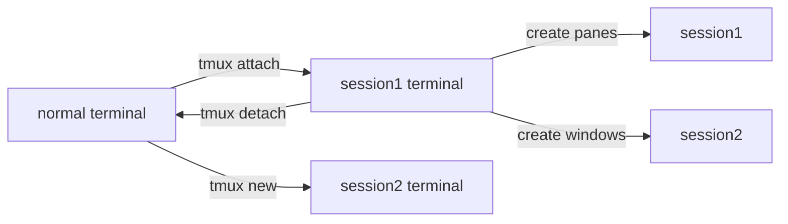

Tmux is a command line utility that enable terminal emulator to have multiple panes and windows(virtual tabs) in a single tab. In short, it is a terminal multiplexer. It can also be used as a background tasker that let you run commands in the background even though that Tmux has exited.

## Overview and Workflow


From this preview, you can see that the whole terminal is split into three panes, 1, 2, 3. The fourth arrow is the status bar. Right now, it indicates we have 0, 1, 2, 3 virtual tab and at the bottom right is the meta information.   

The the far left of the bottom line is the session name, the following are window number and window name. Notice that window 0 has a asterisk, this indicates it's the active window.  

This whole terminal is called Tmux session, inside that session, you can create panes and windows.   

You can detach that Tmux session to the normal terminal and re-attach to that session again. When you detach that session, the jobs inside that session keep running, this is not like the background jobs in bash shell. You can have multiple sessions at the same time, but you can only inside one session.

The work flow is defined as following:



All the interactions you make follows the pattern of `prefix+[something]`. A prefix is kind of like the leader key in Vim which indicates subsequent stroke is a special command. Tmux uses `ctrl+b` as the prefix, surely you can redefine it in the configuration. 

## Sessions

1. create a session or a named session called work
   ```bash
   tmux
   tmux new -s work
   ```

2. detach a session
   ```bash
   prefix + d
   # or
   tmux detach
   ```

3. attach(reconnect) a session
   ```bash
   tmux attach # last used session
   tmux attach -t work # attach a session called work
   ```
   
4. show all session and kill one 
   ```bash
   tmux ls
   ```

5. kill all the session by killing the default server
   ```bash
   tmux kill-server
   ```

6. change session name
   ```bash
   C-b $ # inside tmux
   tmux rename-session -t 0 zzz # outside tmux
   ```

## Panes

In Tmux, Vertical Split and Horizontal Split are very confusing. To avoid confusion, think of Horizontal Split as the resulting two panes are aligned along the horizontal line (x axis), Vertical Split as the two panes are aligned along the vertical line (y axis).

1. Vertical Split
   ```bash
   prefix + "
   ```

2. Horizontal Split
   ```bash
   prefix + %
   ```

3. Kill a pane
   ```bash
   prefix + x
   ```

4. toggle zoom on a panel
   ```bash
   prefix + z
   ```

5. swap panes
   ```bash
   prefix + {
   prefix + }
   ```

### Adjust Pane Size

> [!IMPORTANT]
>
> You can enable mouse mode by enter the command mode by typing `prefix + :` and then type the command `set -g mouse`. Now you can use the mouse to switch between panes and windows and resize them. With right click, you can do even more.

1. Move between panes.
   ```bash
   prefix + [arrow key]
   ```

2. Adjust panes
   ```bash
   prefix[keep holding] + [arrow key]
   ```

## Windows

1. Create a new window
   ```bash
   prefix + c
   ```

2. rename current window
   ```bash
   prefix + ,
   ```

3. Move to the next or previous window.
   ```bash
   prefix + N
   prefix + P
   ```

4. Move to a specific window by number.
   ```bash
   prefix + 0 (1,2,...)
   ```

5. Navigate through windows from all sessions
   ```bash
   prefix + w # from all sessions
   prefix + s # from current session
   ```

6. kill current window

   ```bash
   prefix + &
   ```

## Layout

You might create many panes, but you wanna re-layout them in a specific layout. Tmux comes with five  different layouts:

- `even-horizontal`
- `even-vertical`
- `main-horizontal`
- `main-vertical`
- `tiled`

You can use the layout by

```bash
tmux select-layout layout-name
```

You can toggle tmux layouts with a keyboard shortcut. Press:
```bash
Prefix + Space
```

## Window Tree

We previously talk about the `prefix + w` can navigate through windows from all sessions. In fact, this is a powerful tool that enables you to manage your windows as well. It will display all the windows. You can use arrow keys or `jkhl` to navigate through windows. Use `x` to kill a session or a pane.

To show all the sessions but not their sub windows, use `prefix + s`. 

Items in the tree are tagged by pressing `t` and untagged by pressing `t` again. Tagged items are shown in bold and with `*` after their name. All tagged items may be untagged by pressing `T`. Tagged items may be killed together by pressing `X`, or a command applied to them all by pressing `:` for a prompt.

This is a list of the keys available in tree mode without pressing the prefix key:

| Key     | Function                                                     |
| ------- | ------------------------------------------------------------ |
| `Enter` | Change the attached session, current window or active pane   |
| `Up`    | Select previous item                                         |
| `Down`  | Select next item                                             |
| `Right` | Expand item                                                  |
| `Left`  | Collapse item                                                |
| `x`     | Kill selected item                                           |
| `X`     | Kill tagged items                                            |
| `<`     | Scroll preview left                                          |
| `>`     | Scroll preview right                                         |
| `C-s`   | Search by name                                               |
| `n`     | Repeat last search                                           |
| `t`     | Toggle if item is tagged                                     |
| `T`     | Tag no items (cancel all tagged items)                       |
| `C-t`   | Tag all items                                                |
| `:`     | Prompt for a command to run for the selected item or each tagged item |
| `O`     | Change sort field                                            |
| `r`     | Reverse sort order                                           |
| `v`     | Toggle preview                                               |
| `q`     | Exit tree mode                                               |

Tree mode is activated with the `choose-tree` command.

## Misc

1. View all keybindings. Press **Q** to exit.
   ```bash
   prefix + ?
   ```

2. Enter the command line to type commands. Tab completion is available.

   ```bash
   prefix + :
   ```

3. show tine in the pane
   ```bash
   prefix + t
   ```

4. reload tmux configuration

   ```bash
   tmux source ~/.tmux.conf
   : source ~/.tmux.conf
   ```

## Customization

You can change the tmux configuration permanently by modifying the tmux configuration file. By default, this file is located at `$HOME/.tmux.conf`.

### Key Combination

For example, the default prefix key combination is **Ctrl+B**, you can unbind this shortcut and re-bind it to another shortcut like **Ctrl+A**.

```bash
# Remove the old prefix
unbind C-b

# Send Ctrl+a to applications by pressing it twice
bind Meta-a send-prefix
```

### Customize the Status bar

Tmux's status bar is fully customizable. You can change the colors of each section and what is displayed. 

- Change the status bar background color: `set -g status-bg cyan`
- Change inactive window color: `set -g window-status-style bg=yellow`
- Change active window color: `set -g window-status-current-style bg=red,fg=white`

## Full Configuration
Tmux conf located at `~/.tmux.conf`

```bash
set -g mouse

bind -n M-a select-layout main-vertical
bind -n M-q choose-tree
bind -n M-z resize-pane -Z

# switch windows alt+number
bind-key -n M-1 select-window -t 1
bind-key -n M-2 select-window -t 2
bind-key -n M-3 select-window -t 3
bind-key -n M-4 select-window -t 4
bind-key -n M-5 select-window -t 5
bind-key -n M-6 select-window -t 6
bind-key -n M-7 select-window -t 7
bind-key -n M-8 select-window -t 8
bind-key -n M-9 select-window -t 9

# Start windows and panes at 1, not 0
set -g base-index 1
setw -g pane-base-index 1

# Enable two prefixes
# set-option -g prefix C-a
# set-option -g prefix2 C-b
```

## Known Issues
1. when used inside tmux, you can't click url. Try hold `shift` and click that url.
2. 

## Clipboard Sync
When you select in the tmux, you wanna sync that to the system clipboard even through ssh. You can achieve that by OSC52 sequence, certain terminals can understand that sequence and receive the content from that sequence and set the clipboard. You can check more about tmux clipboard [here](https://github.com/tmux/tmux/wiki/Clipboard). A list of terminals support OSC52 as following:

| name                                                                                      | platform       | supported                                                    |
| ----------------------------------------------------------------------------------------- | -------------- | ------------------------------------------------------------ |
| [Alacritty](https://github.com/alacritty/alacritty)                                       | cross          | yes                                                          |
| [kitty](https://github.com/kovidgoyal/kitty)                                              | cross(not win) | yes                                                          |
| [iTerm2](https://iterm2.com/)                                                             | macos          | yes                                                          |
| [Konsole](https://konsole.kde.org/)                                                       | linux          | [not yet](https://bugs.kde.org/show_bug.cgi?id=372116)       |
| [GNOME Terminal](https://github.com/GNOME/gnome-terminal) (and other VTE-based terminals) | linux          | [not yet](https://bugzilla.gnome.org/show_bug.cgi?id=795774) |
| [Windows Terminal](https://github.com/microsoft/terminal)                                 | windows        | yes                                                          |
| putty                                                                                     | windows        | yes                                                          |
| mintty                                                                                    | windows        | turn set selection on                                        |
| [wez terminal](https://wezfurlong.org/wezterm/index.html)                                 | cross          | yes                                                          |
|                                                                                           |                |                                                              |

More terminals list can be viewed [here](https://github.com/jirutka/tty-copy).
>[!tip]
>Konsole on Arch can be fixed with `paru konsole-osc52`

## Tmux inside Tmux
Just change the prefix, use `ctrl+t` and any nested sessions still use `ctrl+b`
```bash
unbind C-b
set -g prefix C-t
```