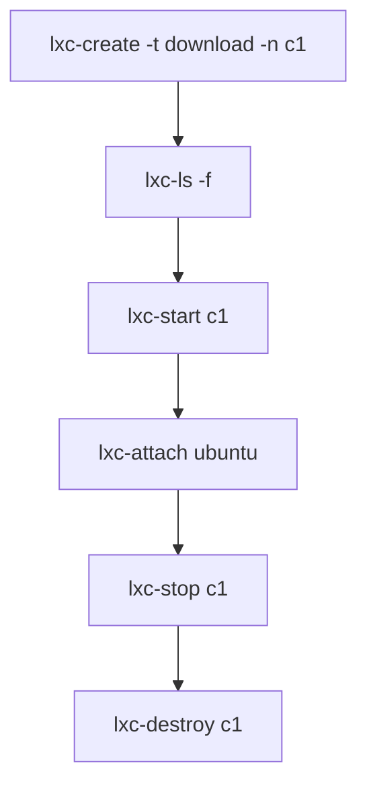

## Intro
Linux Containers (LXC) provide a Free Software virtualization system for computers running GNU/Linux. This is similar to Docker container, but provides you more capabilities like restricting disk size and cpu cores. It just like a virtual machine except the kernel is not emulated.

## Installation
### Debian Based
```bash
sudo apt install lxc
```
### Fedora Based
```bash
sudo 
```

### Change Mirror

Note that this only works for lxc 2.0 and above.

```bash
lxc remote add mirror-images http://mirrors.tuna.tsinghua.edu.cn/lxc-images/ --protocol=simplestreams --public
lxc image list mirror-images:
```

## Quick Start
### Workflow


The basic steps are:
1. create container from templates(image list) 
   ```bash
   sudo lxc-create --template download --name mycontainer 
   sudo lxc-create -t download -n ubuntu 
   ```

2. Enter the Distribution name, Release name, and Architecture by order.

   > [!tip]
   >
   > If you know the container image you want to use, you can specify the options to be sent to the download template.
   > ```bash
   > lxc-create --name mycontainer --template download -- --dist alpine --release 3.19 --arch amd64
   > ```

3. check the container status in pretty form
   ```bash
   lxc-ls -f
   ```
   
4. run the container
   ```bash
   lxc-start --name mycontainer
   ```

5. get into the container (start a container shell)
   ```bash
   lxc-attach --name mycontainer
   # or shorter
   lxc-attach mycontainer
   ```

6. see status of container
   ```bash
   lxc-info --name mycontainer # check one container
   lxc-ls --fancy # check all containers
   ```

7. (optional) stop the container 

   ```bash
   lxc-stop --name mycontainer
   ```

8. (optional) destroy the container
   ```bash
   lxc-destroy --name mycontainer #  (must stop first)
   # force destroying a container does not clear the container's lease. Be kind. Always stop a container before destroying it.
   lxc-destroy mycontainer -f # destroy it even it is running
   ```

> [!IMPORTANT]
>
> Note that you don't need to specify `--name` for all the above operations.

## Debug
There are cases that you can't run up a container. Try run it in the foreground:
```bash
sudo lxc-start ubuntu -F
```

## Commonly Used Images
### Ubuntu

```bash
# ubuntu 24 noble
lxc-create --name ubuntu --template download -- --dist ubuntu --release noble --arch amd64

# ubuntu 23 mantic
# ubuntu 22 jammy
# ubuntu 20 focal
# ubuntu 18 bionic
```

* replace with the mirror
  ```bash
  sed -i -e 's/archive.ubuntu.com/mirrors.tuna.tsinghua.edu.cn/' -e '/security/ s/^#*/#/' /etc/apt/sources.list
  
  # for ubuntu 24.04 that use new format
  sed -i -e 's/archive.ubuntu.com/mirrors.tuna.tsinghua.edu.cn/' /etc/apt/sources.d/ubuntu.sources
  ```

### Centos

```bash
# centos9 stream
lxc-create --name centos9 --template download -- --dist centos --release 9-Stream --arch amd64
```

## Alpine

```bash
lxc-create --name alpine --template download -- --dist alpine --release 3.20 --arch amd64
```

* change mirror
  ```bash
  sed -i 's#https\?://dl-cdn.alpinelinux.org/alpine#https://mirrors.tuna.tsinghua.edu.cn/alpine#g' /etc/apk/repositories
  ```

## Common Issues
* start containers failed on fedora or arch
  Because those distros don't create `lxcbr0` by default.
  1. Ensure `dnsmasq` is installed.
  2. Check `/etc/default/lxc` that  `USE_LXC_BRIDGE="true"`
  3. start the `lxc-net` service
     1. it will ok.

### Lxcbr0 not Exist
```bash
lxc network create lxdbr0
```
