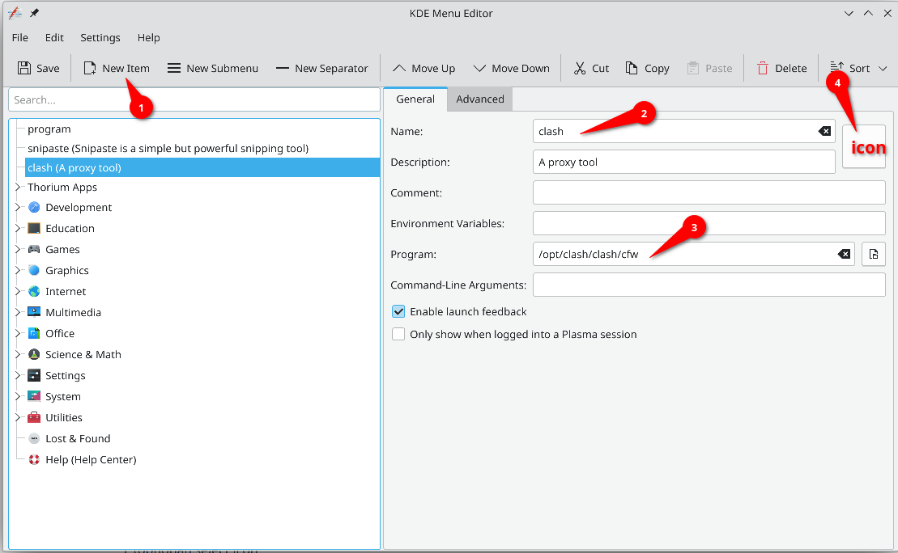

## Change Shortcuts to Windows Style
Open the settings and search for shortcut.
In the shortcuts settings, search for the following items and change their shortcuts:

| Item Name                                              | Original Shortcut | Final Shortcut  |
| ------------------------------------------------------ | ----------------- | --------------- |
| Toggle Overview(show virtual desktops)                 | meta+w            | meta+tab        |
| walk through desktops (next desktop)                   |                   | meta+ctrl+right |
| walk through desktops (reverse)                        |                   | meta+ctrl+left  |
| switch to next desktop(currently broken on Debian KDE) |                   |                 |
| Maximize window                                        | meta+pgUP         | meta+up         |

## Create Desktop Entry

To create a desktop entry, you can create a text file ends with `.desktop` and put it under the application folder. Well, you don't need to. In KDE, you can right click the bottom left KDE icon, and choose edit application. 


1. Then create a new item
2. enter the entry name and program path (normally at opt/vendor/product)
3. (optional) select icon



## Keyboard Issues

### Numlock on Startup

In the settings, search Hardware -> InputDevices -> Keyboard, then select Numlock on Plasma startup.

## Animation Disable

### Cursor Animation

appearance -> cursors -> Configure Launch Feedback, then cursor feedback choose "None".

## Wayland and X11

### Enable Legacy X11 App Support

To enable it, search "legacy x11 app support", select "always" to allow x11 apps to read keystrokes.

## Known Issues
Don't enable file index because the process accounting for it called baloom file will consume a lot of ram. `balooctl disable`
Akonadi is also responsible to high ram usage. so disable it by `akonadictl stop`.

## Installation
Take this [article](https://blog.azurezeng.com/installation-guide-for-archlinux-kde/)

SDDM hidpi settings
Add to `/etc/sddm.conf`
```ini
[General]
GreeterEnvironment=QT_SCREEN_SCALE_FACTORS=1.25,QT_FONT_DPI=120
```

## Kde Quick search
use `alt+space` to quick search like quicklook in MacOS

## Dolpine Specific
1. change dolpine as single instance in the settings
	1. change "meta+e" to open a new tab
2. show the full path by default
3. make title bar editable
4. 

## Konsole Single Instance
1. set "run all konsole windows in a single process"
2. append konsole shortcut "--new-tab"
3. change shortcut "ctrl+shift+t" to open new tab not "open konsole"

## Kate
### Enable LSP for Any Language
open the tab, find lsp, it will show that lsp isn't in your path.
Go to that URL, donwload lsp and place it into `usr/local/bin`. Why not `~/bin`, because kate doesn't share the path as `usr`. So it's better to use some standard path.
>[!important]
>Make sure the executable contain only name, for example, markdown lsp should rename from "marksman-linux-x64" to "marksman"

For Arch, you need add following lines to `~/.bashrc`
```bash
if [[ -d ~/bin ]]; then  
   PATH="~/bin:$PATH"  
fi
```

### Session
We can open a folder and save it as a session.
### Markdown
install `markdownpart` for Kate Markdown Preview
1. In the Kate, settings -> plugin -> check "document preview"
2. In the file association for ".md", go to embedding tab, set markdownpart at the top of the list