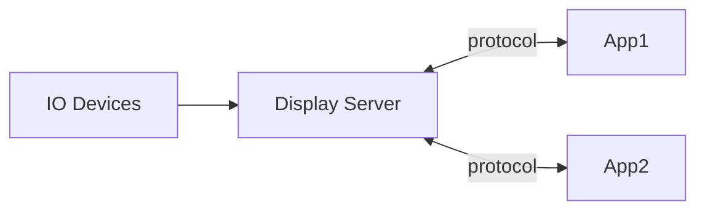

# X window system

Before diving into the Linux graphic system, which is primarily composed by X Window System. We talk a little about the history of the graphic user interface. 

## History of Graphic User Interface

In 1973, Xerox PARC developed the Alto personal computer, the first computer to demonstrate the desktop metaphor and graphical user interface (GUI). The Alto greatly influenced the design of personal computers during the late 1970s and early 1980s, notably the Apple Lisa and Macintosh.  

As for Microsoft, it transformed from MS-DOS to MS-Windows. That was a big success as the introduction of Windows 95.  On the other hand, in the Unix world, the X Window System(Commonly X11 or X), first released in the mid-1980s. The W Window System (1983) was the precursor to X. X was developed at MIT as Project Athena. Its original purpose was to allow users of the graphic terminals to access remote graphics workstations without regard to the workstation's operating system or the hardware. 

## Windowing System In General

A windowing system is a software suite that manages separately different parts of display screens. It is a type of graphic user interface (GUI) which implements the WIMP (windows, icons, menus, pointer) paradigm for a user interface.  

### Structure

The main component of any windowing system is usually called the display server, although other terms such as window server or compositor are also in use. Any GUI application is a client of the displayer server. They communicate with each other using API or a communications protocol. The display server being the mediator between the clients and the user.  

The display server accepts the input data from the user through kernel. And then pass to a specific client. It can also accept output of its clients to show content on the screen. The server/client relationship of a standalone display server  is somewhat counterintuitive in that a "server" usually thought of as a large, remote machine, whereas a standalone "display server" is a small local system, with most clients being executed on a larger central machine. The explanation is that a display server provides the services of a display and input devices.  

### List of windowing systems

* Quartz Compositor (macOS)
* X Window System
* Wayland
* Desktop Window Manager (DWM) in Microsoft Windows (Vista and later)

## X Window System Intro

As we said in the history of graphic user interface, X was specifically designed to be used over network connections rather than on an integral or attached display device. That's why lately there has been a trend that every major Linux distros switch to Wayland, which is a more superior Window System than X.  

## X Window manager

An X window manager is a window manager that runs on top of the X Window System. Unlike other vendor-controlled OS like MacOS, Windows which provided a fixed set of ways to control how windows and panes display on a screen. Window management is deliberately kept separate from the software providing the graphic display. The user can choose various third-party window managers. 

### How X window manager work

when a window manager is running, some kinds of interaction between the X server and its client are redirected through the window manager. Whenever an attempt to show a new window is made, this request is redirected to the window manager, which decides the initial position of the window. Besides most window managers wrap the window with the banner that shows the title.

### Types of window managers

#### Stacking window managers

A stacking window manager renders the windows one-by-one onto the screen at specific co-ordinates. One window can overlap another.

#### Tiling window managers

A tiling window manager is a window manager with an organization of the screen into mutually non-overlapping frames , as opposed to the traditional approach of coordinate-based stacking of objects. Tiling window managers include dwm, i3, and XWEM.  

## Desktop Environment and Login Manager

Linux has so many desktop environment like KDE, GNOME, and LXDE. We consider the window manager is part of the desktop environment. Because it is a core component of the GUI. On the other hand, login manager is used to start the x-server and login in the user. For example, KDE use SDDM as its login manager.  And KDE has its own window manger, KWin, we can replace it using any other window manager like i3wm. You can check the tutorial about how to replace KDE's default window manger [here](https://wiki.archlinux.org/title/KDE#Use_a_different_window_manager).  

## X11 forwarding over SSH

X11 forwarding, `ssh -x`, is an SSH protocol that enables user to run graphical applications on a remote server and interact with them using their local display and I/O devices. Since the data transferred is not encrypted, we choose SSH to secure our data.  

