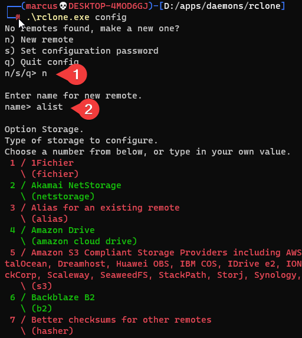

[Alist](https://alist.nn.ci/) is a file program that supports multiple storage.

## mount webdav on windows
We can use a console program called rclone. It is a daemon, you can use nssm to run this daemon.
1. Before using it, you need to install [winscp](https://github.com/winfsp/winfsp) on Windows
2. After that, Enter the directory and run rclone.exe config
3. Create a new config
   
4. enter number 49 to choose WebDav

For Alist use the following conf:

1. http://127.0.0.1:5244/dav

2. Note that the port     number is the same as the web port

3. Your account and password

4. Choose other WebDav     configuration

5. After you made     your configuration, you can start mounting the drive to e.g. Z:\ by:
   ```bash                
   .\rclone.exe mount alist:/ Z: --vfs-cache-mode full
   ```

   > [!NOTE]
   >
   > Note that alist is your config name, Z: is the drive letter you wanna mount on

   > [!TIP]
   >
   > You can also use the experimental feature: web gui configuration by typing:
   >
   > ```bash
   > rclone rcd --rc-web-gui
   > ```
