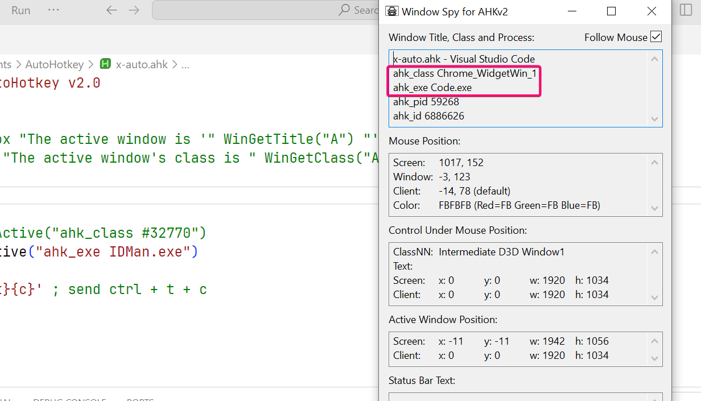

AutoHotKey is a script language.
## Basic
```vim
var1 := 'string'
var2 := "another string"
var3 := 'embed "quotes"'
var1 := unset ; unset a variable
x := 3 ; number
y := 4 
result := x + y
; boolean value
isTrue := true
isFalse := false


# test the variable is init
varResult := IsSet(var1)

# todo object
```

## Functions

```vim
Add(x, y)
{
    return x + y
}

Add(3,2)

MsgBox("something")
MsgBox "something" 
```

For historical reason, parentheses can be omitted when calling a function at the start of a line. There are many functions have optional parameters, like this:

```vim
ControlSend Keys [, Control, WinTitle, WinText, ExcludeTitle, ExcludeText]
```

Square brackets signify that the enclosed parameters are optional. You have to use `,` to omit certain parameters, and put the optional parameters you wanna enter at the right position.

```vim
ControlSend "^{Home}", "Edit1", "A"  ; Correct. Control is specified.
ControlSend "^{Home}", "A"           ; Incorrect: Parameters are mismatched.
ControlSend "^{Home}",, "A"          ; Correct. Control is omitted.
```

### More on Functions

```vim
; default parameters
Add(X, Y, Z := 0) {
    return X + Y + Z
}

; optional parameter
MyFunc(p?) {  ; Equivalent to MyFunc(p := unset)
    if IsSet(p)
        MsgBox "Caller passed " p
    else
        MsgBox "Caller did not pass anything"
}

Greet(title?) {
    MsgBox("Hello!", title?)
}
```

Attempting to read the parameter's value when it has none is considered an error, To pass an optional parameter through to another function even when the parameter has no value, use `title?` in this case.

> [!warning]
> Note that all variables used in functions are local. To reference a global variable, use `global` keyword.
Note that when you write `func`, it actually call this function without any parameter.

## HotKey

We can use `HotKey` and `HotString` functions to define hotkeys and hotstrings.

```vim
; Hotkey KeyName [, Action, Options]
Hotkey "^!z", callback ; ctrl + alt + z

callback(key)
{
    MsgBox "You pressed " key
}
```

Parameter **"KeyName"** has a special format. We use special symbols to define modify keys

| key  | desc                                                         |
| ---- | ------------------------------------------------------------ |
| #    | Win (Windows logo key).                                      |
| !    | Alt                                                          |
| ^    | Ctrl                                                         |
| +    | Shift                                                        |
| *    | Wildcard: Fire the hotkey even if extra modifiers are being held down. `*!a` trigger ctrl+a+any |

The complete list is [here](https://www.autohotkey.com/docs/v2/KeyList.htm)

Clearly, the use of hotkey is so common that there's a special syntax to define it more easily.

```vim
; a single function
keyname::function

; multiple functions
keyname:: {
	function1
	function2
}

; defines a hotkey that runs Notepad whenever you press `Win+N`, write following:
#n::Run "Notepad.exe"
```

## HotString

```vim
; Hotstring String [, Replacement, OnOffToggle]

Hotstring "::btw", "behind the wheel" ; btws would be replaced with behind the wheel
```

The hotstring's trigger string, preceded by the usual colons and option characters. For example, `::btw` or `:*:]d`. Just like hotkeys, it is so common that it has a special syntax to ease the definition.

```vim
::btw::by the way

::btw:: {
    MsgBox 'You typed "btw".'
}
```

Note that replacement can also be actions.

## KeyStrokes

We use Send function to send multiple keystrokes at once. It can only send texts. You can directly enter modifier keys like `^`, `!`, `+` or `#`. However, to send normal keys, you wrap them into `{}`. For keys not wrapped in `{}`, those would be considered as normal text.

```vim
Send "^{Home}" ; presses Ctrl+Home
Send "+abC" ; sends the text "AbC"
Send "!a" ; presses Alt+A
Send "#e" ; holds down Win and presses E
```

`{}` can embed other expression into it, like press a key 4 times

```vim
Send "{DEL 4}"  ; Presses the Delete key 4 times.
Send "{S 30}"   ; Sends 30 uppercase S characters.
Send "+{TAB 4}"  ; Presses Shift-Tab 4 times.
```

Some common key names are listed here:

| Key name            | Description                                                  |
| ------------------- | ------------------------------------------------------------ |
| `{F1} - {F24}`      | Function keys. For example: `{F12}` is F12.                  |
| `{{}`               | `{`                                                          |
| `{}}`               | `}`                                                          |
| `{Enter}`           | Enter on the main keyboard                                   |
| `{Esc}`             | esc                                                          |
| `{Space}`           | this is only needed for spaces that appear either at the beginning or the end of the string to be sent -- ones in the middle can be literal spaces |
| `{LAlt}/{RAlt}`     | Left/Right Alt                                               |
| `{LShift}/{RShift}` | Left/Right Shift                                             |

## Conditional commands

```text
#HotIf WinActive("ahk_class #32770")
^v:: {
    Send '!{t}{c}' ; send ctrl + t + c
}
#HotIf
```
Every command wrapped in this `HotIf` will execute only the expression is evaluated true.

## Find window name

We can use AutoHotKey window spy to get window class name and exe name of the window that the cursor points to. The following information is about VsCode window.


After that, you might use the conditional commands to activate certain commands on IDM.
```text
; #HotIf WinActive("ahk_class #32770")
#HotIf WinActive("ahk_exe IDMan.exe")
^v:: {
    Send '!{t}{c}' ; send ctrl + t + c
}
#HotIf
```
Here, I prefer `ahk_exe` over `ahk_class`, since most electrons use the same window class called `Chrome_WidgetWin_1`. 
You can clearly combine these two conditions, since each program might have different windows that you only wanna match a certain one.

## Run a program
For some programs (like OBS Studio, for example) you need to also use the correct WorkingDir (using the second parameter of the [Run](https://autohotkey.com/docs/Run) command), because "(i)f omitted, the script's own working directory (A_WorkingDir) will be used". Some progs don't like this.

## See more
Docs are available as chm in your installation folder. `C:\Program Files\AutoHotkey\v2\`. It is called AutoHotkey.chm.
[official sites](https://www.autohotkey.com)

## String operation

```text
; explicit concat
home . 'sdf' . 'something'

; implicit concat
home 'sdf' 'something'
```

## Controls
See "GUI Control Types". You can use `Gui.Add[Control]` to add a control type to a GUI window.

## See More