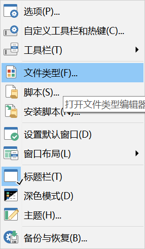

## [Drag and Drop operation](https://www.gpsoft.com.au/help/opus10/index.html#!Documents/Drag_and_drop.htm)
- Drag-and-drop of a file to another folder on the same drive will move it
- Drag-and-drop to a folder on a different drive will copy it
- Holding the **Shift** key when dropping forces the file to be moved
- Holding the **Ctrl** key when dropping forces it to be copied
- Holding the **Alt** key when dropping creates a shortcut to the file
- Drag-and-drop with the right button displays a menu that lets you select _Copy_, _Move_ or _Create Shortcut_ as the action.

To change it, you can edit it by the File Types.

