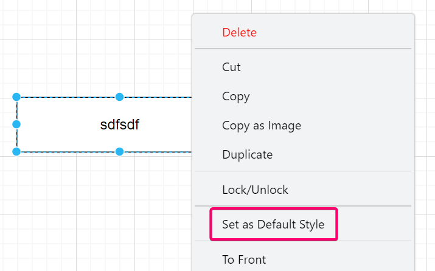
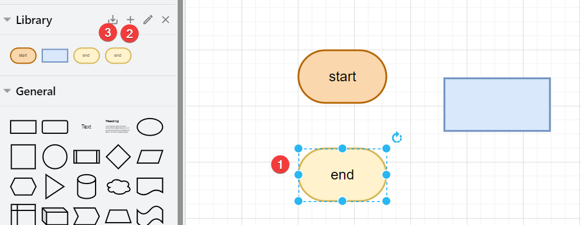

## Set default font size

Create a shape and change its fonts and right click set it with "Set as default style"

## Library
You can store custom shapes in your library. So every time you create a new file, you can import the library into your file. A library is just a normal drawio file. To create and enable it:
1. File -> New Library
2. Enter the library name, save the library as draw.io file
3. import the library from File -> Open Library
4. Click the shape you wanna add, click plus button, and step 3 to save the library otherwise your shape will lose
 

