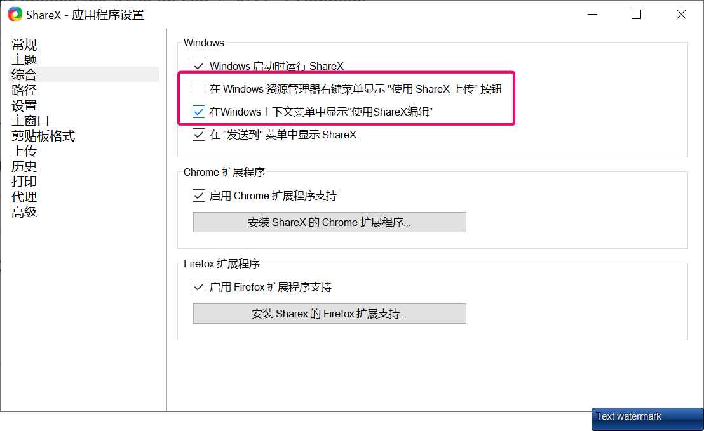

## Common settings
1. disable upload
   Application Settings - Advanced - Disable Upload
2. enable image editor in the context menu
   

## Image Editor shortcut

| key        | meaning               |
| ---------- | --------------------- |
| rightclick | remove the mark       |
| m          | mouse                 |
| i          | steps tag             |
| r          | rectangular           |
| l          | draw a line           |
| t          | add text              |
| p          | 马赛克                   |
| h          | highlight             |
| c          | crop selected area    |
| x          | cut out selected area |

## See more
