## Preparation
### Create a winform project
### High Dpi support

1. Click your project and add an item "manifest"

2. enable Windows 10 compatibility

3. add the following lines into `app.config`
   ```xml
   <configuration>
     <!-- ... other xml settings ... -->
   
     <System.Windows.Forms.ApplicationConfigurationSection>
       <add key="DpiAwareness" value="PerMonitorV2" />
     </System.Windows.Forms.ApplicationConfigurationSection>
   
   </configuration>
   ```

4. Call the static [EnableVisualStyles](https://learn.microsoft.com/en-us/dotnet/api/system.windows.forms.application.enablevisualstyles) method in the main method of file Program.cs
   ```csharp
   // program.cs
   static void Main()
   {
       Application.EnableVisualStyles(); // add this line
       Application.SetCompatibleTextRenderingDefault(false);
       Application.Run(new form1());
   }
   ```

## Visual studio interface

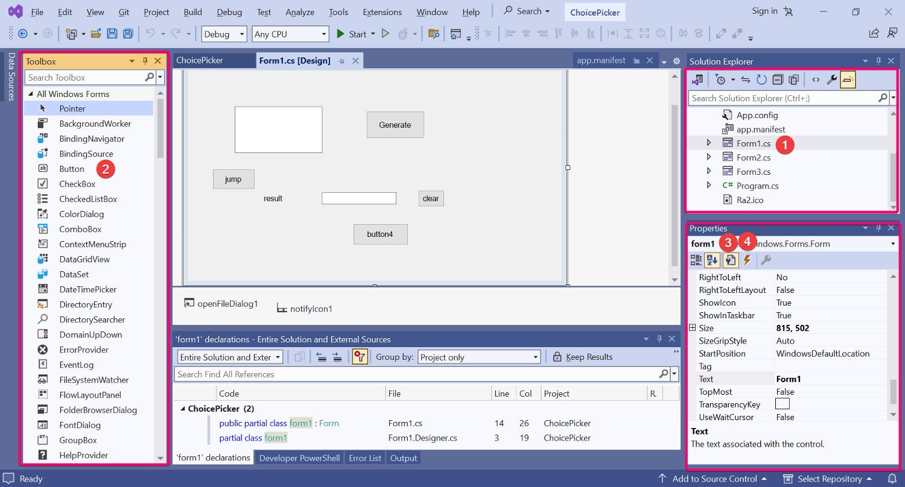

1. You click `Form1.cs` in region 1 to show the form1 designer. 
2. You can drag controls from region2.
3. Region 3 is used to change properties of the selected control (click to choose a control)
4. The button at location 4 is used to bind event handlers(functions) to the control.

### Code

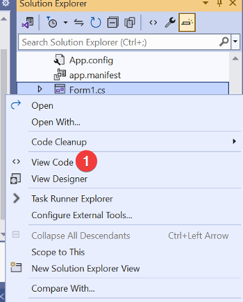

You can check the associated code of the form.

### Events

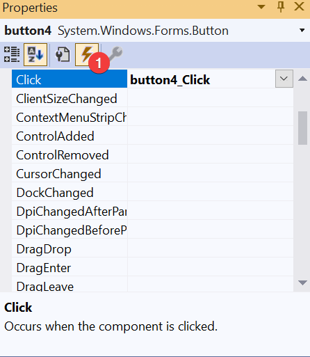

You can bind as many event handlers as you want. Double click on an event, it will generate a handler. Or select existing methods from a drop down list.

## Advanced
### Create a tray icon

1. Drag a notify icon control into the form.

2. add the icon in the project root, and set property "copy to output dir" to "copy always"

3. add the following code to show the icon
   ```csharp
   notifyIcon1.Icon = new Icon("Ra2.ico");
   notifyIcon1.Visible = true;
   ```

   This `new Icon` will try to find the specified icon from output root directory. So you need to copy the icon there.

   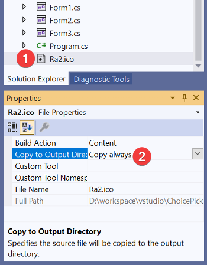

## Controls

### Picture control

| property | meaning                           |
| -------- | --------------------------------- |
| Image    | the showing image                 |
| Sizemode | show the image in full or partial |
|          |                                   |

by default, resource pictures are embedded into the executable.

## Dialogs
Dialog controls are not visible even you drag them on the designer page. Typically, you would use `controlName.Show()` or similar methods to display it.

MessageBox is a little special. There's no control. You use code to create it.

```csharp
MessageBox.Show("some message");
```

### Common control properties and methods

| property                                    | meaning                                      |
| ------------------------------------------- | -------------------------------------------- |
| name                                        | the variable name referring to the control   |
| text                                        | display text (as for "form", it's the title) |
| visible                                     | visibility                                   |
| `control1.focus()`                          | move the focus to the control                |
| `this.Close()`                              | close the current form                       |
| this                                        | refer to the current form                    |
| `this.BackColor=Color.Blue`                 | change the current form's color              |
| `label1.BackColor = Color.Black;`           | set color of a control                       |
| `label1.BackColor = SystemColors.Control; ` | set default colors on your system            |
|                                             |                                              |

## Reading Input with TextBox

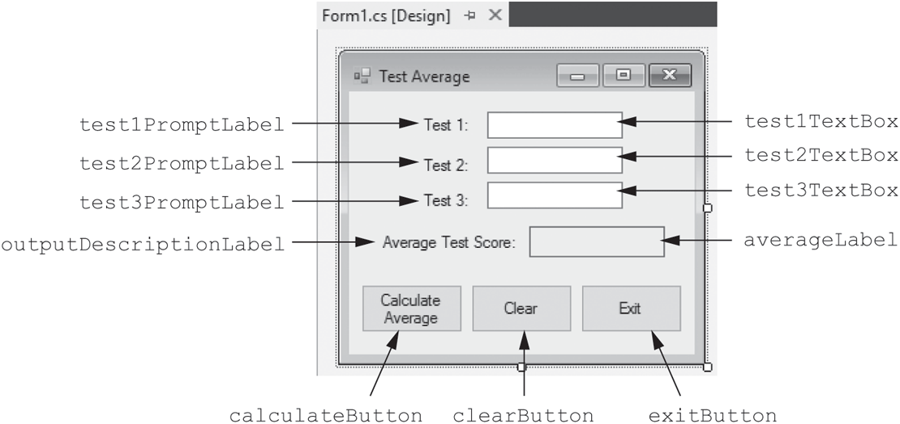

You use textbox to accept user inputs. You need to handle invalid data with "try catch".

```csharp
int num;

try {
    num = int.Parse(textBox.Text); // convert into int
	num = 234324;
	num.toString('n'); // number format
	num.toString('c'); // currency format
	num.toString('p'); // percent format
} catch (Exception ex) {
    MessageBox.Show(ex.Message);
}

// avoid exceptions
if (int.TryParse(string, out num)) {
    // do something
} else {
    // show error messages
}
```

```csharp
const double INTERTEST_RATE = 0.129
```

using math class

you can print lines into the console. You can show it in the "Output". Position 1 can clear the output.

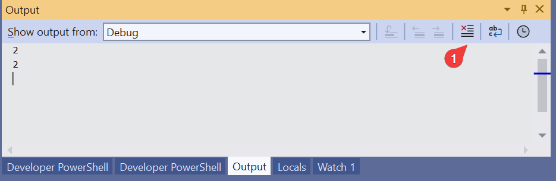

## Mnemonic support

In windows, you can hit `Alt`, some controls will show a letter with underline. You can hit with that key to trigger that control.
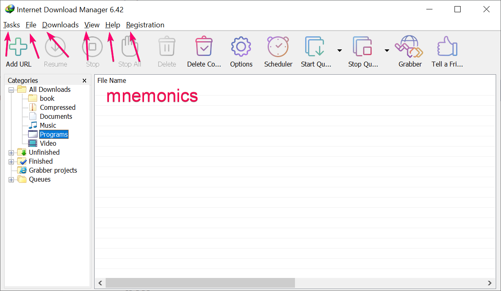

You use `b&tton1` to enable a mnemonic of b`. To type a true ampersand, use `&&`.

## Organize controls

GroupBoxes and Panels

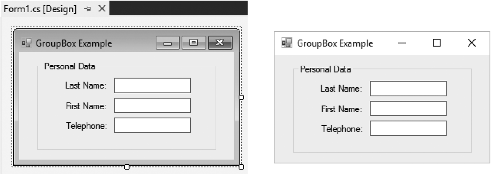

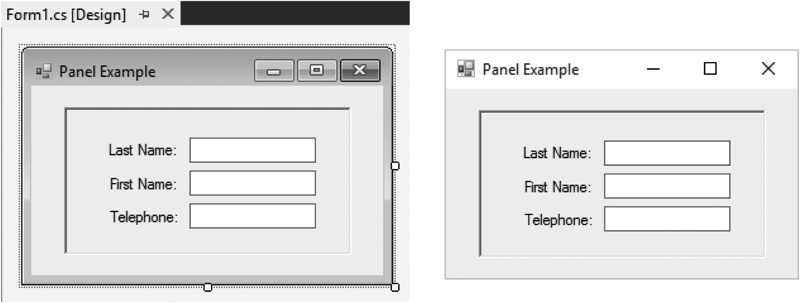

You would place radio controls into a GroupBox control. All radio controls can mutually-exclusive.

checkbox or radio button

```csharp
if (checkBox.Checked) {
    // do something
}
if (radioButton.Checked) {
    // do something
}

// The CheckedChanged Event
```

## Listbox

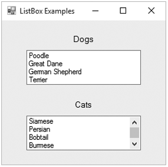

It displays a list of items and allow the user to select an item from the list.

```csharp
// An exception will occur if you try to get that property value 
// when no item is selected in the ListBox.
if (fruitListBox.SelectedIndex != −1)  
{
    selectedFruit = fruitListBox.SelectedItem.ToString();
}
```

You can show the result in another label.

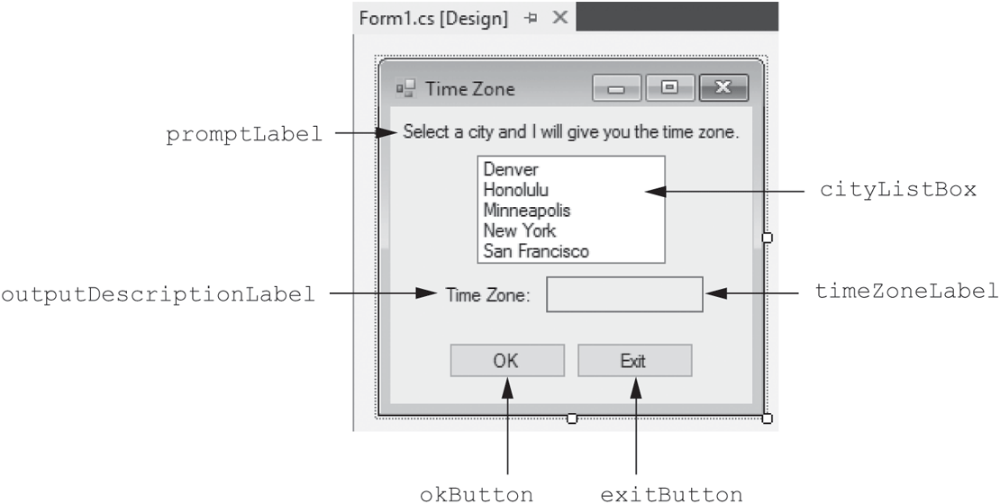

```csharp
listBox1.Items.Add("sdf");
listbox1.Items.Count == 0; // items
listbox1.Items.Clear(); // erase all items
```

## Files

```csharp
using System.IO;

// write a new or existing file
StreamWriter outputfile;
outputfile = File.CreateText("hello.txt");
outputfile.WriteLine("something");
outputfile.Write("nonewline");
outputfile.Close();

// append data
outputfile = File.AppendText("hello.txt");

// specify a path
outputfile = File.CreatText(@"C:\test\Names.txt");

// read
StreamReader inputFile;
inputFile = File.OpenText("a.txt");
string str = inputFile.ReadLine();

while (!inputFile.EndOfStream) {
    // read
    // process
}

inputFile.close();
```

## Filedialog

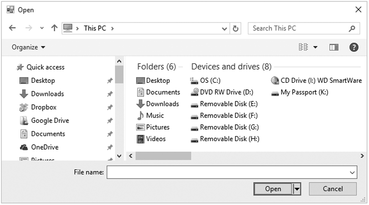

```csharp
StreamReader inputFile;

// By default, it displays the contents of the user’s Documents directory 
openFile.InitialDirectory = "C:\Data";
if (openFile.ShowDialog() == DialogResult.OK) {
    // Open the selected file.
    inputFile = File.OpenText(openFile.FileName);
    // Continue processing the file…
}
else {
    MessageBox.Show("Operation canceled.");
}
```

By default, the word *Open* is displayed in an *Open* dialog box’s title bar. You can change the default text displayed in the title bar by changing the control’s **Title property**.

## Multiple form
You can create a second form in your main form.

```csharp
form2 = new Form2();
form2.Show(); // open an independent form
form2.ShowDialog(); // show as the dialog, parent form can't click
```

How would you share data between forms

1. pass data to the sub form constructor
   ```csharp
   // method1
   form2 = new Form2("some data");
   form2.Show();
   ```

2. each form have a public `SetData` method to accept data
   ```csharp
   // pass the reference to the sub form
   form2 = new Form2(this);
   form2.Show();
   form2.SetData("hello");
   
   // Form2.cs
   form1.SetData("some data");
   ```


## Multiple document interfaces (MDI)

An MDI application presents a collection of forms within a single application window. This style has fallen out of favor in recent years in lieu of more recent styles that are thought to be more useful. This includes the multiple single document interface style employed by Microsoft Word, and the multiple tabbed documents interface style employed by the Firefox web browser and Visual Studio. 

## API

### Find events

Locate the control, say, you wanna register a event of "Form" control.
You can the form in the [api](https://learn.microsoft.com/en-us/dotnet/api/system.windows.forms.form?view=netframework-4.7.2), and locate all the events there.

## See more

[WinForm Guide](https://learn.microsoft.com/en-us/dotnet/desktop/winforms/?view=netframeworkdesktop-4.8)

[WinForm Class API](https://learn.microsoft.com/en-us/dotnet/api/system.windows.forms.notifyicon?view=netframework-4.7.2)
[resource management](https://learn.microsoft.com/en-us/dotnet/core/extensions/create-resource-files?redirectedfrom=MSDN#see-also)

[webview2](https://learn.microsoft.com/en-us/microsoft-edge/webview2/get-started/winforms)

[webview2 intercept new page as a tab](https://stackoverflow.com/questions/62799506/create-tabs-using-webview2-edge)

[sqlite](https://learn.microsoft.com/en-us/dotnet/standard/data/sqlite/?tabs=visual-studio)

