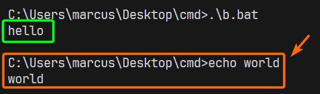

## cmd

cmd is a scripting language just like bash.  
It can store variables and have loops.


## Help

You can type `HELP` in cmd to view all available commands.   

To view parameters of a command, append `/?` to the command, just like `--help` in Linux.

## commands compared with bash

| cmd  | bash  |
| ---- | ----- |
| cd   | cd    |
| cls  | clear |
| echo | echo  |


## arguments

Using the `%*` in a batch script refers to all the arguments (for example, `%1`, `%2`, `%3`, ...).

You should wrap `%*` within quotes, in case the value contains spaces. So it should be `"%1"`

### a wrapper batch file

You can use a batch file to create a wrapper for an exe.

```cmd
@echo off
"C:\xx.exe" -parameter "%1"
```

This will pass the first argument to the target. You can use [bat to exe converter](https://www.f2ko.de/en/applications/bat-to-exe-converter/).  This converted exe can hide the window when running.  


## stop echoing commands

By default, when executing a command, it will echo the executed command.

To suppress that, just append `@` before a command.

To suppress all of it, put `@echo off` beforehand, or use `@echo on` to enable it.

```cmd
@echo off
echo hello

@echo on
echo world
```



## 在chrome中展台模式kiosk

```cmd
@echo off
"C:\Program Files\Google\Chrome\Application\chrome.exe" --kiosk "https://baidu.com"
```

