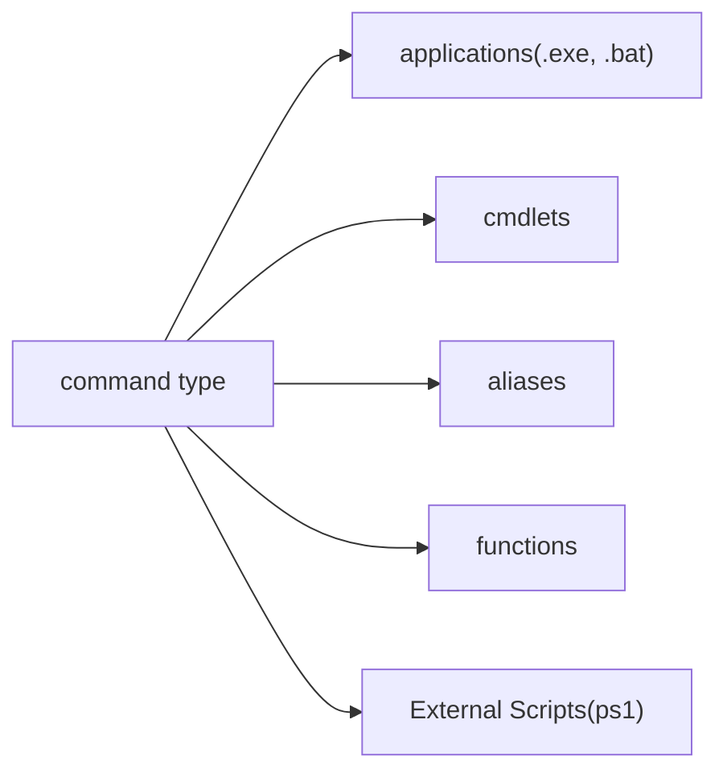

## Intro

PowerShell is now the default shell on Windows. We'll first state the command line use and then dive more on the script side.

## CmdLet
Cmdlet is a special command that can accept objects from the pipeline. Since PowerShell pipeline pass the objects not strings. 
Every PowerShell command is a cmdlet that can accept objects. You can also define cmdlet functions in PowerShell.
Cmdlets are not limited to PowerShell commands, you can create an `.exe` which implement `Cmdlet` interface.

## Command Line Structure

PowerShell has a similar structure with [Bash](../devops/1-linux/administration/Bash.md). The structure can be expresses as the following:

```powershell
command [-options] [<CommonParameters>]
```

The command have so many types as following:



The `Get-Command` cmdlet gets all commands that are installed on the computer, including cmdlets, aliases, functions, scripts, and applications. 
### Command Precedence
If you don't specify a path, PowerShell uses the following precedence order when it runs commands.
1. Alias
2. Function
3. Cmdlet (see [Cmdlet name resolution](https://learn.microsoft.com/en-us/powershell/module/microsoft.powershell.core/about/about_command_precedence?view=powershell-7.4#cmdlet-name-resolution))
4. External executable files (including PowerShell script files)
## Getting Help

Just like the notorious **mandoc** on Linux, the PowerShell has its own help system. You can query the syntax of a command (mostly cmdlet) by the `help` command and the `Get-Help` cmdlet. It is often used with parameters `Examples`.

```powershell
get-help add-content -examples
```

Besides that, the PowerShell help system provides **About Topics**, which are help snippets for broader subjects and specific commands. They all start with **about**, so you can view them by :

```powershell
get-help about*
```

## Option Style

As for PowerShell, the options are started with `-`, for instance, `ls -Hidden`. Parameters can have following types:

1. positional parameters
2. named parameters
3. switch parameters
4. common parameters

By convention, every parameter you type you should precede it with a name, like `ps -name *qq*`, however, for simplicity in command line, the named parameters can be tagged as positional parameters, so you can also use it like `ps *qq*`.  It will bind to the right parameters. 

Switch parameters are parameters that take no parameter value. Technically, it accepts Boolean value, `$true` or `$false`. It defaults to `$false`, so it can act like a switch to be switched on when providing no parameters.

Common parameters are a set of cmdlet parameters that you can use with any cmdlet. They're implemented by PowerShell, not by the cmdlet developer, and they're automatically available to any cmdlet. You can use the common parameters with any cmdlet, but they might not have an effect on all cmdlets. For example, if a cmdlet doesn't generate any verbose output, using the **Verbose** common parameter has no effect. The common parameters are also available on advanced functions that use the **CmdletBinding** attribute or the **Parameter** attribute.
## Variables and Types

Variables in PowerShell come in two broad classes: user-defined variables, and automatic variables, which already exist in PowerShell.

How to define a variable:

```powershell
$color = 'blue'
$color
set-variable -name color -value blue
get-variable -name color
```

> [!TIP]
>
> When you use the equal sign to define a variable, you're doing the same thing you'd do with the `Set-Variable` command. Likewise, when you type a variable into the console, and it prints out the value, you're doing the same thing you'd do with the `Get-Variable` command.

> [!tip]
>
> You can also use `Get-Variable` to return all available variables.

As for automatic variables, the common ones are listed in below:

| Variable        | Description                                      |
| --------------- | ------------------------------------------------ |
| `$null`         | suppress output                                  |
| `$LASTEXITCODE` |                                                  |
| `$?`            | true or false based on exit code of last command |

There are also some variables referred to as preference variables, These variables control the default behavior of PowerShell, like error handling, strictness. You can check them by `get-variable -name *preference`.

| variable                         | description |
| -------------------------------- | ----------- |
| `set-strictmode -version latest` | strict mode |

### Basic Types

There are several data types, including bools, strings and integers.

```powershell
$foo = 1 # integer
$foo2 = 'one' # string
$foo3 = $true; $foo4 = $false # bool
$num = 1.5 # float
$num.GetType().name # calling method
```

From the above examples, you might wonder how powerful PowerShell is compared to Bash. Well, in general, every variable is an object just like those concepts in Java, Ruby. So you can call method on them. 

### Data Structures

There are three types of data structures, clearly they are all objects, arrays, ArrayList, and hashtables.

```powershell
$color = @('blue', 'white', 'yellow')
$emptyList = @()
$liset=  1,2,3
$color += 'red'
$color += @('pink', 'cyan')

$colorPicker = [System.Collections.ArrayList]@('blue', 'white', 'yellow', 'black')
$colorPicer.Add('gray')
$colorPicker.Remove('gray')


# hashtables
$user = @{
	name = 'xcy'; # semicolons are optional
	age = 25
}

$user['name']
$user.age
$user.Keys # list all keys
$user.Values # list all values
$user.Add('height', '1.83')
$user['gender'] = 'male'

$user.ContainsKey('profession') # bool
$user.remove('age')
```

Creating Custom Objects are useful when you are dealing with pipelines, which is a topic we'll soon talk about it.

```powershell
$myObject = New-Object -TypeName PSCustomObject
$myObject2 = [PSCustomObject]@{OSBuild = 'x'; OSVersion = 'y'}
```

### [Script blocks](https://learn.microsoft.com/en-us/powershell/module/microsoft.powershell.core/about/about_script_blocks?view=powershell-7.5)

```powershell
{ param ([type]$Parameter1 [,[type]$Parameter2]) 
	<statement list> 
}
```

### Viewing Objects

Objects have its properties and methods, they all referred to as members. 

1. To view only properties of an object
   ```powershell
   $obj | select-object
   $num | Select-Object -Property Length
   ```

2. To view all members of an object
   ```powershell
   ls | get-member
   ```

> [!tip]
>
> You can view the type of the variable by `$num.getType()`. If the type is Array, you can check more info by inspecting its members using `$output | get-member`.  It is also helpful to see a variable is Array or not by `$num -is [array]`.

## How PowerShell Interpret Commands

PowerShell is a modern script language. It is more powerful than Bash, because it was written in DotNet. In turn, it can use all libraries provided. Recall that we talk about the structure of the typical command line, this may be the case for Bash, but not for PowerShell. PowerShell treat those commands more like an expression, in that sense, you can check some examples.

```powershell
$name = sdf # error
$name = 'sdf' # right
$output = (ls).Length
```

As for Bash, after that expansion process, everything is treated as strings. However, for PowerShell, in this case, the assignment is more like those programming languages. It view `sdf`as a command not a string. That's consistent in other languages. Think of the PowerShell like the interactive console of other languages, like NodeJS. It will evaluate each line and print out the output.

**Just remember when you wanna assign a string, use quotes**. 

> [!important]
>
> As in the last line of the example, you can wrap your expression with parentheses to further process it. 

### Line Continuation

Just like Bash, you can spread your one line command into multi-lines by using line continuation. The symbol for that is backtick and space. So it looks like this:

```powershell
Get-Process -Name `
"Powershell_ISE"
```

Pipeline also can be used.

```powershell
Get-Service |
  Where-Object CanPauseAndContinue -eq $true |
    Select-Object -Property *
```

## Pipelines

PowerShell also have pipelines, albeit based on objects not string. The output of most cmdlets and functions are objects. When you pass parameters to a command, PowerShell initiates a process known as parameter binding, in which it matches each object you pass into the command to the parameters specified by the command's author. For a PowerShell command to accept pipeline input, the author of that command has to explicitly build in pipeline support for that parameter. 

You can check whether the command accept pipeline input. 

```powershell
help get-service -full
```

Note that there are two parameters accept pipeline input. How would PowerShell determine which one should accept the input? Notice these two parameters require different types, so when you pass the output to that command, it will try to match each parameter that accept input. If there's no matched type, it will throw an error. As you might expect, there may be two parameter accepting string type, in that case, you should notice that that parameter accept pipeline input via **ByValue** or **ByPropertyName**. `ByValue` Just means by the type, we've talked about it. If no matched type, it will try to inspect whether the object the specified property key, let's view a concrete example:

```powershell
$CustomObject = [pscustomobject]@{
 Name = 'w32time'
 }
 
 $CustomObject | Get-Member
```

> [!note]
>
> Note that in this example, no type matched, the value of property `Name` is passed to the Name parameter, in this case, it binds by property name instead of by value(type) because the contents of `$CustomObject` is an object that has a property named **Name**.

> [!important]
>
> ```bash
> Get-ChildItem | get-acl
> ```
>
> In this example, left command didn't return an array of string as required in the right command. Left Command returned `FileInfo` objects, which have `PSPATH` attributes. The `LiteralPath` has an alias `PSPATH`. So in this case, it bound by property name or specified property aliases, so this property name can be `LiteralPath` or `PSPATH`.

### Pipeline One At a Time

The output of a command could be a single object or an array of objects. When you pipe multiple objects to a command, PowerShell sends the objects to the command one at time. 
When you use it as a command parameter, the objects are sent as a single array object. This has significant consequences. A concrete example is shown here:

```powershell
Get-Process | Get-Member # pass an object at a time
Get-Member -InputObject (Get-Process) # pass as an array
```

Note that the first line output the members of the item type , however, the second one output the members of the array type. Also Note that even though `Get-Member` is called many times, it eliminates duplicates, so if the objects are all of the same type, it only displays one object type.
## Jobs Control

https://learn.microsoft.com/en-us/powershell/module/microsoft.powershell.core/about/about_operators?view=powershell-7.4&viewFallbackFrom=powershell-7.1#call-operator-

## See More

[PowerShell Examples](./PowerShell%20Examples.md)
[PowerShell-Scripting](./PowerShell-Scripting.md)
[PowerShell-Scripting-CrashCourse](./PowerShell-Scripting-CrashCourse.md)
