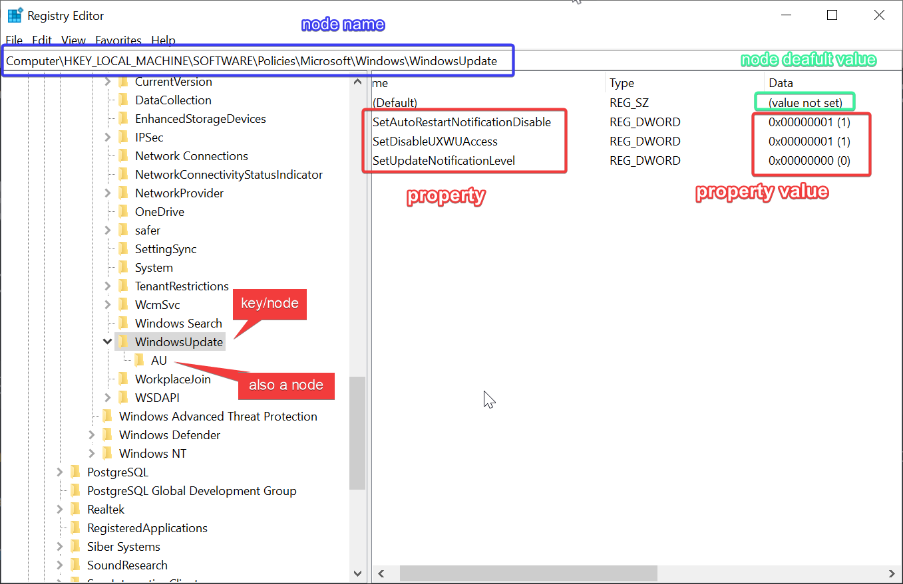

## Structure of Registry

^3c7f5a

Prior to Windows Registry, Windows use `.ini` files to store settings. Clearly Windows Registry is better for central management. Windows Registry is more like a node Tree or a database. Each node in the tree is called a key, you can access that key using registry path like `HKEY_LOCAL_MACHINE\SYSTEM\CurrentControlSet\Control\`. 
And each node has properties attached to it.

Note that each key can have subkey, so if you have a key like `HKEY_LOCAL_MACHINE\SYSTEM\CurrentControlSet\Control\` you can have a subkey `\HKEY_LOCAL_MACHINE\SYSTEM\CurrentControlSet\Control\BGFX`. You might think they are related, but their path is more like those objects path in OSS. They are useful when you manage them, but the core is the values associated with that key. The values have a name and data. Data can have many data types like DWORD, string. The values are also be called as entries.

> [!important]
>
> 
> 

:::important
Although you can `cd` into registry using `HKLM:\` in PowerShell, and you might use `ls` to show all sub keys(node).  
However, to get all properties associated with this key(node), you have to use a separate command. Check more on [PowerShell Examples](powershell-examples.md#registry-trees).