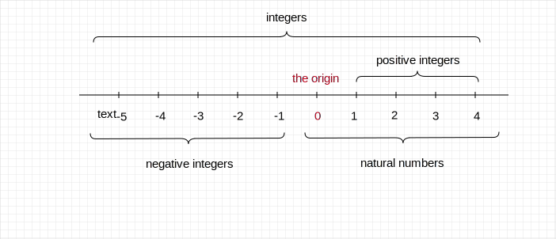
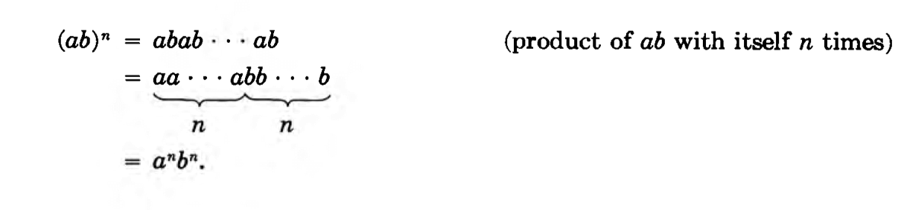

# Basic Mathematics

## number

### Rules for addiction 

1. Commutativity
$$
a + b = b + a \\
3 + 5 = 5 + 3 = 8\\
-2 + 5 = 5 + (-2) = 3
$$
2. Associativity

$$
(a + b) + c = a + (b + c)\\
(3+5) + 9 = 8 + 9 = 17\\
3 + (5 + 9) = 3 + 14 = 17\\
(2 + (-5)) + (-3) = -3 + (-3) = -6\\
2 + (-5 + (-3)) = 2 + (-8) = -6
$$

3. If $a + b = 0$, then $b = -a$ and $a = -b$

*Proof:*

add $-a$ to both sides of the equation. We get $-a+a+b=-a+0$ , then $b=-a$

**Special Case:**

because $a + (-a) = 0$, thus we get $a = -(-a)$

## Rules For MULTIPLICATION

1. Commutativity

$$
ab = ba\\
$$

2. Associativity

$$
(ab)c = a(bc)\\
(3\cdot7)\cdot4 = 21\cdot4 = 84\\
3\cdot(7\cdot4) = 3\cdot28 = 84\\
$$

3. Distributivity

$$
a(b+c) = ab + ac\\
(b+c)a = ba + ca\\
$$

4. power rule

we say that $aa = a^2$, $aaa=a^3$, $aaaa=a^4$, and in general if n is a positive integer, 
$$
a^n = aa... a \quad \text{(the product is taken n times)}
$$

$$
a^{m+n} = a^{m}a^{n}
$$

$$
(a^m)^n = a^{mn}\\
$$

$$
(ab)^n = a^{n}b^{n}
$$

5. Frequently used formulas

$$
(a+b)^2 = a^2 + 2ab + b^2\\
(a-b)^2 = a^2 - 2ab + b^2\\
(a+b)(a-b) = a^2 - b^2\\
$$

## Rational numbers

It means an ordinary fraction, that is a quotient. We must ensure $n \ne 0$
$$
\frac{m}{n} \quad \text{also written} \quad {m/n}
$$

### rule for cross-multiplying

$$
\frac{m}{n} = \frac{r}{s} \quad \text{if and only if} \quad ms = rn
$$

### Cancellation rule for fractions

$$
\frac{am}{an} = \frac{m}{n}\\

\frac{10}{15} = \frac{2\cdot5}{3\cdot5} = \frac{2}{3}
$$

### Other rules

$$
-\frac{m}{n} = \frac{-m}{n} = \frac{m}{-n}\\

\frac{m}{n}\cdot\frac{r}{s} = \frac{mr}{ns}\\

a^k = (\frac{m}{n})^k = \frac{m^k}{n^k}\\
$$

Every integer can be expressed as a rational number $m = m/1 = \frac{m}{1}$

## MULTIPLICATIVE INVERSES

The inverse of a number is a value that, when multiplied by the original number, results in the identity element for multiplication, which is 1. 

An identity element is a special element of a set that, when combined with another element of the same set using a specific operation, leaves that element unchanged. For example, 
$$
a + 0 = a\\
a \times 1 = a \\ 
$$
If a number is $a$, the inverse of the number can be denoted by $a^{-1}$ 
$$
a^{-1}a = a^{-1}a^1= a^{-1+1}=a^0=1
$$
if a = $\frac{m}{n}$, then $a^{-1}=\frac{n}{m}$ because $\frac{m}{n}\frac{n}{m}=\frac{mn}{mn}=1$

$$
if \quad ab = 1\\
then \quad b = a^{-1} = \frac{1}{a}
$$

### rationalization

$$
\frac{1}{\sqrt2 -1} = \frac{\sqrt2+1}{(\sqrt2-1)(\sqrt2+1)}=\sqrt2-1
$$

we rationalize the denominator.

## Linear Equations

$$
2x + y = 1\\
3x - 2y = 4\\
\text{we could eliminate y first}\\
2\cdot(2x+y)=4x+2y=2\\
4x+2y+(3x-2y)=2+4\\
7x=6\\
x=\frac{6}{7}\\
y=1-2x\\
y=1-2\cdot(\frac{6}{7})=-\frac{5}{7}
$$

## Quadratic Equations

Let a,b, c be real numbers and $a \ne 0$. The solutions of the qudratic equation
$$
ax^2 + bx + c = 0\\

x = \frac{ -b\pm\sqrt{b^2-4ac} } {2a}\\
$$
Provided that $b^2-4ac$ is positive, or 0. If $b^2-4ac$ is negative, then the equation has no solution in the real numbers.

## Geometry

### Pythagoras Theorem

Let a, b be the lengths of the two legs of a right triangle, and let c be the hypotenuse.
$$
a^2 + b^2 = c^2
$$

## Trignometry

$$
sin(x+2n\pi) = sin\;x\\
cos(x+2n\pi) = cos\;x\\
sin^2x+cos^2x = 1\\
cos~x = sin(x + \frac{\pi}{2})\\
sin ~ x = cos(x - \frac{\pi}{2})\\
sin~(-x) = -sin(x)\\
cos~(-x) = cos(x)\\
$$

