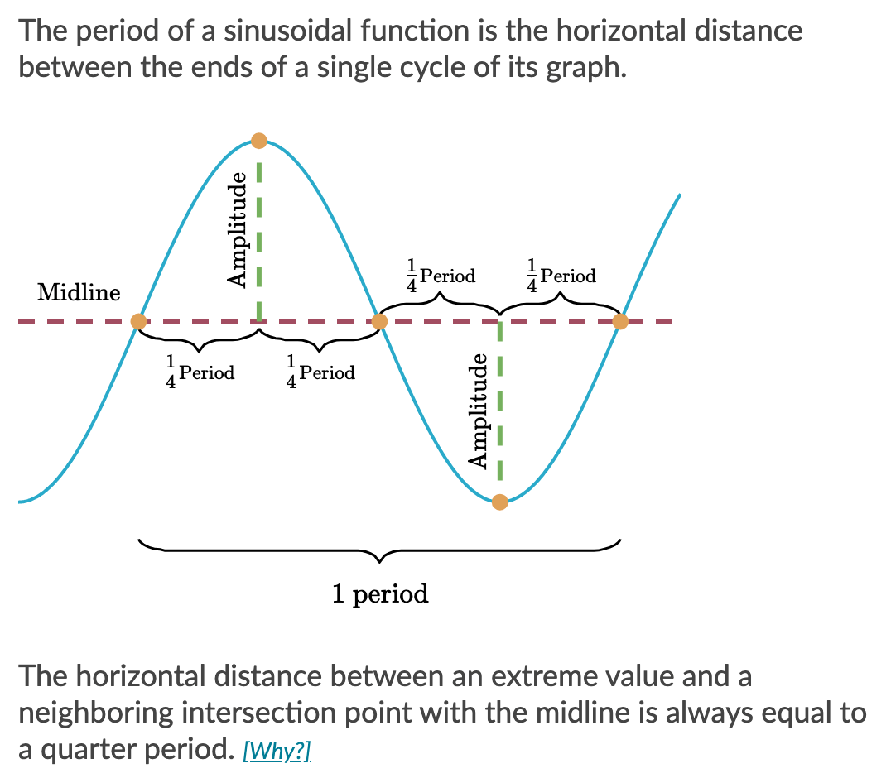
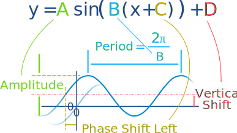

# trigonometry

The unit circle definition allows us to extend the domain of sine and cosine to **all real numbers**.  We can always find the value of $\cos\theta$ or $\sin\theta$ is a x-coordinate or y-coordinate in a unit circle.

## Pythagorean trig identity

The intersect points in this circle can form a right triangle. From Pythagorean's theorem we know the adjecent square  and opposite square is equal to the hypotenuse. And in this unit circle, the hypotenuse is 1. 

We can form that $(\cos\theta)^2 + (\sin\theta)^2 = 1$ .

If we know the $\sin\theta$ , we know the $\cos\theta$, but the sign of it is determined by the *quadrant*. If $\theta$ is in **Quadrant IV**, so its cosine value must be positive. 

### Trig values of $\pi/4$

## Two measure systems of angle

### Degress

we define a full revolution in 360 degress.

### [Radians](https://en.wikipedia.org/wiki/Radian)

we say a angle $\theta$ is 1 radian. it means the length of arc that subtends the angle is exactly $1\times radius$

When we measure an angle in radians, we are essentially measuring the ratio between the length of a circular arc and the radius of the circle it lies on. So a full revolution means the circumference of a circle. The angle in terms of radians is 
$$
\frac{2\cdot\pi\cdot{r}}{r} = 2\cdot\pi
$$

**If we have a unit circle the angle in radians is same with the circumference of it.**

The relation between degress and radians is 
$$
360\degree = 2\pi \text{rad}
$$

## Features of sinusoidal functions

### period

Period is the distance between two consecutive maximum points, or two consecutive minimum points (these distances must be equal).

The horizontal distance between the maxium and minium point is half of the period.  

The distance between two consecutive intersection points with the midline is half of the period.  

### midline

Midline of a sinusoidal function passes *exactly in the middle of its extreme values*.  
$$
midline= \frac{\text{max value} + \text{min value}}{2}
$$

### amplitude

Amplitude of a sinusoid is equal to the vertical distance from its midline to one of its extrema.  
$$
midline = \text{max value} - \text{amplitude}\\
midline = \text{min value} + \text{amplitude}
$$

$$
amplitude = \frac{\text{max value} - \text{min value}}{2}
$$

:skull: The amplittude is a absolute value.

