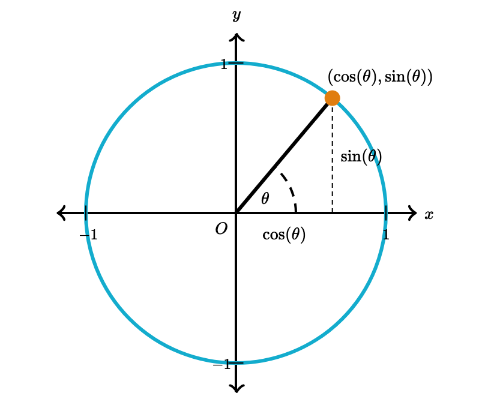

## trigonometry

The unit circle definition allows us to extend the domain of sine and cosine to **all real numbers**.  We can always find the value of $\cos\theta$ or $\sin\theta$ is a x-coordinate or y-coordinate in a unit circle.

$$
x+3=5
$$
