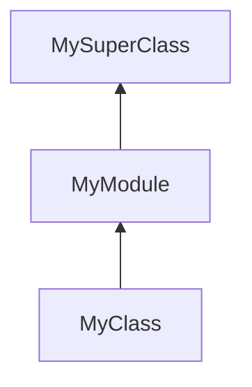

# ruby教程

## 安装

## 镜像 
```bash
# 查看默认源
gem sources

# 阿里源
gem sources -a https://mirrors.aliyun.com/rubygems/
# 腾讯源
gem sources -a https://mirrors.cloud.tencent.com/rubygems/

# 移除官方源
gem sources --remove https://rubygems.org/

```
## 包管理
1. ruby自带gem安装第三方依赖，安装到全局
2. bundler类似于Npm，将依赖存放到项目中，有`Gemfile`和`Gemfile.lock`. 

### bundler
```bash
bundle add sinatra
bundle install

bundle exec ruby # 运行
```

### 安装rvm
在linux和mac中最好使用[rvm](http://rvm.io/)管理工具安装ruby。
```bash
# 安装gpg keys
gpg2 --keyserver keyserver.ubuntu.com --recv-keys 409B6B1796C275462A1703113804BB82D39DC0E3 7D2BAF1CF37B13E2069D6956105BD0E739499BDB

\curl -sSL https://get.rvm.io | bash -s stable
# 同时安装rails
\curl -sSL https://get.rvm.io | bash -s stable --rails
```

### rvm使用
1. 查看所有的版本 `rvm list known`
2. 安装指定版本 `rvm install 3.0.0`


```
```


## shell
终端输入irb进入shell，exit退出
`irb -I`加载当前目录的ruby文件
`require 'lib.rb'`
## 基础语法
### 基础操作
```ruby
# main.rb
# 这是注释
puts "hello world"
print "hello world"; # puts会在最后加一个\n

small = 3
big = '5'

puts small + big.to_i  # 不同类型需要类型转换


num = 2019
num2 = 10
puts num.to_s + num2.to_s #转字符串

"hello".upcase 
"hello".reverse  
42.even? # 返回的是布尔值用问号结尾

# 获取用户输入
input = gets # 函数不带参数，尽量不写括号 gets()
# 去除末尾的\n
input = input.chomp

# 模板字符串
puts "Welcome to the world, #{input}"

puts("one", "two") 
puts "one", "two" # 小括号是可选的

puts "\tsomething" 
puts "\tsomething" # 单引号不转义

puts rand(100) # 0<= x < 100 随机数


# symbol
#　符号类似于字符串，但总是指向一个对象
:foo
:'foo'
puts :foo.object_id  
puts :'foo'.object_id

puts "something".object_id # 每个字符串都是独立的对象
puts "something".object_id
```

### help
```ruby
# 查询对象的方法
puts "hello".methods
# 查看对象所属的类
puts true.class 
```


## 控制语句
```ruby
if !true
  puts "I will" # 缩进两格
end

# 只在false的时候执行
unless false
  puts "I won't be printed"
end

while num_guesses < 10 && guesses_it == false
  ...
end

# 条件未true的时候才停止
until num_guesses == 10 || guessed_it

# 内联if和unless
puts "I'll be printed" if true
puts "I won't " unless true
```

## 函数
```ruby
# 没有参数就不要加小括号
def accelerate
  puts "speeding up"
end

def accelerateWithParams(speed)
  puts "speeding up at #{speed}"
end

def order_soda(flavor, size="medium")
  puts "something"
end

# 隐式返回值
# 默认最后的表达式的值作为方法的返回值
def add(a, b)
  a + b
end

# 收集参数 splat
def add(*args)  
  puts args.class  
end  
  
  
add(*[5, 7, 9])

# keyword收集
def add(*args, **kwargs)  
  p args  
  p kwargs  
end  
  
  
add(3, 5, key: 'main', name: 'xcy')
```

## 类
```ruby
class Bird
  def talk
    # 实例变量
    @age = 32;
  end

end

tony = Bird.new
tony.talk
tony.age # 报错，不能访问属性

class MyClass
  # setter 以=结尾的方法名为setter
  def my_attr=(value)
    if value == ''
      raise "can't be a empty string"
    end
    @my_attr = value
  end

  # getter
  def my_attr
    @my_attr

my_instance = MyClass.new
my_instance.my_attr = 3 # 调用了my_attr=方法

# 快速定义setter和getter
class Dog
  # 设置了getter和setter
  attr_accessor :name, :age

  # 设置getter
  atttr_reader :gender

  # 设置setter
  attr_writer :name

  report_age:
    puts @name

class Person
  def greet_by_name(name)
    "hello, #{name}"
  end
end

class Friend < Person
  def greet_by_name(name)
    basic_greeting = super(name)
    # basic_greeting = super 省略了参数，会自动调用超类的方法
    # basic_greeting = super() 调用超类方法，不带任何参数
    "#{basic_greeting} Glad to see you"
  end
end


puts Person.superclass # 查看超类
puts p.instance_variables # 对象的实例变量列表

```

### 初始化
```ruby
class SalariedEmployee < Employee
  def initialize(name = "Anonymous", salary = 0.0)
    super(name)
    self.salary = salary;

```

### 类方法
```ruby
class MyClass
  def self.my_class_method(p1, p2)
    puts "something"
  end
end

```

### 私有方法
```ruby
class Invoice
	private  # 在它之后的所有方法搜会标注为私有
	  def fees
	  end

end
```

### 继承 (单继承)
```ruby
class Person  
  def walk  
    echo "walk"  
  end  
end  
  
  
class Man < Person  
  def walk  
    puts "main walking"  
  end  
end  
  
  
m = Man.new  
  
m.walk
```

## 数组
```ruby
prices = [7.99, 25.00, nil]

puts prices.first
puts prices[1]

prices << 5.99
prices << 8.99


p prices[prices.length-1]
prices.last
```

## 块
不能在块中使用return，否则会从当前所属的函数中返回。
```ruby
# 使用&my_block定义，可以使用yield关键词调用块
def my_method(&my_block)  
  puts "We're in the method top"  
  # my_block.call("param1", "param2")  
  result = yield "param1", "param2"  
  puts result  
end  
  
  
my_method do |param, param2|  
  puts param  
  puts param2  
  puts "something in the block"  
  "return value from the block"
end

my_method { |param, param2| return "something"}
```

## 散列 哈希
```ruby
# 可以使用任何对象作为键

protons = {
  1 => "one",
  "two" => 2,
  :three => 3.0
}

puts protons.length  
puts protons.keys  
puts protons.values
protons.has_key?('Li')

# nil是假值
if protons['two'] != nil

# 不使用literal
new Hash({}) # 里面写默认值

# 获取哈希值
puts 2.object_id
puts instance.object_id
```

### 散列默认块
```ruby
bodies = Hash.new do |hash, key|
  body = CelestialBody.new
  body.type = "planet"
  hash[key] = body # 返回值和散列赋的值保持一致
end
```


## 假值
其他语言中的空字符串，空数组和数字0，在ruby中是真值，只有nil和false是假值。

## 参数
### 使用散列作为参数
1. 通常使用符号作为键，查询效率高。
```ruby
def area(options = {}) # 默认参数  
  options[:length] * options[:length]  
end  
  
puts area({:length => 2})

# 散列作为最后一个参数可以省略大括号
puts area(:length => 2)  
# 简略写法
puts area(length: 2)
```

### 关键词参数
```ruby
# 不写默认值也要有冒号
def area(name:, age: 9)  
  puts name;  
  puts age;  
end  
  
area(name: 5)
```


## mixin
```ruby
# 不要在mixin中写initialize方法，因为可能被覆盖
module Friendly  
  def hello  
    puts "hello from the mixins"  
  end  
end  
  
  
class Person  
  include Friendly  
  
  def walk  
    puts "I am working"  
  end  
end  
  
  
p1 = Person.new  
  
p1.hello
```

### 方法查找链



```ruby
p Person.ancestors # 按顺序搜索方法
```

### 条件赋值语句
`@comments = @comments || []` 等于 `@comments ||= []`

### 常量
```ruby
class MyClass
	My_CONSTANT= 42
	def my_method
	  puts MY_CONSTANT
	end
end
```

### 飞船操作符
```ruby
puts 3 <=> 4 # -1
puts 3 <=> 3 # 0
puts 4 <=> 1 # 1
```

### 实现Comparable
Comparable需要实现`<=>`方法
```ruby
class Steak  
  include Comparable  
  
  attr_accessor :name, :price  
  
  def initialize(price="0")  
    @price = price  
  end  
  
  def <=>(other)  
    if @price < other.price  
      return -1  
    elsif @price == other.price  
      return 0  
    else  
      return 1  
    end  
  endend  
  
  
s1 = Steak.new(50)  
s2 = Steak.new(100)  
  
puts s1 < s2
```

### 实现Enumerable
需要实现each方法
```ruby
class WordSplitter  
  include Enumerable  
  
  attr_accessor :string  
  
  def each  
    string.split(" ").each do |word|  
      yield word  
    end  
  endend  
  
  
  
s1 = WordSplitter.new  
s1.string="hello world"  
s2 = WordSplitter.new  
s2.string="make the world a better place"  
  
s1.each { |word| puts word }

```

## 文档
[ruby标准库文档](https://ruby-doc.org/core-3.1.2/)

### 生成文档
```bash
rdoc magic.rb
```

## 错误处理
## 普通错误
```ruby
# 拆分单词  
class WordSplitter  
  
  def generateErro  
    raise "error msg"  
  end  
end  
  
  
begin  
  WordSplitter.new.generateErro  
rescue => error  
  p error.message  
end
```

## 自定义错误类
1. 所有的类都继承于Exception
2. 通常自定义的错误都继承于`StandardError`，其他的属于程序无法控制的错误。

```ruby
class MyError < StandardError  
  attr_accessor :custom_msg  
end  
  
class SomeError < StandardError  
  
end  
  
  
# 拆分单词  
class WordSplitter  
  
  def generateErro  
    raise  MyError, "custom error"  
  end  
end  
  
  
begin  
  WordSplitter.new.generateErro  
rescue SomeError => error  
  puts "never goes here"  
rescue MyError => error  
  puts error.message 

  retry # 回到begin处，小心无限循环

ensure
  puts "must do something no matter what" # 必须要执行的代码
end

```

## 单元测试
```ruby
require 'minitest/autorun'  
require './person.rb'  
  
class TestPerson < Minitest::Test  
  def test_introduction  
    person = Person.new("bob", 32)  
    assert(person.getIntro == "hello, I am bob")
    assert_equal('apple', list.join)
  end  
end
```


## sinatra
sinatra是一个简单的web框架
### 安装
```bash
bundle add sinatra puma #　puma是网络服务器
```

### 基础
```ruby
require 'sinatra'

get('/hello') do 
"hello"
end
```

### erb
ruby的模板，可以在html中使用模板
`erb :index`会寻找view文件夹下的index.erb文件
```ruby
# main.rb
get('/main') do  
  @age = 35  
  
  erb :index  
end

# index.erb
<body>  
    hello,今天天气不错2  
    <h1><%= @age %></h1>  
    <% if false %>   #有等号的会显示
	<h1>是否显示</h1>  
	<% end %>  
	  
	<% [1,2,3].each do |elem| %>  
	<h1><%= elem %></h1>  
	<% end %>
</body>
```

## 命令行参数
```ruby
ruby argv_test.rb hello

# 所有的参数都存到ARGV数组中
puts ARGV[0] # 0 代表hello
```

## 正则表达式
```ruby
"Found you" =~ /Found you/ # 找到了返回index，否则返回nil
if "Found you" =~ /Found you/
  # do something
end
```

## 单例方法
```ruby
superhero = Person.new

def superhero.fly
  puts "Up we go"
end
```

## 调用任何方法
在对象上调用不存在的方法会调用meethod_missing方法，可以利用这个特性做代理对象

```ruby
class Person  
  
  private def method_missing(symbol, *args)  
	# symbol为方法名字
    puts symbol  
    puts args  
  end  
  
end
```

## ruby on rails

